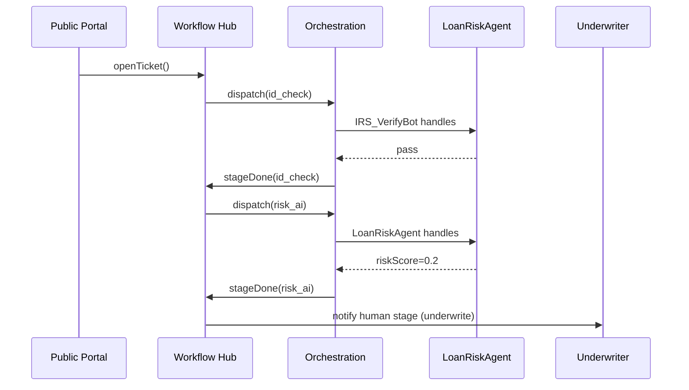

# Chapter 8: Workflow & Task Management Hub (HMS-OMS)

*(Coming from the air-traffic controller you just met in [Action Orchestration Service (HMS-ACT)](07_action_orchestration_service__hms_act__.md). Now let’s see **where those flights get scheduled, tracked, and re-routed.**)*  

---

## 1. Why Do We Need HMS-OMS?

Imagine you open **benefits.gov** to apply for a **Small-Business Disaster Loan**.  
From your side it looks like a single 5-minute form, but inside the government that request must:

1. Pass an **identity check** (IRS).  
2. Pull your county’s **disaster declaration** (FEMA).  
3. Wait for a **human underwriter** if the loan is > $50 k.  
4. Trigger an **AI risk score** before final approval.

Without a central tracker, every agency keeps its own spreadsheet and citizens sit in the dark ✉️.  
**HMS-OMS** is the *“supercharged USPS package tracker”* that:

* Creates one **Ticket** per request.  
* Knows every **Stage** (identity-check ✅, underwriting ⏳, AI-score 🔄).  
* Assigns each stage to the right **Owner**—human 🌎 or agent 🤖.  
* Publishes real-time status to portals *without leaking internal notes*.

---

## 2. Key Concepts (Plain English)

| Term | Think of it as | Why it matters |
|------|---------------|----------------|
| Ticket | A manila folder with a unique ID | Bundles all data & history for one request. |
| Stage | A step in the assembly line | “Pending identity check”, “Underwriting”, … |
| Owner | The worker (human or AI) responsible | Links to [Agent Framework](05_agent_framework__hms_agt_agx__.md) or a human inbox. |
| Dependency | Stage that must finish first | Prevents “approve loan” before “verify tax”. |
| SLA | Time limit for a stage | Lets auditors spot bottlenecks early. |
| Timeline | Immutable list of events | Citizens can see *what* happened; managers see *who/why*. |

Beginners really only need **Ticket**, **Stage**, and **Owner** to start.

---

## 3. Quick-Start: Track a Disaster-Loan Ticket in 4 Calls

All snippets stay under **20 lines** and use the `hms-oms-sdk` (TypeScript-flavored).

### 3.1 Define a Workflow Template (one time)

```ts
// create_workflow.ts  (≤18 lines)
import { createWorkflow } from "hms-oms-sdk";

await createWorkflow({
  name: "DisasterLoan",
  stages: [
    { id: "id_check",  owner: "IRS_VerifyBot",     slaMins: 30  },
    { id: "risk_ai",   owner: "LoanRiskAgent",     slaMins: 10, dependsOn: ["id_check"] },
    { id: "underwrite",owner: "SBA_HumanTeam",     slaMins: 240, dependsOn: ["risk_ai"], minAmount: 50000 },
    { id: "fund",      owner: "Treasury_Payments", slaMins: 60,  dependsOn: ["underwrite","risk_ai"] }
  ]
});
```

Explanation  
1. One JSON describes every stage & dependency.  
2. `owner` can be **agent names** or **human groups**.  
3. SLAs attach clocks for later dashboards.

---

### 3.2 Open a Ticket

```ts
// open_ticket.ts
import { openTicket } from "hms-oms-sdk";

const ticketId = await openTicket("DisasterLoan", {
  applicant: "ACME Solar LLC",
  amount: 120000,
  ein: "12-3456789"
});
console.log("Your tracking #:", ticketId);   // e.g., DL-2024-00091
```

OMS instantly:

* Creates the Ticket.  
* Queues the first stage (`id_check`) in [HMS-ACT](07_action_orchestration_service__hms_act__.md).  
* Starts the SLA timer.

---

### 3.3 Check Status (Citizen or Staff)

```ts
// track_ticket.ts
import { getTimeline } from "hms-oms-sdk";

const timeline = await getTimeline(ticketId);
console.table(timeline);
```

Typical output:

| time | stage | owner | status |
|------|-------|-------|--------|
| 09:02 | id_check | IRS_VerifyBot | ✅ done |
| 09:07 | risk_ai | LoanRiskAgent | ✅ done |
| 09:08 | underwrite | SBA_HumanTeam | ⏳ in-progress |

Citizens *only* see stage names & status; staff see extra notes.

---

### 3.4 Escalate a Stuck Stage

```ts
// escalate.ts
import { escalate } from "hms-oms-sdk";

await escalate(ticketId, "underwrite", "SLA breached >4h");
```

OMS pings a supervisor, records the action, and (optionally) re-routes to another underwriter.

---

## 4. What Happens Behind the Curtain?



Key ideas:

1. **OMS drives the storyboard**; **ACT** just calls each actor when told.  
2. After every completion, OMS evaluates dependencies to decide the next stage.  
3. All events land in the **Timeline** table for transparency.

---

## 5. A Peek Inside HMS-OMS Code (Super-Simplified)

### 5.1 Ticket Schema (Python, 12 Lines)

```py
# oms/models.py
class Ticket(BaseModel):
    id: str
    workflow: str
    data: dict
    stage: str
    history: list   # [{stage, status, ts}]
```

Even beginners can see: one record, current stage, and full history.

---

### 5.2 Dependency Resolver (TypeScript, 19 Lines)

```ts
// oms/engine.ts
export function nextStages(ticket, template){        // template = workflow def
  const done = new Set(ticket.history
                       .filter(h=>h.status==="done")
                       .map(h=>h.stage));
  return template.stages.filter(stg=>{
    if(done.has(stg.id)) return false;               // already done
    const deps = stg.dependsOn || [];
    return deps.every(d=>done.has(d));               // all deps met
  });
}
```

Explanation  
* Calculates which stages are **now** unblocked.  
* OMS calls this after each completion to know what to dispatch next.

---

### 5.3 SLA Checker (Rust, 10 Lines)

```rs
// oms/sla.rs
pub fn breached(started: u64, now: u64, limit_mins: u64) -> bool {
  now - started > limit_mins * 60
}
```

Exactly the same idea you saw in HMS-ACT, but scoped per stage.

---

## 6. How OMS Works With the Rest of HMS

| Neighbor | Relationship |
|----------|--------------|
| [HMS-ACT](07_action_orchestration_service__hms_act__.md) | Executes each stage. |
| [HMS-AGT/AGX](05_agent_framework__hms_agt_agx__.md) | Provides AI / digital workers. |
| [HMS-GOV](01_government_admin_portal__hms_gov__.md) | Dashboards SLA & bottleneck heat-maps. |
| [HMS-OPS](15_operations___observability_suite__hms_ops__.md) | Monitors uptime & latency. |
| [HMS-DTA](09_unified_data_fabric__hms_dta__.md) | Stores tickets & timelines in a queryable lake. |

Think of OMS as the *traffic board* in Grand Central—every train (ticket) listed, every delay visible.

---

## 7. Mini-FAQ

**Q: Is OMS the same as ACT?**  
A: OMS decides *what* should happen next and keeps the map. ACT decides *who* actually does it.

**Q: Can I change a workflow template on the fly?**  
A: Yes. Edits via [HMS-GOV](01_government_admin_portal__hms_gov__.md) create a new version; existing tickets keep the old graph, new tickets use the new one.

**Q: How big can a workflow get?**  
A: Tested to 500 stages, but most federal forms fit under 10.

**Q: Does OMS expose public APIs?**  
A: Two: `getTimeline(ticketId)` for citizens, and `admin/ticket/{id}` with full notes for staff (behind auth).

---

## 8. Recap & What’s Next

In this chapter you:

• Learned why HMS-OMS is the **package-tracker** for every permit, benefit, or inspection.  
• Defined a multi-stage workflow, opened a ticket, tracked it, and escalated—all in under 70 total lines.  
• Peeked at the dependency resolver and SLA checker.  
• Saw how OMS coordinates with ACT, agents, and humans while keeping citizens informed.

Next we’ll look at **where all these tickets, metrics, and audit trails actually live**.  
Jump to [Unified Data Fabric (HMS-DTA)](09_unified_data_fabric__hms_dta__.md).

---

---

Generated by [AI Codebase Knowledge Builder](https://github.com/The-Pocket/Tutorial-Codebase-Knowledge)