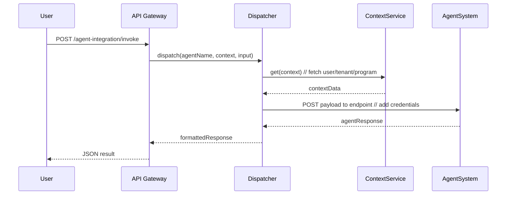

# Chapter 9: Agent Integration Framework

In [Chapter 8: Assessment Module](08_assessment_module_.md) you saw how HMS-API can run questionnaires and score results. Now it’s time to bring in smart helpers—AI or human experts—to answer questions, summarize policies, or guide users. That’s exactly what the **Agent Integration Framework** does.

---

## 9.1 Why Agent Integration Framework?

Imagine a citizen wants to know: “What documents do I need for public housing?” or an administrator asks: “Summarize the latest eviction moratorium.” Instead of each module re-implementing AI calls or human routing, we build a single “dispatcher”:

  • It receives a user’s request.  
  • It looks up which agent (AI or human) should handle it.  
  • It fetches context (tenant, program, user data).  
  • It securely relays credentials.  
  • It returns a consistent answer format.

Think of it like 911 dispatch: you call one number, they decide which first-responder (officer, medic, or drone) to send—and all you care about is the response.

---

## 9.2 Key Concepts

1. **Dispatcher**  
   The central router that receives requests and selects the right agent.

2. **Agent**  
   A human or AI endpoint (HMS-A2A) registered with a name, type, URL, and credentials.

3. **Context Fetching**  
   Before calling the agent, the dispatcher gathers relevant data: user profile, tenant ID, program details, previous chat history.

4. **Secure Credential Passing**  
   Agents often require API keys or OAuth tokens. The framework injects these behind the scenes—users never see them.

5. **Unified Patterns**  
   Whether you call a lawyer-bot or a policy expert, the input/output structure stays the same.

---

## 9.3 How to Use the Framework

### 9.3.1 Register a New Agent

First, tell HMS-API about your agent:

```http
POST /api/agents
Content-Type: application/json

{
  "name": "PolicySummarizer",
  "type": "ai",
  "endpoint": "https://hms-a2a.gov/summarize",
  "credentials": { "apiKey": "SECRET_KEY" },
  "triggers": ["policy_summary"]
}
```

• `name`: Unique agent ID  
• `type`: “ai” or “human”  
• `endpoint`: Where to send requests  
• `credentials`: Secure tokens stored server-side  
• `triggers`: Tags or use-cases this agent handles

---

### 9.3.2 Invoke an Agent

Now end-users can call your agent by name:

```http
POST /api/agent-integration/invoke
Content-Type: application/json

{
  "agentName": "PolicySummarizer",
  "context":   { "tenantId":"tenant_state_123", "policyId":"policy_001" },
  "input":     { "text":"What’s the eviction clause?" }
}
```

**What happens:**  
1. HMS-API’s dispatcher looks up “PolicySummarizer.”  
2. It fetches tenant & policy details.  
3. It calls the AI endpoint with user input + context.  
4. It returns a JSON result:

```json
{
  "agentName":"PolicySummarizer",
  "result": {
    "summary":"During emergencies, evictions for residential properties are paused..."
  }
}
```

---

## 9.4 What Happens Under the Hood?



---

## 9.5 Internal Implementation

### File: models/agent_model.js

```js
// models/agent_model.js
class Agent {
  constructor({ name, type, endpoint, credentials }) {
    this.name = name;
    this.type = type;
    this.endpoint = endpoint;
    this.credentials = credentials;
  }

  static async findByName(name) {
    // Simplified DB lookup
    const rows = await db.query('SELECT * FROM agents WHERE name=?', [name]);
    return rows[0] ? new Agent(rows[0]) : null;
  }
}
module.exports = Agent;
```
*Represents each agent and fetches by name.*

---

### File: services/agentDispatcher.js

```js
// services/agentDispatcher.js
const Agent = require('../models/agent_model');
const ContextService = require('./contextService');
const fetch = require('node-fetch');

async function dispatch(agentName, context, input) {
  const agent = await Agent.findByName(agentName);
  if (!agent) throw new Error('Agent not found');

  // 1. Fetch extra context (user, tenant, program)
  const ctx = await ContextService.get(context);

  // 2. Build payload
  const payload = { ...ctx, ...input };

  // 3. Call agent
  const res = await fetch(agent.endpoint, {
    method: 'POST',
    headers: { 'Authorization': `Bearer ${agent.credentials.apiKey}`,
               'Content-Type': 'application/json' },
    body: JSON.stringify(payload)
  });
  return res.json();
}

module.exports = { dispatch };
```
*Orchestrates context + secure call to agent.*

---

### File: middleware/agentIntegration.js

```js
// middleware/agentIntegration.js
const { dispatch } = require('../services/agentDispatcher');

async function invokeAgent(req, res) {
  try {
    const { agentName, context, input } = req.body;
    const result = await dispatch(agentName, context, input);
    res.json({ agentName, result });
  } catch (err) {
    res.status(500).json({ error: err.message });
  }
}

module.exports = invokeAgent;
```
*Hooks HTTP route `/api/agent-integration/invoke` to your dispatcher.*

---

## 9.6 Summary

You’ve learned how the **Agent Integration Framework** gives HMS-API a single, secure “call dispatcher” for human or AI helpers. It:

- Registers agents with endpoints & credentials  
- Fetches shared context (tenant, program, user)  
- Routes requests uniformly and returns structured replies  

Next up, we’ll see how to keep HMS-API in sync with external systems like national registries in [Chapter 10: External System Synchronization](10_external_system_synchronization_.md).

---

Generated by [AI Codebase Knowledge Builder](https://github.com/The-Pocket/Tutorial-Codebase-Knowledge)