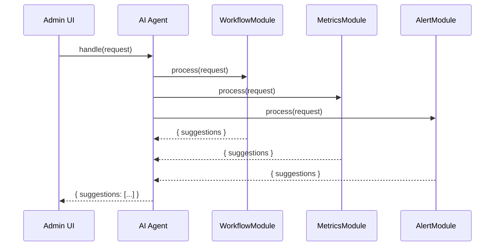

# Chapter 9: AI Agent

In [Chapter 8: HMS-A2A (Agent-to-Agent System)](08_hms_a2a__agent_to_agent_system__.md) we saw how multiple AI Agents collaborate on a single task. Now we’ll focus on the **AI Agent** itself—your expert aide inside the government portal that listens to user requests, analyzes data, and proposes process improvements just like a policy advisor.

---

## 1. Motivation & Central Use Case

**Problem:** A busy government office needs a fast way to spot bottlenecks, monitor performance, and suggest tweaks to programs without hiring more staff.

**Use Case Example:**  
The Department of Social Services wants to optimize the “No Poverty” benefits workflow:
1. An administrator asks, “Why is our average application processing time 15 days? Any suggestions?”  
2. The **AI Agent** pulls program metrics, examines the workflow steps, and generates a memo:  
   - “Average time: 15 days. Consider adding one caseworker per 500 applications.”  
   - “Alert: backlog spike last week in Region CA.”  
3. The admin reviews, tweaks the staffing plan, and approves or overrides the suggestion.

This single agent handles listening, data lookup, analysis, and accountability flags—just like an expert aide in a policy office.

---

## 2. Key Concepts

1. **AI Agent**  
   A self-contained service that exposes a `handle(request)` method.  
2. **Modules**  
   Specialized components inside the agent (e.g., `workflow`, `metrics`, `alerts`) that each process part of the request.  
3. **Request Context**  
   The user’s input, including `type` (e.g., `'optimizeProcess'`) and `payload` (e.g., `{ policyId: 'no-poverty-2024' }`).  
4. **Suggestions**  
   An array of recommendations produced by modules.  
5. **Escalation & Override**  
   Agents can flag urgent issues or defer to a human decision-maker for final approval.

---

## 3. Using the AI Agent

Let’s walk through a minimal example of instantiating an agent and handling a user request.

### 3.1 Instantiate an Agent

```js
import { AIAgent } from 'hms-ai-agent'

// Create a “PolicyAdvisor” agent with three modules
const agent = new AIAgent({
  name: 'PolicyAdvisor',
  modules: ['workflow', 'metrics', 'alerts']
})
```
Here we tell the system which internal modules our agent will use.

### 3.2 Send a Request

```js
async function suggestImprovement(policyId) {
  const response = await agent.handle({
    userId: 'admin123',
    type: 'optimizeProcess',
    payload: { policyId }
  })
  console.log(response.suggestions)
  // e.g. [
  //   "Workflow: Step 'Review' averages 5 days; consider reallocating staff.",
  //   "Metrics: Backlog spiked by 20% last quarter."
  // ]
}
suggestImprovement('no-poverty-2024')
```
The agent returns a friendly list of suggestions based on real data.

---

## 4. What Happens Under the Hood


1. The UI calls `agent.handle()`.  
2. Agent fans out the request to each module.  
3. Modules return their recommendations.  
4. Agent aggregates and sends one combined result back.

---

## 5. Internal Implementation

Below is a simplified look at how the AI Agent is structured on disk and in code.

### 5.1 File Structure

```
hms-ai-agent/
└── src/
    ├── index.js            # AIAgent class
    └── modules/
        ├── workflow.js     # analyzes workflow steps
        ├── metrics.js      # fetches & interprets performance data
        └── alerts.js       # checks for off-track indicators
```

### 5.2 AIAgent Class

```js
// src/index.js
export class AIAgent {
  constructor({ name, modules }) {
    this.name = name
    // load each module by filename
    this._modules = modules.map(m => require(`./modules/${m}`))
  }

  async handle(request) {
    // run all modules in parallel
    const results = await Promise.all(
      this._modules.map(mod => mod.process(request))
    )
    // collect suggestions from every module
    const suggestions = results.flatMap(r => r.suggestions)
    return { suggestions }
  }
}
```
- We `require` each module dynamically.  
- `handle()` fans out the request and merges their `suggestions`.

### 5.3 Sample Module

```js
// src/modules/metrics.js
const api = require('hms-api-client')

module.exports.process = async function(request) {
  // 1. Fetch program metrics
  const data = await api.get(
    `/policies/${request.payload.policyId}/metrics`
  )
  // 2. Analyze average time
  const avg = data.avgProcessingTime
  const suggestions = []
  if (avg > 10) {
    suggestions.push(
      `Metrics: average processing time is ${avg} days; consider hiring more staff.`
    )
  }
  return { suggestions }
}
```
This module calls **HMS-API** to get live numbers, then makes a recommendation.

---

## 6. Conclusion & Next Steps

In this chapter, you learned how to:

- Instantiate an **AI Agent** with specialized modules  
- Send a `handle()` request and receive actionable suggestions  
- Peek under the hood to see how modules process and aggregate data  

Up next, we’ll connect all this rich data into a graph structure with [Chapter 10: HMS-AGX (Knowledge Graph)](10_hms_agx__knowledge_graph__.md). See you there!

---

Generated by [AI Codebase Knowledge Builder](https://github.com/The-Pocket/Tutorial-Codebase-Knowledge)