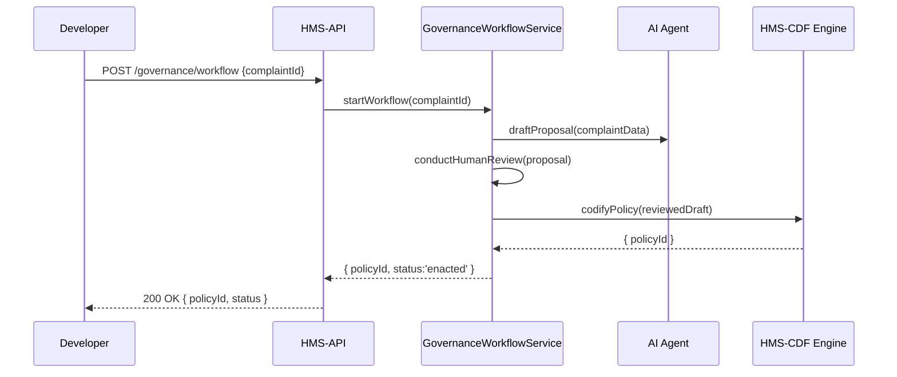
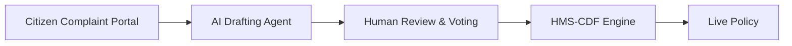

# Chapter 9: AI-Driven Governance Workflow

In [Chapter 8: Agent Integration Layer](08_agent_integration_layer_.md) we learned how to register and invoke AI agents for analytics or drafting text. Now we’ll orchestrate the entire **end-to-end governance flow**—from citizen complaints to AI-drafted proposals, human review (HITL), and final policy enactment via our legislative engine (HMS-CDF). Think of this as a **digital parliament** where debates, amendments, votes, and enactment happen in minutes, with every step traceable.

---

## 1. Motivation: Rapid, Transparent Policy Response

Imagine a citizen reports a pothole on the state’s road portal. Traditionally, this complaint might bounce between departments for weeks. With AI-Driven Governance Workflow you can:

1. Receive the complaint in the portal.  
2. Automatically invoke an AI agent to draft a repair-policy proposal.  
3. Let managers review, suggest amendments, and vote.  
4. Submit the revised draft to HMS-CDF for codification.  
5. See the final policy go live—all in minutes.

This drastically cuts bureaucracy, yet keeps humans in the loop and logs each consensus step.

---

## 2. Key Concepts

- **Complaint Portal**  
  Entry point where citizens lodge issues (e.g., potholes).  
- **AI Drafting Agent**  
  Uses HMS-A2A to draft policy text based on complaint details.  
- **Human-In-The-Loop (HITL)**  
  Managers read, amend, and vote on the draft.  
- **Legislative Engine (HMS-CDF)**  
  Finalizes, versions, and publishes approved policies.  
- **Traceable Consensus**  
  Each vote or amendment is recorded for audit.

---

## 3. Getting Started: Kick Off the Workflow

Here’s how to trigger the full governance workflow with one HTTP call:

```js
// runWorkflow.js
const { GovernanceWorkflowService } = require('hms-api')

async function handleComplaint(complaintId) {
  const result = await GovernanceWorkflowService.startWorkflow(complaintId)
  console.log('✅ Policy enacted:', result.policyId)
}
handleComplaint('complaint-789').catch(console.error)
```

Explanation:
1. We call `startWorkflow(complaintId)`.  
2. Under the hood, the system loads the complaint, drafts a proposal via AI, runs a HITL review, and enacts the policy.  
3. You get back the new `policyId` and status.

---

## 4. Under the Hood: Sequence Flow



---

## 5. Internal Implementation

### 5.1 Service Layer (src/services/governanceWorkflow.service.ts)

```ts
import { ComplaintService }   from './complaint.service'
import { AgentService }       from './agent.service'
import { LegislativeService } from './legislative.service'

// Orchestrates end-to-end flow
export async function startWorkflow(complaintId: string) {
  const complaint = await ComplaintService.getComplaint(complaintId)
  // AI drafts initial proposal
  const proposal = await AgentService.invokeAgent(
    complaint.programId, complaint.agentId,
    { prompt: `Draft policy to fix: ${complaint.text}` }
  )
  // Human review & amendments
  const reviewed = await LegislativeService.submitDraft(proposal)
  // Final enactment
  const policy = await LegislativeService.enactPolicy(reviewed.draftId)
  return policy
}
```

Explanation:
1. Load the complaint details.  
2. Call the AI agent to draft a proposal.  
3. Send the draft for human-in-the-loop review and voting.  
4. Enact approved draft via HMS-CDF.

### 5.2 Repository & Integration Sketch

- `ComplaintService.getComplaint` fetches portal data from your DB.  
- `AgentService.invokeAgent` wraps HMS-A2A calls (see [Chapter 8](08_agent_integration_layer_.md)).  
- `LegislativeService` talks to HMS-CDF to submit drafts and enact legislation.

---

## 6. Visualizing the Digital Parliament



- Citizens start at **Portal**.  
- AI quickly drafts proposals.  
- Managers debate, amend, and vote in **Review**.  
- HMS-CDF publishes the final **Policy**.

---

## 7. Conclusion & Next Steps

You’ve seen how to wire up an **AI-Driven Governance Workflow**:

- From user complaints to AI drafting  
- Through human-in-the-loop review and consensus steps  
- To final enactment in minutes, with every step logged

Next up, we’ll learn how to keep these policies and data in sync with other government systems in  
[Chapter 10: External System Synchronization](10_external_system_synchronization_.md).

---

Generated by [AI Codebase Knowledge Builder](https://github.com/The-Pocket/Tutorial-Codebase-Knowledge)