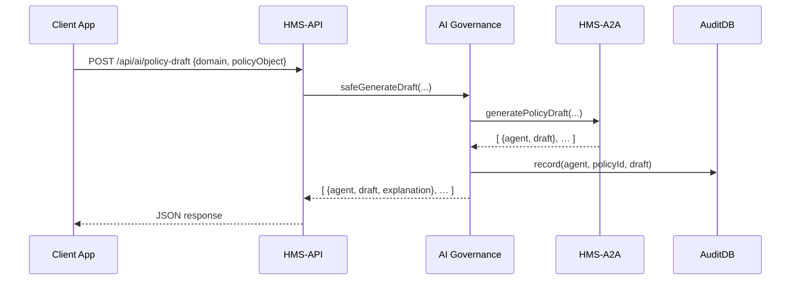

# Chapter 9: AI Governance Framework

Building on [Chapter 8: AI Agent Framework (HMS-A2A)](08_ai_agent_framework__hms_a2a__.md), where we saw how AI modules draft policy texts, now we need a “municipal charter” to keep those drafts in line with ethics, privacy, and safety. The **AI Governance Framework** ensures every AI recommendation or action in HMS-SCM is explainable, auditable, and compliant with your agency’s rules.

---

## 1. Motivation & Real-World Use Case

Imagine the U.S. Department of Education uses AI to allocate grant budgets. An AI agent proposes funding levels for each school district. Before sending that to decision-makers, you must:

- Confirm no student PII is leaked  
- Check fairness rules (e.g., underfunded districts get priority)  
- Generate a human-readable explanation of each suggestion  
- Record an audit trail for regulators  

The AI Governance Framework acts like a charter: it codifies data-usage policies, explainability requirements, and audit logs to justify every AI output under federal standards.

---

## 2. Key Concepts

1. **Ethics Rules**  
   Policies about sensitive data, bias checks, or fairness thresholds.

2. **Privacy Guards**  
   Automatic scans that throw errors if PII (like SSNs) appears.

3. **Explainability Module**  
   Attaches a human-readable rationale to each AI suggestion.

4. **Audit Trail**  
   Immutable logs of who asked what, which agent responded, and when.

5. **Compliance Checker**  
   Central service that enforces all of the above before and after AI calls.

---

## 3. Using the AI Governance Framework

Below is a minimal example showing how to wrap AI calls with governance checks:

File: `src/services/governanceService.js`
```js
const aiSvc   = require('./aiService')       // HMS-A2A
const audit   = require('./auditLogService') // generic audit

async function safeGenerateDraft(domain, policyObject) {
  enforceEthics(policyObject)                // step 1: pre-checks
  const drafts = await aiSvc.generatePolicyDraft(domain, policyObject)
  // step 2: attach explainability + record audit
  return drafts.map(d => {
    audit.record({agent: d.agent, policyId: policyObject.id, draft: d.draft})
    return { ...d, explanation: explainableSummary(d) }
  })
}

function enforceEthics(obj) {
  if (obj.containsPII) throw new Error('Privacy violation: PII detected')
}

function explainableSummary({agent, draft}) {
  return `Generated by ${agent}: recommends section on equity based on Rule X.`
}

module.exports = { safeGenerateDraft }
```

Explanation:
- We run `enforceEthics` before calling AI.  
- For each draft, we record an audit entry.  
- We return drafts with an `explanation` field.

---

### 3.1 Exposing a Secure API

File: `server/routes/aiGovernance.js`
```js
const express = require('express')
const { safeGenerateDraft } = require('../services/governanceService')
const router = express.Router()

router.post('/policy-draft', async (req, res) => {
  const { domain, policyObject } = req.body
  const result = await safeGenerateDraft(domain, policyObject)
  res.json(result)
})

module.exports = router
```

Now any client calling `/api/ai/policy-draft` gets fully vetted, explainable, and audited drafts.

---

## 4. What Happens Under the Hood?



1. **Client** requests an AI draft.  
2. **HMS-API** calls our Governance service.  
3. Governance pre-checks ethics, forwards to HMS-A2A.  
4. AI Agent Framework returns drafts.  
5. Governance logs audits, attaches explanations.  
6. Results flow back to the client.

---

## 5. Internal Implementation Details

### 5.1 Audit Log Service

File: `server/services/auditLogService.js`
```js
const logStore = []
async function record(entry) {
  entry.timestamp = new Date().toISOString()
  logStore.push(entry)
  // In production, write to a secure audit database
}
module.exports = { record }
```
Keeps an append-only log of every AI output for regulators to review.

### 5.2 Ethics & Privacy Rules

You can extend `enforceEthics` with more checks:

```js
function enforceEthics(obj) {
  if (obj.containsPII) throw new Error('Privacy violation')
  if (obj.proposalCount < 1) throw new Error('No proposals provided')
  // add bias/fairness checks here
}
```

Each rule throws an error if violated, stopping untrusted AI outputs.

---

## Conclusion

In this chapter you learned how the **AI Governance Framework**:

- Enforces ethics and privacy before AI calls  
- Attaches clear, human-readable explanations after AI calls  
- Records every suggestion in an immutable audit log  

Next, we’ll see how these governance checks integrate at the system level in [Chapter 10: Governance Layer (HMS-SYS)](10_governance_layer__hms_sys__.md).

---

Generated by [AI Codebase Knowledge Builder](https://github.com/The-Pocket/Tutorial-Codebase-Knowledge)