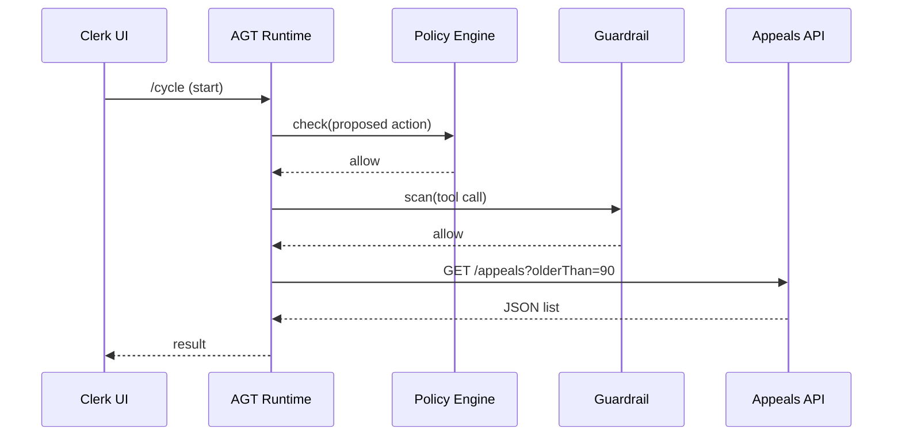

# Chapter 9: AI Representative Agent Framework (HMS-AGT / HMS-AGX)

*(continuing from [Policy & Legislative Engine (HMS-CDF)](08_policy___legislative_engine__hms_cdf__.md))*  

---

## 1. Why “Digital Deputies”?

Picture the **Court of Appeals for the Federal Circuit (CAFC)**.  
Each morning it receives a pile of new patent-appeal filings. A clerk must:

1. Check every filing for missing forms.  
2. Look up related district-court dockets.  
3. Assign a tentative hearing date that respects statutory deadlines.  

What if a **tireless deputy** did the boring look-ups, filled a spreadsheet, and politely asked the clerk for a thumbs-up?

That deputy is built with **HMS-AGT / HMS-AGX**.  
The framework turns large-language models (LLMs) into *governed* agents that:

* know their legal limits (thanks to [HMS-CDF](08_policy___legislative_engine__hms_cdf__.md) & [HMS-ESQ](05_security__privacy___legal_guardrails__hms_esq___platform_controls__.md)),  
* can call real tools (REST APIs, SQL, e-mail),  
* remember past conversations,  
* and hand control back to humans when needed.  

---

## 2. Key Concepts (Plain-English Cheat-Sheet)

| Concept | Everyday Analogy | One-Sentence Meaning |
|---------|------------------|----------------------|
| Agent | A junior civil servant | An LLM instance wrapped with rules, memory, and tools. |
| Skill | A learned procedure | Code snippet the agent can call (e.g., “fetch docket info”). |
| Tool | Office equipment | External API or database the skill touches. |
| Memory | Notebook on desk | Store of past interactions to avoid repetition. |
| Role Guard | Badge + rulebook | IAM scope + ESQ/CDF checks that constrain the agent. |
| Life-Cycle | Workday schedule | `bootstrap → think → act → record → sleep`. |

Keep these six terms handy; the rest is mechanics.

---

## 3. 5-Minute “Hello Deputy” Walk-Through

We’ll build a *toy* CAFC deputy that lists appeals older than 90 days.  
Everything runs locally—no API keys needed.

### 3.1 Describe the Agent (YAML, 12 lines)

`agents/cafc_deputy.yaml`

```yaml
id: cafc_deputy
persona: >
  You are a helpful clerk at the Court of Appeals for the Federal Circuit.
goals:
  - "List appeals pending > 90 days."
memoryBucket: ./memory/cafc/
tools:
  - id: listAppeals
    desc: "GET /appeals?olderThanDays=90"
    endpoint: http://localhost:4007/appeals
permissions:
  role: clerks_office
  maxBudgetUSD: 0   # no paid calls
```

### 3.2 Tiny Runtime (JavaScript, 18 lines)

`runAgent.js`

```js
import fs from 'fs';
import fetch from 'node-fetch';
import { openai } from './llm.js';          // ⬅️ stub, returns canned text
import { scan }   from './esqHelper.js';    // ESQ guard
import { check }  from './cdfHelper.js';    // CDF guard

export async function runCycle(specPath) {
  const spec = YAML.parse(fs.readFileSync(specPath, 'utf8'));
  const context = fs.readFileSync(spec.memoryBucket + 'latest.txt', 'utf8');

  // 1️⃣ THINK
  const prompt = `${spec.persona}\n${context}\nGoal: ${spec.goals[0]}`;
  let thought = await openai(prompt);

  // 2️⃣ CDF / ESQ CHECK
  if (!(await check(thought)) || !(await scan(thought)))
      return console.log('Blocked by guardrails.');

  // 3️⃣ ACT (tool call)
  const url = spec.tools[0].endpoint + '?olderThanDays=90';
  const res = await fetch(url).then(r => r.json());

  // 4️⃣ RECORD
  fs.writeFileSync(spec.memoryBucket + 'latest.txt', JSON.stringify(res));

  console.log('Deputy says:', res);
}
```

**What it does**  
1. Reads the YAML spec and last memory note.  
2. Calls a stubbed LLM (`openai`) to “think.”  
3. Sends that thought to CDF + ESQ; if blocked, the cycle stops.  
4. Hits the only tool endpoint and saves the result to memory.  

Run it:

```bash
node runAgent.js agents/cafc_deputy.yaml
```

Output:

```json
Deputy says: [
  { appealNo: 23-1011, filed: "2023-12-18", status: "awaiting brief" },
  { appealNo: 23-1044, filed: "2023-12-22", status: "awaiting appendix" }
]
```

Voilà—your first digital deputy!

---

## 4. How the Deputy Talks to HMS



Only **if both** CDF *and* ESQ agree does the tool call proceed.

---

## 5. Deep Dive: Life-Cycle in 5 Steps

| Step | Code Hook | What Happens |
|------|-----------|--------------|
| 1. Bootstrap | `init()` | Read YAML, load memory, get IAM token. |
| 2. Think | `openai(prompt)` | LLM drafts a plan (“call listAppeals”). |
| 3. Review | `check()` + `scan()` | Policy & legal guardrails approve or block. |
| 4. Act | `callTool()` | Execute REST or SQL, possibly via [API Gateway](03_backend_api_gateway__hms_api___hms_svc__.md). |
| 5. Record | `saveMemory()` | Store result + reasoning for next cycle & audits. |

Crash in the middle? The next run picks up from the last **record** phase—state is durable.

---

## 6. Adding a New Tool Plug-In (Permits Example)

Need the deputy to *also* fetch city permits? Drop a file:

`tools/permitTool.js` (11 lines)

```js
export default {
  id: 'listPermits',
  desc: 'GET /permits?status=pending',
  async call(params) {
    const q = new URLSearchParams(params);
    const res = await fetch('http://localhost:4008/permits?' + q);
    return res.json();
  }
};
```

Add it to the YAML under `tools:` and you’re done.  
The runtime auto-loads any `tools/*.js` on startup.

---

## 7. Safety Net: HITL Pause

Sometimes the agent proposes a sensitive action—e.g., “dismiss appeal 23-1011”.  
Insert a **HITL checkpoint**:

```yaml
hitl:
  when: "action == 'DISMISS_APPEAL'"
  approvers: ["senior_clerk"]
```

At runtime the agent fires an event that pauses the cycle until a human approver clicks **Approve** in the HITL UI (see next chapter).

---

## 8. Frequently Asked Beginner Questions

**Q: Is one agent tied to one LLM?**  
A: No. `openai()` can route to GPT-4, a local model, or an ensemble—your choice.

**Q: Can agents talk to each other?**  
A: Yes, via an internal “inbox” queue. All messages still pass ESQ scans.

**Q: What stops an agent from spending \$1 000 on cloud GPUs?**  
A: The `maxBudgetUSD` permission plus ESQ’s budget guardrail.

**Q: How do I debug?**  
A: Every cycle emits a **Trace ID** and writes logs to [HMS-OPS](15_monitoring___metrics__hms_ops__.md).  
Search by ID and you’ll see thoughts, tool calls, and guard decisions.

---

## 9. Recap & Where to Next

You just:

* Met the **digital deputy** concept.  
* Created a YAML spec and 18-line runtime loop.  
* Saw how CDF & ESQ keep agents lawful.  
* Added a new tool with a tiny plug-in.  

Next we’ll put humans back in the loop—approving, rejecting, or editing agent actions.  
👉 Continue to [Human-in-the-Loop (HITL) Oversight](10_human_in_the_loop__hitl__oversight_.md)

---

Generated by [AI Codebase Knowledge Builder](https://github.com/The-Pocket/Tutorial-Codebase-Knowledge)