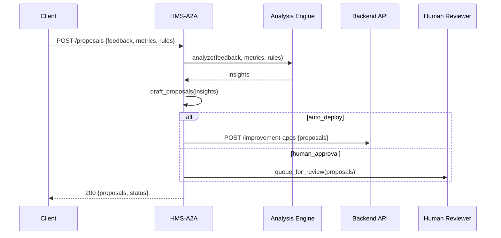

# Chapter 9: AI Representative Agent (HMS-A2A)

Welcome back! In [Chapter 8: AI Governance Framework](08_ai_governance_framework_.md), we wrapped our AI outputs in checks for fairness, compliance, and privacy. Now we’ll introduce a new helper—a **digital policy analyst**—that turns raw feedback and metrics into concrete improvement proposals. This is the **AI Representative Agent**, or **HMS-A2A**.

---

## 1. Motivation & Central Use Case

Federal agencies get lots of feedback and performance numbers every day:

• Citizens report “my application stalled.”  
• Portals log average wait times.  
• Policy rules define maximum steps.

Putting these pieces together to spot delays or confusing forms is time-consuming. Imagine the Rural Utilities Service (RUS) wants to speed up loan approvals:

- They need to scan hundreds of user comments (“forms too long”)  
- Check platform metrics (average completion time: 12 minutes)  
- Compare against policy rules (max 10 steps per form)  

**HMS-A2A** automates this “policy analyst” role: it ingests feedback, metrics, and rules; spots bottlenecks; drafts workflow changes; and then either pushes updates automatically or waits for a human sign-off.

---

## 2. Key Concepts

1. **Data Ingestion**  
   HMS-A2A gathers user feedback, platform metrics, and current policy rules.  

2. **Analysis Engine**  
   It looks for patterns—like “step 3 causes most drop-offs” or “response times exceed SLA.”  

3. **Proposal Drafting**  
   The agent drafts clear, actionable recommendations (e.g., “Combine step 2 and 3,” “Add progress bar”).  

4. **Integration & Approval**  
   Proposals can be pushed to backend APIs for immediate deployment or queued for human approval via our [Human-in-the-Loop Workflow](06_human_in_the_loop_workflow_.md).

---

## 3. Using HMS-A2A

Here’s how an application might ask for improvement ideas:

```python
# generate_proposals.py
from hms_a2a.agent import generate_proposals

# 1. Collect raw inputs
feedback = [
  "Form resets if I refresh",
  "Too many unrelated fields",
]
metrics = {
  "avg_completion_minutes": 12.5,
  "dropoff_rate_pct": 35
}
rules = {
  "max_steps": 10,
  "sla_hours": 48
}

# 2. Ask the AI agent
proposals = generate_proposals(feedback, metrics, rules)

# 3. See suggested improvements
for p in proposals:
    print(f"- {p['title']}: {p['description']}")
```

Output might be:

```
- Reduce Steps: Combine address and contact fields into one page.
- Add Auto-Save: Save form data every 2 minutes to prevent data loss.
```

---

## 4. What Happens Under the Hood



1. **Client** sends feedback, metrics, and rules to HMS-A2A.  
2. HMS-A2A calls its **Analysis Engine** for insights.  
3. It **drafts** proposals.  
4. Depending on config, it either **deploys** them via the **Backend API** or **queues** them for human review.  
5. Finally, it returns the proposals and a status.

---

## 5. Inside HMS-A2A: Code Overview

We split the agent into small, clear modules.

### a) Entry Point  
File: `hms_a2a/agent.py`

```python
# hms_a2a/agent.py
from .ingestion import ingest_data
from .analysis import analyze
from .drafting import draft_proposals
from .integration import deploy_or_queue

def generate_proposals(feedback, metrics, rules):
    data = ingest_data(feedback, metrics, rules)
    insights = analyze(data)
    proposals = draft_proposals(insights)
    status = deploy_or_queue(proposals)
    return {"proposals": proposals, "status": status}
```

Explanation:  
- We **ingest** inputs, **analyze**, **draft**, then **deploy or queue**.

### b) Data Ingestion  
File: `hms_a2a/ingestion.py`

```python
# hms_a2a/ingestion.py
def ingest_data(feedback, metrics, rules):
    # In reality, validate and normalize
    return {"feedback": feedback, "metrics": metrics, "rules": rules}
```

Explanation:  
- Gathers and packages all inputs into one dict.

### c) Analysis Engine  
File: `hms_a2a/analysis.py`

```python
# hms_a2a/analysis.py
def analyze(data):
    # Simple checks: high dropoff -> focus on form steps
    if data["metrics"]["dropoff_rate_pct"] > 30:
        return {"issue": "high_dropoff", "step": 3}
    return {"issue": "none"}
```

Explanation:  
- Detects key issues. In a real system, this could use ML or statistical models.

### d) Proposal Drafting  
File: `hms_a2a/drafting.py`

```python
# hms_a2a/drafting.py
def draft_proposals(insights):
    if insights["issue"] == "high_dropoff":
        return [{"title": "Reduce Steps",
                 "description": "Combine step 3 with step 2"}]
    return []
```

Explanation:  
- Converts insights into human-readable proposals.

### e) Integration & Approval  
File: `hms_a2a/integration.py`

```python
# hms_a2a/integration.py
import os, requests
def deploy_or_queue(proposals):
    if os.getenv("AUTO_DEPLOY") == "true":
        requests.post("https://api.gov/improvement-apps", json=proposals)
        return "deployed"
    # Otherwise send to human workflow
    requests.post("https://workflow.gov/tasks", json={"type":"improvement","data": proposals})
    return "queued"
```

Explanation:  
- If `AUTO_DEPLOY` is on, it calls the **Backend API**; otherwise it queues tasks for human review via [Chapter 6: Human-in-the-Loop Workflow](06_human_in_the_loop_workflow_.md).

---

## 6. Summary

In this chapter you learned how **HMS-A2A**:

- Acts as a “digital policy analyst” by **ingesting** feedback, metrics, and rules.  
- Runs an **Analysis Engine** to spot bottlenecks.  
- **Drafts** actionable workflow improvements.  
- **Deploys** them automatically or **queues** for human approval.

With HMS-A2A, your agency can harness AI to suggest process improvements at scale—while keeping oversight where it matters.

Up next, we’ll see how to keep external systems in sync with these changes in  
[Chapter 10: External System Synchronization](10_external_system_synchronization_.md).

---

Generated by [AI Codebase Knowledge Builder](https://github.com/The-Pocket/Tutorial-Codebase-Knowledge)