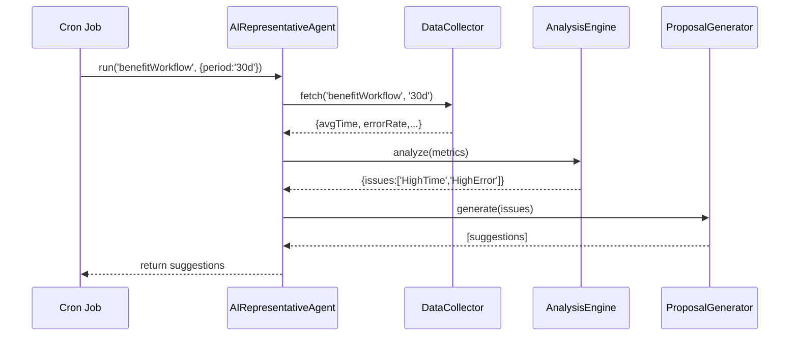

# Chapter 9: AI Representative Agent

In the last chapter we learned how to keep external systems in sync with [External System Sync](08_external_system_sync_.md). Now, let’s introduce an **AI Representative Agent**—our smart consultant that watches system data, spots inefficiencies, and proposes policy or workflow improvements.

---

## Why an AI Representative Agent?

Imagine a city council hiring a data-driven consultant. They hand over their service logs and ask:

> “Where should we focus our next improvements?”

The **AI Representative Agent** does that automatically. It:

- Gathers performance metrics and logs  
- Analyzes the data for bottlenecks or compliance gaps  
- Suggests optimizations (e.g., split a task, tighten a policy)  
- Continuously refines recommendations as new data arrives  

**Central Use Case**  
Your unemployment benefit workflow is slower than target. The agent reviews last month’s processing times and error rates, then recommends splitting document verification into parallel tasks to cut average wait time by 30%.

---

## Key Concepts

1. **Data Collector**  
   Fetches metrics (e.g. response times, error counts) from monitoring logs or databases.  
2. **Analysis Engine**  
   Examines metrics against thresholds or patterns to detect issues.  
3. **Proposal Generator**  
   Translates analysis into concrete suggestions or policy tweaks.  
4. **Feedback Loop**  
   Administrators review suggestions, accept them, and the agent learns from outcomes.

---

## 1. Using the AI Representative Agent

Here’s how you might call the agent in a script to audit the `benefitWorkflow` over the last 30 days:

```js
// scripts/runAgent.js
import AIRepAgent from '../agent/AIRepresentativeAgent'

async function audit() {
  const suggestions = await AIRepAgent.run('benefitWorkflow', { period: '30d' })
  console.log('🏗️  Improvement Proposals:', suggestions)
}

audit()
```

Explanation:  
- `run()` takes a `workflowId` and a config object (`period`).  
- Returns an array of human-readable suggestions:

  Example output:  
  [
    "High avg processing time: consider parallelizing document checks",
    "Error rate spiked in PaymentService: review retry policy"
  ]

---

## 2. What Happens Step-by-Step?



1. **Cron Job** triggers `run()`.  
2. **Data Collector** returns metrics.  
3. **Analysis Engine** identifies issues.  
4. **Proposal Generator** crafts improvement suggestions.  
5. Suggestions are returned for admin review.

---

## 3. Inside the Implementation

Let’s peek at the minimal code. All files are under an `agent/` folder.

### 3.1 AIRepresentativeAgent.js

```js
// agent/AIRepresentativeAgent.js
import DataCollector from './dataCollector'
import AnalysisEngine from './analysisEngine'
import ProposalGenerator from './proposalGenerator'

class AIRepresentativeAgent {
  async run(workflowId, opts) {
    const metrics = await DataCollector.fetch(workflowId, opts.period)
    const insights = AnalysisEngine.analyze(metrics)
    return ProposalGenerator.generate(insights)
  }
}

export default new AIRepresentativeAgent()
```

Explanation:  
- Orchestrates the three pieces: collect → analyze → propose.

---

### 3.2 dataCollector.js

```js
// agent/dataCollector.js
export default {
  async fetch(workflowId, period) {
    // In real life, query your monitoring DB or logs
    // Here we return a stubbed metric object
    return { avgTime: 1200, errorRate: 0.08 }
  }
}
```

Explanation:  
- Retrieves metrics for the given workflow and time window.

---

### 3.3 analysisEngine.js

```js
// agent/analysisEngine.js
export default {
  analyze({ avgTime, errorRate }) {
    const issues = []
    if (avgTime > 1000)     issues.push('HighProcessingTime')
    if (errorRate > 0.05)   issues.push('HighErrorRate')
    return { avgTime, errorRate, issues }
  }
}
```

Explanation:  
- Checks numeric thresholds and records any issue IDs.

---

### 3.4 proposalGenerator.js

```js
// agent/proposalGenerator.js
export default {
  generate({ issues }) {
    const suggestions = []
    if (issues.includes('HighProcessingTime'))
      suggestions.push(
        'Consider parallelizing document verification to reduce avgTime'
      )
    if (issues.includes('HighErrorRate'))
      suggestions.push(
        'Review PaymentService retry logic to lower error rates'
      )
    return suggestions
  }
}
```

Explanation:  
- Maps issue IDs to clear, actionable recommendations.

---

## Conclusion

In this chapter you learned how the **AI Representative Agent**:

- Autonomously gathers workflow data  
- Analyzes metrics against goals  
- Generates clear proposals for optimization  
- Provides a continuous improvement loop  

Next up, we’ll see how to let the AI agent drive **process changes directly** with [AI-Facilitated Process Optimization](10_ai_facilitated_process_optimization_.md).

---

Generated by [AI Codebase Knowledge Builder](https://github.com/The-Pocket/Tutorial-Codebase-Knowledge)