# Chapter 9: Backend API Gateway (HMS-API / HMS-MKT)


*(If you just finished reading about ethics checks, hop back to  
[Governance Layer (Ethics, Transparency, Safety)](08_governance_layer__ethics__transparency__safety__.md).)*  

---

## 1 · Why do we need a “single doorway”?

Picture the **National Agricultural Library (NAL)**. Three things happen at 9 a.m.:

1. A **Policy Drafter** publishes a new “dust-bowl prevention” grant rule.  
2. A **Mobile Farmer App** pulls today’s subsidy rates.  
3. An **External Auditor** downloads yesterday’s access logs.

Without a *single* point of entry, each micro-service (grants, finance, logs) would need its own security filters, rate-limits, and documentation—a spaghetti nightmare.

The **Backend API Gateway** (codename **HMS-API** for internal calls, **HMS-MKT** for external callers) fixes this. Think **TSA checkpoint**:

* One line, one badge check, one X-ray, **then** you can board any gate.

---

## 2 · Key concepts (plain English)

| Concept            | Airport Analogy | 1-Sentence Job |
|--------------------|-----------------|----------------|
| **Entry Portal**   | The front door | Accept the HTTP request. |
| **Auth Stamp**     | Passport check | Validate JWT / API-Key. |
| **Policy Stamp**   | Customs form   | Attach active governance policy IDs. |
| **Audit Envelope** | Baggage tag    | Log who, what, when. |
| **Router**         | Departure board| Send the request to the correct micro-service. |
| **Marketplace (HMS-MKT)** | Duty-free shop | Read-only facade + docs for outside agencies & vendors. |

---

## 3 · Central use-case: updating a subsidy rate

> “Let the **Colorado Farmer App** see the new \$600 wheat subsidy 30 seconds after the rule goes live.”

1. **Policy Editor** publishes the change (see [Policy Editor](04_policy_editor__rule_authoring_studio__.md)).  
2. Gateway stamps the outbound event with policy ID **PL-8732** and forwards it to **HMS-FIN** micro-service.  
3. External app calls `GET /mkt/subsidies?crop=wheat` and instantly sees `600`—all via the same doorway.

---

## 4 · How to call HMS-API / HMS-MKT (tiny examples)

### 4.1 Internal caller (UI, micro-service, or cron job)

```bash
curl -H "Authorization: Bearer $JWT" \
     -H "x-policy-id: PL-8732" \
     https://api.hms.gov/grants/42
```

*What happens?*  
• Gateway verifies the JWT, adds an audit line, and routes to **/grants** micro-service.

### 4.2 External caller (vendor app)

```bash
curl -H "x-api-key: $MARKET_KEY" \
     https://mkt.hms.gov/v1/subsidies?crop=wheat
```

*What happens?*  
• Marketplace layer checks the key, applies public-rate limits, then proxies to the same internal micro-service.

---

## 5 · A 15-line client helper

```js
// src/services/gateway.js
export async function callApi(path, opts = {}) {
  const headers = {
    'Authorization': 'Bearer ' + localStorage.getItem('jwt'),
    'x-policy-id'  : opts.policyId || 'unknown'
  }
  return fetch('/api' + path, { ...opts, headers })
}
```

Explanation:  
1. Reads JWT from local storage.  
2. Adds the optional `x-policy-id` header (great for audits).  
3. Sends the call to `/api`, which the dev server proxies to HMS-API.

---

## 6 · What happens inside? (step-by-step)

```mermaid
sequenceDiagram
    participant APP as App / Client
    participant GW  as HMS-API
    participant AUTH as Auth Svc
    participant GOV as Governance
    participant FIN as Finance Svc

    APP->>GW: GET /grants/42  (JWT)
    GW->>AUTH: validate token
    AUTH-->>GW: ✅
    GW->>GOV: attach policy + audit
    GW->>FIN: forward request
    FIN-->>GW: JSON data
    GW-->>APP: 200 OK
```



1. Gateway **validates** credentials.  
2. Wraps the call with governance stamps (see previous chapter).  
3. Routes to the proper micro-service and streams the response back.

---

## 7 · Peek into the gateway code (all ≤ 18 lines)

### 7.1 Express entry point

```js
// gateway/index.js
import express from 'express'
import { auth } from './middlewares/auth.js'
import { stamp } from './middlewares/stamp.js'
import { route } from './middlewares/route.js'

const app = express()
app.use(auth)      // ① verify JWT / API-Key
app.use(stamp)     // ② add policy + audit info
app.use(route)     // ③ forward to micro-service
app.listen(8080)
```

### 7.2 Auth middleware (simplified)

```js
// middlewares/auth.js
export const auth = (req, res, next) => {
  const jwt = req.headers.authorization?.split(' ')[1]
  const key = req.headers['x-api-key']
  if (verifyJwt(jwt) || verifyKey(key)) return next()
  return res.status(401).json({ error: 'Unauthorized' })
}
```

### 7.3 Stamp middleware

```js
// middlewares/stamp.js
import { log } from '../lib/audit.js'
export const stamp = (req, res, next) => {
  req.headers['x-stamped-by'] = 'HMS-GW'
  req.headers['x-audit-id']   = log(req)    // returns new audit row id
  next()
}
```

### 7.4 Router middleware

```js
// middlewares/route.js
const table = { '/grants': 'http://hms-fin:7000',
                '/schedules': 'http://hms-svc:7100' }

export const route = (req, res) => {
  const target = Object.keys(table)
                    .find(p => req.path.startsWith(p))
  if (!target) return res.status(404).end()

  req.pipe(fetch(table[target] + req.originalUrl, { method:req.method, headers:req.headers }))
     .then(r => r.body.pipe(res))
}
```

*(Real gateway adds retries, caching, and circuit-breakers, but the core idea fits in 18 lines.)*

---

## 8 · Marketplace layer (read-only facade)

HMS-MKT is **just** HMS-API with:

* A stricter `verifyKey` (checks vendor plan & quota).  
* Routes prefixed with `/v1/*` that map to GET-only upstream calls.  
* Auto-generated **OpenAPI** docs at `mkt.hms.gov/docs`.

Creating a new public endpoint = add one line to `table` and run `npm run docs`.

---

## 9 · Connecting dots to earlier chapters

* Governance stamps come from the checks in  
  [Governance Layer](08_governance_layer__ethics__transparency__safety__.md).  
* Publish events originate in the [Process Proposal Pipeline](06_process_proposal_pipeline_.md).  
* Role validation reuses the JWT model from  
  [Role-Based Access & Authorization Model](01_role_based_access___authorization_model_.md).  
* Downstream addresses (`hms-fin`, `hms-svc`, …) belong to the  
  [Microservices Mesh (HMS-SYS, HMS-SVC, HMS-ACH, etc.)](10_microservices_mesh__hms_sys__hms_svc__hms_ach__etc___.md).

---

## 10 · Mini exercise 🏋️‍♂️

1. Add a new internal route `/records` → `http://hms-rec:7200`.  
2. Call `callApi('/records?citizen=123')` from the front-end and see the JSON.  
3. Create a *public* marketplace alias `/v1/records/summary` (GET-only).  
4. Verify that using an invalid `x-api-key` returns **429 Too Many Requests** after 5 calls.

*(Skeleton solution in `exercises/09`.)*

---

## 11 · What we learned

You now know that **HMS-API / HMS-MKT**:

* Acts as the **single programmable doorway** for every internal and external request.  
* Stamps calls with **auth**, **policy IDs**, and **audit trails** automatically.  
* Requires only **3 tiny middlewares** to verify, stamp, and route.  

Next, we’ll step behind that doorway to see the **mini-cities** (micro-services) that actually do the work:  
[Microservices Mesh (HMS-SYS, HMS-SVC, HMS-ACH, etc.)](10_microservices_mesh__hms_sys__hms_svc__hms_ach__etc___.md)

Happy routing!

---

Generated by [AI Codebase Knowledge Builder](https://github.com/The-Pocket/Tutorial-Codebase-Knowledge)