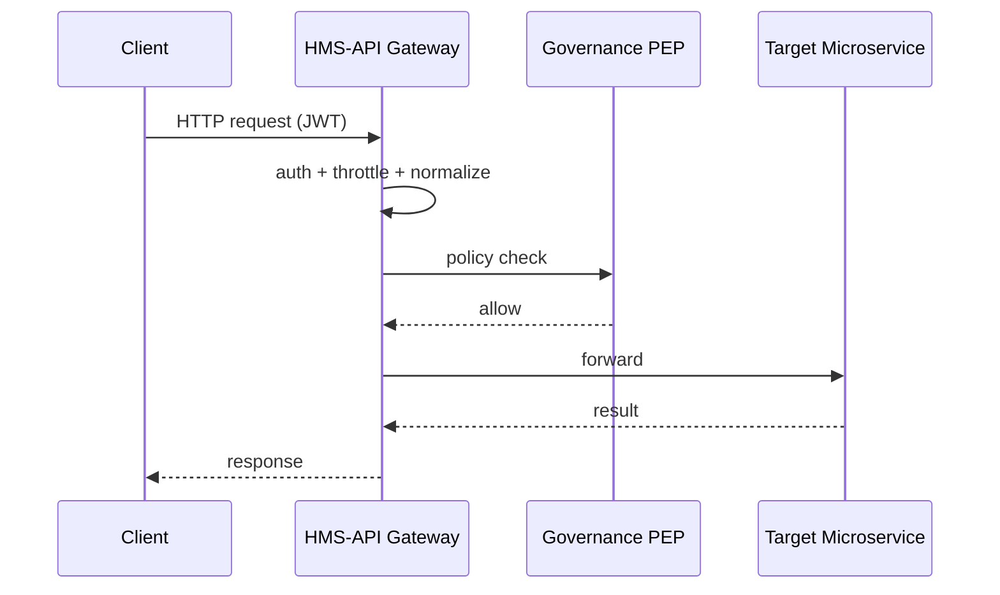

# Chapter 9: Backend API Gateway (HMS-API / HMS-SVC)

[⬅ Back to Chapter 8: Governance & Compliance Layer](08_governance___compliance_layer_.md)

---

## 0. Why Do We Need a “Customs Checkpoint” for APIs?

Imagine a Monday morning at the Department of Housing:

1. Alex (a citizen) uploads proof-of-income to check rent-relief eligibility.  
2. A city-approved **AI bot** requests 5 000 case files for trend analysis.  
3. A private bank pings HMS to validate a grant award before wiring funds.

Without a single gateway you get 👇  

```
Browser → random microservice
AI bot → another port
Bank   → maybe the same, maybe not
```

Chaos!  
HMS-API / HMS-SVC is the **one guarded door** each request must walk through, no matter who knocks.

```
Anything → HMS-API → (throttle, log, policy) → correct microservice
```

---

## 1. Key Concepts (Airport Analogy)

| Airport Analogy          | Gateway Concept            | Beginner-Friendly Explanation |
|--------------------------|----------------------------|--------------------------------|
| Immigration counter      | **Entry Point**            | All traffic first lands here.  |
| Passport scan            | **Auth Check**             | Verifies JWT from [Authorization & Identity Layer](03_authorization___identity_layer_.md). |
| Duty-free quota limits   | **Throttler**              | Stops one client from hogging bandwidth. |
| Customs declaration form | **Request Normalizer**     | Re-labels weird inputs into standard JSON. |
| Baggage carousel signs   | **Smart Router**           | Sends each request to the right microservice (payments, policy, etc.). |

Keep these five boxes in mind; everything else is plumbing.

---

## 2. Meet the Gateway in 10 Lines

Below is a **toy** Express server that already does three jobs:
`validate → throttle → route`.

```js
// gateway.js  (10-line version)
import express from "express";
import jwt from "jsonwebtoken";
import rateLimit from "express-rate-limit";
const app = express();

// 1) Auth Check
app.use((req, res, next) => {
  const tok = req.headers.authorization?.split(" ")[1];
  try { req.user = jwt.verify(tok, "SECRET"); next(); }
  catch { return res.status(401).json({ error: "bad token" }); }
});

// 2) Throttle: 60 requests / minute / IP
app.use(rateLimit({ windowMs: 60_000, max: 60 }));

// 3) Smart Route
app.use("/payments",  (r, s) => proxy("http://svc-pay",  r, s));
app.use("/policies",  (r, s) => proxy("http://svc-cur",  r, s));

app.listen(8080);
```

What you just saw:

1. Gateway checks the JWT (customs officer scans passport).  
2. Throttles flood attacks (one suitcase at a time).  
3. Forwards the request to the proper microservice conveyor belt.

---

## 3. Using the Gateway (Citizen & Partner Views)

### 3.1 Citizen Uploads Income Proof

```bash
curl -X POST https://api.gov.example/uploads \
     -H "Authorization: Bearer <alex_jwt>" \
     -F file=@income.pdf
```

What happens:

1. Gateway validates Alex’s JWT.  
2. Request normalized (`multipart → JSON meta + S3 presigned URL`).  
3. Routed to `HMS-DOC` microservice.  
4. Audit line written: `UPLOAD income.pdf by alex`.

### 3.2 Bank Validates Grant

```bash
curl "https://api.gov.example/grants/123/validate" \
     -H "Authorization: Bearer <bank_service_jwt>"
```

1. Rate-limit: 1 000 requests/min for partner orgs.  
2. Gateway calls `HMS-GRANT`.  
3. If payload contains SSN, Governance Layer (Chapter 8) double-checks privacy before response is returned.

---

## 4. What’s Happening Internally?



Only four hops, always in the same order—easy to reason about.

---

## 5. Inside the Gateway Folder (Mini Tour)

```
hms-api/
 ├─ index.js          # starts Express
 ├─ middleware/
 │   ├─ auth.js
 │   ├─ throttle.js
 │   ├─ normalize.js
 │   └─ logger.js
 └─ routes.js         # maps paths → microservice URL
```

### 5.1 Auth Middleware (auth.js – 10 lines)

```js
export default function auth(req, res, next) {
  try {
    const token = req.headers.authorization.split(" ")[1];
    req.user = jwt.verify(token, process.env.JWT_SECRET);
    next();
  } catch {
    res.status(401).json({ error: "invalid or expired token" });
  }
}
```

### 5.2 Logger (logger.js – 12 lines)

```js
import fs from "fs";
export default function logger(req, res, next) {
  const t = Date.now();
  res.on("finish", () => {
    const line = `${t} ${req.user?.sub||"anon"} ${req.method} ${req.path} ${res.statusCode}\n`;
    fs.appendFile("logs/gateway.log", line, ()=>{});
  });
  next();
}
```

Every request—good **or** blocked—is on record for auditors.

### 5.3 Routing Table (routes.js – 16 lines)

```js
import { createProxyMiddleware } from "http-proxy-middleware";
export default function (app) {
  const map = {
    "/payments": "http://svc-pay",  // HMS-ACH in Chapter 10
    "/policies": "http://svc-cur",  // Policy Module (Chapter 7)
    "/docs":     "http://svc-doc"   // Document Service
  };
  Object.entries(map).forEach(([path, target]) => {
    app.use(path, createProxyMiddleware({ target, changeOrigin: true }));
  });
}
```

Add a new microservice? One line in `map`—no front-end change needed.

---

## 6. How the Gateway Reinforces Compliance

Remember the **Governance & Compliance Layer**?  
The Gateway embeds its Policy Enforcement Point (PEP):

```
req → GW middlewares → GCL.validate() → next()
```

If GCL says **deny**, Gateway returns `403` and marks the log entry `BLOCKED_BY_GCL`.  
Zero extra code for each microservice.

---

## 7. Frequently Asked Questions

**Q 1: Is this just a reverse proxy?**  
Partly, but with extra brains: auth, throttling, normalization, compliance hooks, and metrics.

**Q 2: Does it slow everything down?**  
Typical overhead ≈ 3 ms/request. You can run multiple gateway pods behind a load balancer.

**Q 3: Can external partners have different limits?**  
Yes—rate-limit middleware reads `req.user.org` scope and loads org-specific quotas from Redis.

**Q 4: What about WebSockets or gRPC?**  
Same pattern: upgrade the connection in Express or use Envoy/Nginx as a sidecar; the auth token and PEP stay identical.

---

## 8. Recap

Today you:

✓ Saw why HMS-API / HMS-SVC is the **single guarded door** for all traffic.  
✓ Built a 10-line gateway that authenticates, throttles, logs, and routes.  
✓ Learned how it plugs into the Governance & Compliance Layer for automatic policy checks.  
✓ Added or changed microservices by editing one routing table line—no client changes!

Next your requests will reach a **mesh of specialized microservices** safely.  
Let’s open that toolbox in [Microservices Architecture Mesh](10_microservices_architecture_mesh_.md) ➡

---

---

Generated by [AI Codebase Knowledge Builder](https://github.com/The-Pocket/Tutorial-Codebase-Knowledge)