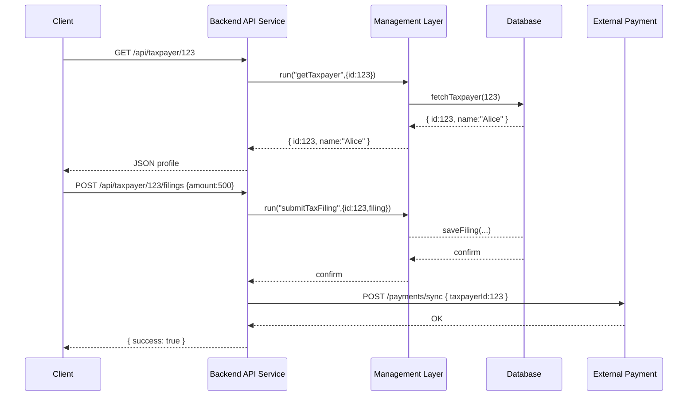

# Chapter 9: Backend API Service

In [Chapter 8: Management Layer](08_management_layer_.md) we learned how to orchestrate multi-step workflows across services. Now it’s time to build the **Backend API Service**—our “post office sorting center” that exposes HTTP endpoints, routes requests to the right workflows, reads/writes data, and connects to external systems.

---

## Why a Backend API Service?

Imagine the Federal Revenue Service needs to:

- Let a front-end portal **fetch** taxpayer profiles.  
- **Submit** new tax filings and trigger audit workflows.  
- **Sync** filing data with an external payment processor.

Instead of each portal talking directly to every microservice, we build one Backend API Service. It:

1. Defines **endpoints** (e.g., `GET /api/taxpayer/:id`)  
2. Hosts **handlers** that call workflows in the [Management Layer](08_management_layer_.md)  
3. Applies common **middleware** (auth, logging, errors)  
4. Connects to **databases** or **external systems**

Just like a sorting center, it receives letters (HTTP requests), reads the address (route), and dispatches them to the correct destination.

---

## Key Concepts

1. **Routes & Endpoints**  
   HTTP paths (GET, POST) that clients call.

2. **Controllers / Handlers**  
   Functions tied to each route—these invoke workflows, read/write data, or call external systems.

3. **Middleware**  
   Shared logic for authentication, request logging, and error handling.

4. **Service Clients**  
   Thin wrappers to talk to other layers (Management Layer, external APIs).

---

## Example: Building Taxpayer Endpoints

Below is a minimal Express setup:

File: `src/backend-api/app.js`

```js
const express = require('express');
const bodyParser = require('body-parser');
const logger = require('./middleware/logger');
const taxRoutes = require('./routes/taxRoutes');

const app = express();
app.use(bodyParser.json());
app.use(logger);                    // apply logging middleware
app.use('/api/taxpayer', taxRoutes);// mount our tax routes
app.listen(3000, () => console.log('API Service running on port 3000'));
```

*Explanation:*  
- We parse JSON bodies.  
- We log every request.  
- We mount routes under `/api/taxpayer`.

---

File: `src/backend-api/routes/taxRoutes.js`

```js
const express = require('express');
const { getProfile, submitFiling } = require('../controllers/taxController');
const router = express.Router();

router.get('/:id', getProfile);        // GET /api/taxpayer/123
router.post('/:id/filings', submitFiling); // POST /api/taxpayer/123/filings
module.exports = router;
```

*Explanation:*  
- Two endpoints: one to fetch a profile, one to submit a filing.

---

File: `src/backend-api/controllers/taxController.js`

```js
const workflow = require('../services/workflowClient');
const externalSync = require('../services/externalSync');

async function getProfile(req, res) {
  const data = await workflow.run('getTaxpayer', { id: req.params.id });
  res.json(data);
}

async function submitFiling(req, res) {
  await workflow.run('submitTaxFiling', { 
    id: req.params.id, 
    filing: req.body 
  });
  await externalSync.syncWithPaymentProcessor(req.params.id, req.body);
  res.json({ success: true });
}

module.exports = { getProfile, submitFiling };
```

*Explanation:*  
- `getProfile` calls the [Management Layer](08_management_layer_.md) workflow `getTaxpayer`.  
- `submitFiling` triggers `submitTaxFiling` then syncs with an external payment system.

---

## Step-by-Step Flow



---

## Inside the Backend API Service

### 1. Logger Middleware

File: `src/backend-api/middleware/logger.js`

```js
function logger(req, res, next) {
  console.log(`${new Date().toISOString()} ${req.method} ${req.url}`);
  next();
}
module.exports = logger;
```

*Explanation:* logs each request with timestamp, method, and URL.

### 2. Workflow Client

File: `src/backend-api/services/workflowClient.js`

```js
const fetch = require('node-fetch');

async function run(name, payload) {
  const res = await fetch(`http://management/${name}`, {
    method: 'POST',
    body: JSON.stringify(payload),
    headers: {'Content-Type':'application/json'}
  });
  return res.json();
}
module.exports = { run };
```

*Explanation:* calls the [Management Layer](08_management_layer_.md) service to execute a named workflow.

### 3. External Sync Service

File: `src/backend-api/services/externalSync.js`

```js
const fetch = require('node-fetch');

async function syncWithPaymentProcessor(id, filing) {
  await fetch('https://irs.example.gov/payments/sync', {
    method: 'POST',
    body: JSON.stringify({ taxpayerId: id, amount: filing.amount }),
    headers:{ 'Content-Type':'application/json' }
  });
}

module.exports = { syncWithPaymentProcessor };
```

*Explanation:* posts filing data to an external payment processor.

---

## Summary

In this chapter you learned how to build the **Backend API Service**:

- Defined **endpoints** and **routes** in Express.  
- Wrote **controllers** that call workflows in the [Management Layer](08_management_layer_.md).  
- Added **middleware** for logging.  
- Connected to external systems (IRS payment sync).  

This "sorting center" makes it easy for UI portals and other clients to perform read/write operations, trigger orchestration, and integrate with outside services.

Up next is how all these services communicate in a dynamic network in the [Microservices Mesh](10_microservices_mesh_.md).

---

Generated by [AI Codebase Knowledge Builder](https://github.com/The-Pocket/Tutorial-Codebase-Knowledge)