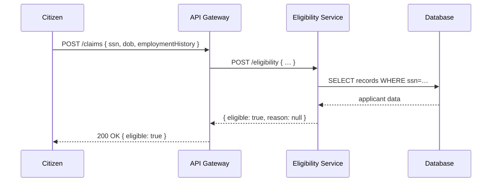

# Chapter 9: Backend Services (HMS-SVC)

Continuing from [Chapter 8: AI Agents (HMS-A2A)](08_ai_agents__hms_a2a__.md), we now turn to **Backend Services (HMS-SVC)**—the modular microservices that implement domain-specific logic like case processing, eligibility checks, or audit logging. Think of each one as a specialized federal office (for example, FDA’s inspection scheduling) that communicates over APIs and scales on its own.

---

## Why Backend Services?

Imagine you run an **Unemployment Benefits** application:

1. A citizen submits a claim through the portal.  
2. The system must check eligibility, calculate payment, and record an audit trail.  
3. Each of these steps is its own microservice:
   - **Eligibility Service**  
   - **Payment Calculator Service**  
   - **Audit Logging Service**  

Breaking logic into small, focused services makes it easier to develop, test, and scale each part independently.  

---

## Central Use Case: Checking Eligibility

1. Citizen portal calls `POST /claims` on the API Gateway.  
2. Gateway routes to **Eligibility Service** (HMS-SVC).  
3. Service looks up applicant data, applies rules, and returns `{ eligible: true }`.  
4. Gateway passes that response back to the portal.  



---

## Key Concepts

- **Domain Focus**  
  Each microservice solves one problem (eligibility, scheduling, logging).
- **API Contract**  
  Services expose a simple HTTP or gRPC interface (input JSON → output JSON).
- **Independent Scaling**  
  You can run more instances of a busy service without touching others.
- **Loose Coupling**  
  Services talk over stable, versioned APIs; internals stay private.
- **Observability**  
  Each service has its own logs and metrics, making troubleshooting easier.

---

## Using HMS-SVC to Solve the Use Case

Let’s create the **Eligibility Service** in Node.js with Express.  

```js
// eligibility-service/index.js
import express from 'express';
import { checkEligibility } from './service.js';

const app = express();
app.use(express.json());

app.post('/eligibility', async (req, res) => {
  const result = await checkEligibility(req.body);
  res.json(result);
});

app.listen(3001, () => console.log('Eligibility Service on 3001'));
```

This code:
- Defines a POST endpoint `/eligibility`.  
- Calls `checkEligibility()` with the request body.  
- Returns `{ eligible: true/false, reason }` as JSON.

---

## Inside the Eligibility Logic

```js
// eligibility-service/service.js
import { getApplicant } from './database.js';

export async function checkEligibility({ ssn, dob }) {
  const applicant = await getApplicant(ssn);
  // Simple rule: at least 1 year employed
  if (applicant.yearsEmployed >= 1) {
    return { eligible: true, reason: null };
  }
  return { eligible: false, reason: 'Less than 1 year employed' };
}
```

Explanation:
- `getApplicant()` fetches data from a DB.  
- We apply a simple rule and return the outcome.

```js
// eligibility-service/database.js
export async function getApplicant(ssn) {
  // Imagine this queries a real database
  return { ssn, yearsEmployed: 2 };
}
```

---

## Deployment & Scaling

Each Backend Service:
- Lives in its own repo or folder (e.g., `/eligibility-service`).  
- Runs in a container or VM.  
- Registers with [Core Infrastructure (HMS-SYS)](05_core_infrastructure__hms_sys__.md) for discovery and config.  
- Exposes a health check (e.g., `GET /health`) for the management layer or orchestrator.  

When traffic grows, you simply increase the number of instances for that one service.

---

## Analogy

Think of a city government:
- A **Building Permit Office** handles permits.  
- A **Tax Assessment Office** handles valuations.  
- An **Inspection Scheduling Office** arranges inspections.  

Each office has its own staff and phone number. You call the right office for your specific need. HMS-SVC organizes your code the same way.

---

## Conclusion

In this chapter you learned:
- What **Backend Services (HMS-SVC)** are and why they matter  
- A concrete eligibility-check use case  
- How to build a tiny Express service with domain logic  
- The internal flow and file structure for a microservice  
- How independent scaling and clear APIs simplify operations  

Next up: handling money flows and payments in **[Chapter 10: Financial Systems (HMS-ACH)](10_financial_systems__hms_ach__.md)**.

---

Generated by [AI Codebase Knowledge Builder](https://github.com/The-Pocket/Tutorial-Codebase-Knowledge)