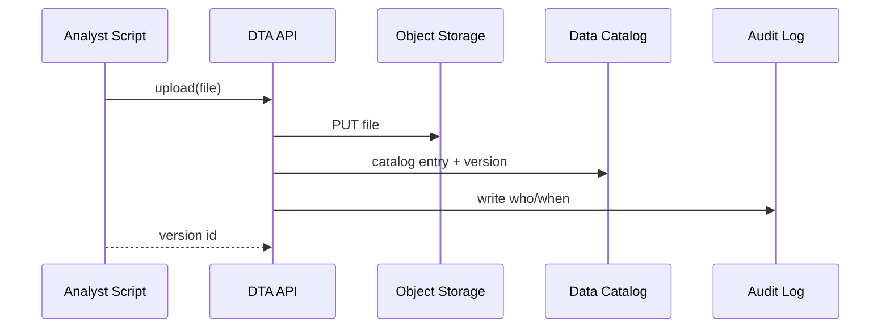
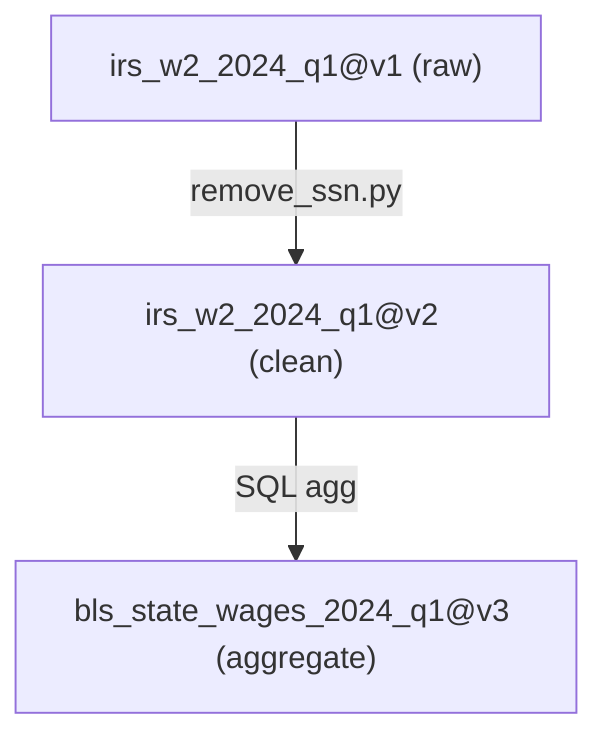

# Chapter 9: Central Data Repository (HMS-DTA)

*(continuing from [Chapter 8: External System Sync](08_external_system_sync_.md))*  

---

## 1. Why Do We Need HMS-DTA?

Imagine the Bureau of Labor Statistics (BLS) preparing tomorrow’s **“Monthly Employment Situation”** press release.

Data sources they need—in less than 6 hours:

* Payroll numbers from Department of Labor (arriving via [External System Sync](08_external_system_sync_.md)).  
* Withholding tax tallies from IRS (arriving via [Inter-Agency Data Exchange](07_inter_agency_data_exchange__hms_a2a__.md)).  
* New demographic adjustments from the Census Bureau.

Without a single “source of truth,” every analyst must:

1. Dig through shared drives named `final_FINAL_reallyfinal.xlsx`.  
2. Re-write ETL scripts to stitch columns together.  
3. Pray nobody overwrote last month’s corrections.

**HMS-DTA** is the **National Archives plus a high-speed analytics lab**:

• Stores *all* datasets—raw and processed—in one place.  
• Keeps **immutable versions** so nobody can silently change history.  
• Tracks **lineage** (“this table came from IRS file #17, cleaned by script `clean.py`”).  
• Bakes in **privacy tiers** so interns can’t see SSNs, but senior statisticians can.

Result: analysts pull *trustworthy* numbers with one line of code, instead of reinventing ETL at midnight.

---

## 2. Key Concepts (Plain English)

| Term | Friendly Description |
|------|----------------------|
| **Bucket** | Folder group: *raw*, *clean*, *aggregate*, *archive*. |
| **Dataset** | A named collection of files that belong together (e.g., “IRS W-2 2024-Q1”). |
| **Version** | A frozen snapshot (v1, v2 …). Older versions are read-only. |
| **Lineage Graph** | A flow-chart showing which versions and scripts produced today’s table. |
| **Privacy Tier** | Labels like *PUBLIC*, *PII-SAFE*, *RESTRICTED*. |
| **Data Catalog** | Searchable index: title, description, owner, schema, latest version id. |

Think “Git for data” with built-in privacy locks.

---

## 3. Five-Minute Walking Tour – From Upload to Query

We’ll walk through BLS importing IRS data, scrubbing PII, then sharing an aggregate view.

### 3.1. Install & Connect

```python
pip install hms-dta
```

```python
# file: bls_demo.py
from hms_dta import DTA

dta = DTA(url="http://localhost:7777", token="alice@bls.gov")
```

### 3.2. Upload Raw Data (Version 1)

```python
v1 = dta.upload(
    name       ="irs_w2_2024_q1",
    bucket     ="raw",
    file_path  ="w2_q1.csv",
    privacy    ="RESTRICTED",
    note       ="Straight from IRS A2A pouch"
)
print(v1)       # --> 'irs_w2_2024_q1@v1'
```

Explanation  
• File lands in the *raw* bucket.  
• Catalog entry `irs_w2_2024_q1@v1` is immutable.

### 3.3. Create a Cleaned Version (Version 2)

```python
v2 = dta.transform(
    source_version="irs_w2_2024_q1@v1",
    script        ="scripts/remove_ssn.py",
    target_bucket ="clean",
    privacy       ="PII-SAFE",
    note          ="Dropped SSN column"
)
print(v2)       # --> 'irs_w2_2024_q1@v2'
```

Behind the scenes HMS-DTA:

1. Runs `remove_ssn.py` inside a sandbox.  
2. Saves output in the *clean* bucket.  
3. Links v2’s lineage to v1 + script hash.

### 3.4. Publish an Aggregate Table (Version 3)

```python
v3 = dta.aggregate(
    source_versions=["irs_w2_2024_q1@v2"],
    sql="SELECT state, SUM(wages) AS wages FROM input GROUP BY state",
    target_name="bls_state_wages_2024_q1",
    note="State totals for employment report"
)
```

Now any analyst can:

```python
df = dta.read("bls_state_wages_2024_q1@latest")
```

…and immediately chart wages per state. No ETL scripts required!

---

## 4. What Happens Under the Hood?



Same pattern repeats for `transform()` and `aggregate()`, each time linking **lineage** in the catalog.

---

## 5. Inside the Code (Super Light)

### 5.1. Version Manager (18 lines)

```python
# hms_dta/version.py
import time, hashlib

class VersionMgr:
    def __init__(self):
        self.store = {}        # {(name, ver): meta}

    def new(self, name, bucket, note, parent=None):
        ver = 1 + max([v for (n,v) in self.store if n==name] or [0])
        key = (name, ver)
        self.store[key] = {
            "bucket": bucket,
            "note": note,
            "parent": parent,
            "ts": time.time(),
            "hash": hashlib.sha256(f"{name}{ver}".encode()).hexdigest()
        }
        return f"{name}@v{ver}"
```

• Calculates next version number.  
• Stores minimal metadata including a content hash for tamper detection.

### 5.2. Lineage Recorder (10 lines)

```python
# hms_dta/lineage.py
GRAPH = []   # list of edges (child -> parent)

def link(child, parent, process):
    GRAPH.append({"from": parent, "to": child, "via": process})
```

Every transform or aggregate just calls `link()` once per parent.

### 5.3. Privacy Gate (12 lines)

```python
# hms_dta/security.py
RULES = {"PUBLIC":0, "PII-SAFE":1, "RESTRICTED":2}

def can_access(user_clearance, dataset_privacy):
    return RULES[user_clearance] >= RULES[dataset_privacy]
```

If an intern with `PUBLIC` clearance tries to read `PII-SAFE` data, HMS-DTA rejects the request before hitting storage.

---

## 6. Visualizing Lineage



*One glance* shows exactly where today’s numbers came from.

---

## 7. Frequently Asked Questions

**Q1: Where are the bytes actually stored?**  
By default in an S3-compatible object store (`minio://hms-dta/`). You can point to AWS S3, Azure Blob, or on-prem Ceph.

**Q2: Can I delete a mistaken upload?**  
You can **deprecate** a version (so it’s hidden), but bytes stay for audit—same philosophy as [Governance Layer](01_governance_layer__hms_gov__.md).

**Q3: Does HMS-DTA replace a data warehouse?**  
No. It’s a **repository + catalog + lineage tracker**. You can still point Redshift/BigQuery at the files for heavy SQL, or feed them into the [Process Optimization Pipeline](11_process_optimization_pipeline_.md).

**Q4: How does privacy tiering integrate with FOIA?**  
FOIA officers can export only *PUBLIC* versions automatically; higher tiers require HITL approval per [Human-in-the-Loop Oversight](15_human_in_the_loop_oversight__hitl__.md).

---

## 8. Mini Challenge (Optional)

1. Add a new column **“gender”** to `w2_q1.csv` and re-upload.  
2. Use `transform()` to hash the gender values (`sha256(gender)`).  
3. Compare lineage graphs of the two branches—see how HMS-DTA keeps both paths clear.

---

## 9. What We Learned

• HMS-DTA is the **single, immutable library** for all raw, clean, and aggregated datasets.  
• **Versions** prevent silent history edits; **lineage** explains every number in tomorrow’s press release.  
• Built-in **privacy tiers** and **audit logs** keep data sharing safe and FOIA-ready.

Ready to watch this data (and every other service) in real-time dashboards? Jump to [Chapter 10: Operational Monitoring & Telemetry (HMS-OPS)](10_operational_monitoring___telemetry__hms_ops__.md).

---

Generated by [AI Codebase Knowledge Builder](https://github.com/The-Pocket/Tutorial-Codebase-Knowledge)