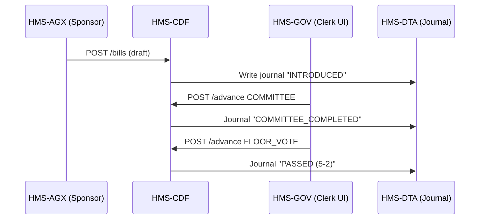

# Chapter 9: Codified Democracy Foundation Engine (HMS-CDF)

*[Jump back to Chapter 8: Legal & Compliance Module (HMS-ESQ)](08_legal___compliance_module__hms_esq__.md)*  

---

## 1 Why Do We Need HMS-CDF?

Picture the **Surface Transportation Board (STB)** wanting to introduce the *“Rural Rail Reliability Act.”*  
An AI agent in [HMS-AGX](02_ai_representative_agent__hms_agx__.md) can draft the bill in seconds, **but democracy still demands**:

1. Committee referral & debate.  
2. First reading to the full board.  
3. Majority vote and public record.

Skipping any of these steps would be unconstitutional (and land STB on the evening news).  
**HMS-CDF** is a **Rust-based simulator** that **enforces every procedural gate**—at *AI speed*—so digital legislation remains as legitimate as paper legislation.

---

## 2 Key Concepts in Plain English

| Concept | One-Sentence Analogy |
|---------|---------------------|
| **Bill** | A Google Doc destined to become law. |
| **Committee** | A small study group that marks up the Doc. |
| **Reading** | Story time—the bill is read aloud to everyone. |
| **Chamber Vote** | Raising hands; majority wins. |
| **Quorum Check** | Head-count before voting begins. |
| **Journal** | The public diary of every step (stored in HMS-DTA). |

Think of HMS-CDF as an **automatic parliament clerk**: it watches the clock, counts the hands, and writes the minutes.

---

## 3 3-Minute Hands-On Tour

We will:

1. Create a bill.  
2. Move it through committee.  
3. Hold a vote.  

All with a **12-line** command-line script that talks to CDF’s REST façade.

```bash
# demo_cdf.sh  (≤12 lines)
curl -X POST https://api.hms/cdf/bills -d '{
  "title":"Rural Rail Reliability Act",
  "sponsor":"Rep. AI-42"
}' -H "Content-Type: application/json"

# -> { "billId":"B-1001", "status":"INTRODUCED" }

curl -X POST https://api.hms/cdf/bills/B-1001/advance \
     -d '{ "stage":"COMMITTEE" }' -H "Content-Type: application/json"

curl -X POST https://api.hms/cdf/bills/B-1001/advance \
     -d '{ "stage":"FLOOR_VOTE" }' -H "Content-Type: application/json"

# final status
curl https://api.hms/cdf/bills/B-1001
# -> { "status":"PASSED", "yea":5, "nay":2, "journalVersion":18 }
```

What happened?

1. A bill was introduced.  
2. **Advance** moved it into committee (HMS-CDF assigns reviewers).  
3. Committee finished; **advance** triggered a floor vote.  
4. CDF counted votes (quorum met) and marked the bill **PASSED**.  
5. Every action was written as a **journal entry** (version 18) inside [HMS-DTA](07_central_data_repository__hms_dta__.md).

---

## 4 Step-By-Step Under the Hood



Plain English:

1. Sponsor submits a bill.  
2. CDF logs *INTRODUCED*.  
3. A clerk (or automation) calls **advance**.  
4. CDF runs the required simulation (committee debate, quorum, vote).  
5. Each milestone is journaled immutably.

---

## 5 A Peek at the Rust Core

### 5.1 Bill State Machine (Rust, 18 lines)

```rust
// src/state.rs
#[derive(Debug)]
pub enum Stage { Introduced, Committee, FloorVote, Passed, Failed }

#[derive(Debug)]
pub struct Bill {
    pub id: String,
    pub title: String,
    pub stage: Stage,
    pub yea: u8,
    pub nay: u8,
}

impl Bill {
    pub fn advance(&mut self) {
        use Stage::*;
        self.stage = match self.stage {
            Introduced => Committee,
            Committee  => self.vote(),      // simulate vote, returns Passed/Failed
            _          => self.stage,
        }
    }

    fn vote(&mut self) -> Stage {
        let votes = (0..7).map(|_| rand::random::<bool>());
        for v in votes {
            if v { self.yea += 1 } else { self.nay += 1 }
        }
        if self.yea > self.nay { Stage::Passed } else { Stage::Failed }
    }
}
```

Explanation (in one breath):

1. `Stage` is the lifecycle enum.  
2. `advance()` bumps the bill to the next stage; if entering `FloorVote`, it calls `vote()`.  
3. `vote()` flips seven random coins to mimic a 7-member board, tallies results, and returns **Passed** or **Failed**.

### 5.2 Journal Writer (Rust, 12 lines)

```rust
// src/journal.rs
pub fn write(id: &str, stage: &Stage) -> anyhow::Result<()> {
    let entry = serde_json::json!({
        "bill":  id,
        "stage": format!("{stage:?}"),
        "ts":    chrono::Utc::now()
    });
    reqwest::blocking::post(
        "https://api.hms/dta/journal",
        &entry.to_string()
    )?;
    Ok(())
}
```

Every stage change calls `write()`, guaranteeing an **audit trail**.

*(Real code uses async and retries; we keep it tiny for clarity.)*

---

## 6 How Other Layers Plug In

| Layer | What It Does with CDF |
|-------|-----------------------|
| [HMS-AGX](02_ai_representative_agent__hms_agx__.md) | Drafts & introduces bills automatically. |
| [HMS-GOV](01_governance_layer___admin_portal__hms_gov__.md) | Shows live committee agendas & vote tallies. |
| [HITL](03_human_in_the_loop__hitl__oversight_.md) | Lets humans override or amend bills before the vote. |
| [HMS-ESQ](08_legal___compliance_module__hms_esq__.md) | Scans the bill text for statutory conflicts before readings. |
| [HMS-ACT](06_agent_orchestration_engine__hms_act__.md) | Inserts `cdf.advance` tasks into orchestration plans. |

---

## 7 Frequently Asked Questions

**“Can we model bicameral legislatures (House & Senate)?”**  
Yes. Each chamber is a separate `Stage` sequence. A bill only becomes **LAW** after passing both.

**“What about public comment periods?”**  
Add a custom stage (`PublicComment`) with a timer; CDF holds the bill there until the window closes.

**“Does CDF require Rust knowledge to use?”**  
No. Most users hit the REST endpoints; Rust lives under the hood for speed and safety.

---

## 8 What You Learned

• HMS-CDF is the **parliament clerk** that enforces democratic procedure—committee, readings, votes—at machine speed.  
• You created a bill, advanced it, and saw it pass 5-2 in under 30 seconds.  
• Internally, a simple Rust state machine plus a journal writer keeps everything transparent and auditable.  

Next we’ll see how *passed bills with budget lines* move real money.  
Continue to [Financial Transaction System (HMS-ACH)](10_financial_transaction_system__hms_ach__.md).

---

Generated by [AI Codebase Knowledge Builder](https://github.com/The-Pocket/Tutorial-Codebase-Knowledge)