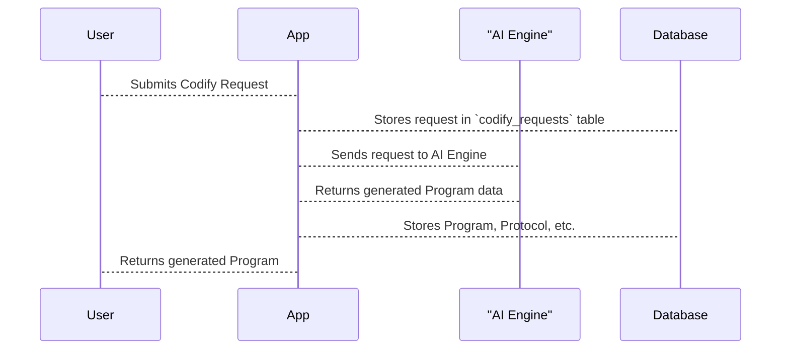

# Chapter 9: Codify Requests

In the previous chapter, [Tenants](08_tenants.md), we learned how to separate different organizations using the same platform. Now, let's explore how users actually tell the system what they want to build. This is where *Codify Requests* come in.

Imagine Alice, our yoga enthusiast, wants the system to generate a new "Morning Yoga" [Program](02_programs.md) for her.  She has specific requirements: it should be 30 minutes long, focus on flexibility, and include sun salutations. How does she communicate these requirements to the AI?  Through a Codify Request.

## What is a Codify Request?

A Codify Request is like a detailed order ticket for the AI. It's how users submit their goals and requirements for AI-powered program generation. It's like giving the AI chef a list of ingredients and dietary restrictions to create a custom recipe.

## Key Concepts in a Codify Request

* **User:** The [User](01_users.md) making the request (Alice in our example).
* **Goal:** The overall objective (e.g., "A 30-minute morning yoga routine").
* **Requirements:** Specific details about the desired program (e.g., "Focus on flexibility," "Include sun salutations").
* **Progress:**  The current status of the request (e.g., submitted, processing, completed).

## Creating a Codify Request

Let's see how Alice submits her request for a "Morning Yoga" program.

```php
// File: app/Http/Controllers/CodifyController.php (Simplified)

use App\Models\Core\Protocol\CodifyRequest;

$request = CodifyRequest::create([
    'user_id' => 1, // Alice's User ID
    'codify' => '30-minute morning yoga routine focused on flexibility with sun salutations', // Alice's request
    // ... other fields ...
]);
```

This code creates a new entry in the `codify_requests` table.  The `codify` field stores Alice's request details.  We're simplifying other fields like `file` and `session_key` for now.

## Processing a Codify Request

Once Alice submits her request, the system processes it.  This involves analyzing the request, generating the [Program](02_programs.md), and potentially creating the associated [Protocol](03_protocols.md), [Protocol Chains](05_protocol_chains.md), and [Protocol Modules](06_protocol_modules.md).

## Under the Hood

Here's a simplified sequence diagram showing what happens when Alice submits a Codify Request:



The `codify_requests` table stores the request information.  The `CreateCodifyRequestsTable` migration file defines the structure of this table.

```php
// File: migrations/2024_03_08_103344_create_codify_requests_table.php
// ... code to create the codify_requests table ...
```

Other migration files, like `ExtendCodifyRequestsTable`, add more columns to the table as needed, such as tracking the `request_id`, `successfully` status, and any error `message`.

```php
// File: migrations/2024_09_09_101454_extend_codify_requests_table.php
// ... code to add more fields ...
```

The `codify_wizard_programs` table stores the generated [Program](02_programs.md) information linked to the Codify Request.

```php
// File: migrations/2024_10_09_091901_create_codify_wizard_programs_table.php
// ... code to create the codify_wizard_programs table ...
```


## Conclusion

In this chapter, we learned about Codify Requests, which are how users submit their requirements for AI-powered program generation. We saw how Codify Requests are created and processed. In the next chapter, we'll explore [AI Prompts](10_ai_prompts.md), which are the specific instructions sent to the AI engine.


---

Generated by [AI Codebase Knowledge Builder](https://github.com/The-Pocket/Tutorial-Codebase-Knowledge)