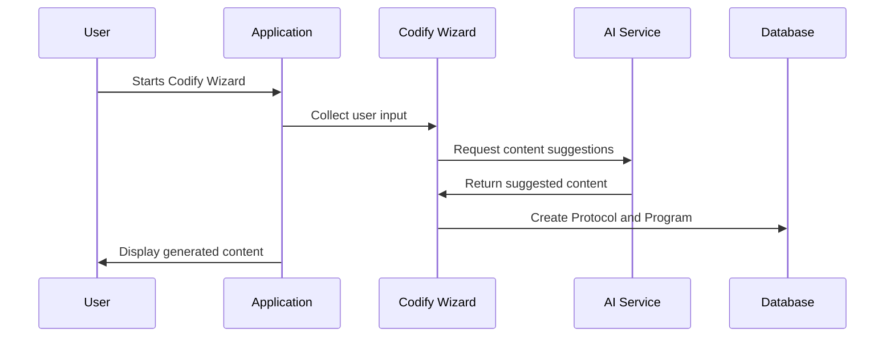

# Chapter 9: Codify Wizard

In the previous chapter, [Google Calendar Integration](08_google_calendar_integration.md), we learned how to connect user calendars to schedule program-related events. This chapter introduces the Codify Wizard, a powerful tool that simplifies the process of creating [Protocols](03_protocol.md) and [Programs](02_program.md) by guiding users through a series of questions and using AI to generate content.

## What is the Codify Wizard?

Imagine you want to create a new online course, but you're not sure where to start.  The Codify Wizard acts like a personal assistant, asking you questions about your course topic, target audience, and desired outcomes.  It then uses this information to generate a [Protocol](03_protocol.md) with suggested [Tasks](04_task.md) and [Modules](05_module.md), saving you time and effort.

## Key Concepts

* **Guided Process:** The wizard breaks down the complex process of creating a [Protocol](03_protocol.md) into smaller, manageable steps.
* **AI-Powered Content Generation:** The wizard uses AI to suggest relevant content for your [Protocol](03_protocol.md), based on your answers to the wizard's questions.
* **Customization:**  You can further customize the generated [Protocol](03_protocol.md) and [Program](02_program.md) to fit your specific needs.

## Using the Codify Wizard

Let's say you want to create a "Beginner's Photography Course."  You would start the Codify Wizard and answer questions like:

* What is the goal of this course? (e.g., "Teach students the basics of photography")
* Who is your target audience? (e.g., "Beginners with no prior experience")
* What topics do you want to cover? (e.g., "Camera settings, composition, lighting")

Based on your answers, the Codify Wizard might generate a [Protocol](03_protocol.md) with suggested [Tasks](04_task.md) like:

* "Watch introductory video on camera settings"
* "Complete a quiz on composition"
* "Practice taking photos in different lighting conditions"

```php
// Simplified example of starting the Codify Wizard
$codifyWizard = new CodifyWizardProgram();
$requestData = [
    'goal' => 'Teach students the basics of photography',
    // ... other user inputs ...
];
$result = $codifyWizard->codifyProgram($requestData);

// ... handle the $result, which might contain a status update ...
```

This simplified code snippet demonstrates starting the codify process. The `codifyProgram` method handles the initial steps of the wizard, including saving user input and initiating the AI-powered content generation process.

## Under the Hood

The Codify Wizard interacts with several models and services to create and manage the [Protocol](03_protocol.md) and [Program](02_program.md).



### Internal Implementation

The `CodifyWizardProgram` model (located in `app/Models/Core/Wizard/CodifyWizardProgram.php`) orchestrates the codify process.  It interacts with the `CodifyRequest` model to store user input and track the progress of the AI content generation.

```php
// Inside the CodifyWizardProgram model (simplified codifyProgram method)
public function codifyProgram(array $requestData)
{
    // ... other code ...

    // Dispatch a job to generate the protocol content
    CodifyRequestJob::dispatch($codifyRequest);

    // ... other code ...
}
```

This simplified code snippet shows how the `codifyProgram` method dispatches a job to handle the AI-powered content generation. The `CodifyWizardUserProgram` model (located in `app/Models/Core/Wizard/CodifyWizardUserProgram.php`) manages the user's progress through the wizard.  It tracks the current step and stores any relevant data.

```php
// Inside the CodifyWizardUserProgram model (simplified getCurrentState method)
public function getCurrentState(Protocol $protocol)
{
    // ... other code to retrieve the current state ...
}
```

This simplified code snippet shows how the `getCurrentState` method retrieves the user's current progress in the Codify Wizard. The `CodifyWizardProtocolInvite` model (located in `app/Models/Core/Wizard/CodifyWizardProtocolInvite.php`) manages invitations to collaborate on the generated [Protocol](03_protocol.md).

## Conclusion

In this chapter, we explored the Codify Wizard, a powerful tool that simplifies the creation of [Protocols](03_protocol.md) and [Programs](02_program.md). We learned about its key concepts and how it leverages AI to generate content. This concludes our tutorial.  We hope you found it helpful in understanding the core concepts of our application.


---

Generated by [AI Codebase Knowledge Builder](https://github.com/The-Pocket/Tutorial-Codebase-Knowledge)