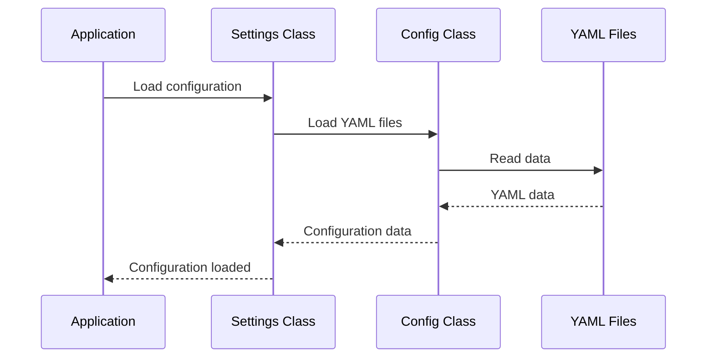

# Chapter 9: Configuration (config)

Coming from learning about the [Hydra BPM Widget (HBW)](08_hydra_bpm_widget__hbw_.md), let's now explore how we customize HMS-OMS to fit our specific needs.  Imagine our online store wants to add a new "Salad Order" [Order Type](03_order_type.md).  We need a way to tell HMS-OMS about this new order type, its [Custom Fields](07_custom_fields.md), and how it fits into our [Business Process (BP)](04_business_process__bp_.md). That's where the `Configuration (config)` comes in.

## What is Configuration (config)?

Configuration files are like settings files for HMS-OMS. They tell the application how to behave, what kinds of orders it can handle, and how those orders should be processed.  Think of it like customizing your phone's settings – you can choose your ringtone, wallpaper, and which apps to display.  Similarly, configuration files let you customize HMS-OMS.

## Key Concepts

* **YAML Files:** HMS-OMS uses YAML files for configuration. YAML is a human-readable data serialization language. It's like a simplified way to write structured data.
* **Order Type Configuration:**  We define our [Order Type](03_order_type.md)s, including their [Custom Fields](07_custom_fields.md), in YAML files.
* **HBW Configuration:** We configure the [Hydra BPM Widget (HBW)](08_hydra_bpm_widget__hbw_.md) using YAML files, telling it where to find the HMS-OMS backend and what kind of entities it should manage.
* **Other Settings:**  We can configure other aspects of HMS-OMS, like data sources and imprint information, using YAML files.

## Defining a New Order Type: Salad Order

Let's define our "Salad Order" [Order Type](03_order_type.md) in a YAML file named `salad_order.yml`:

```yaml
order_type:
  code: salad
  name: Salad Order
  print_form_code: salad_form
  fields:
    ingredients:
      type: string
      label: Ingredients
    dressing:
      type: string
      label: Dressing
```

This YAML file defines a new [Order Type](03_order_type.md) with a `code` of "salad", a `name` of "Salad Order", a `print_form_code` of "salad_form", and two [Custom Fields](07_custom_fields.md): `ingredients` and `dressing`.

## Configuring the HBW

We can configure the [HBW](08_hydra_bpm_widget__hbw_.md) in `config/hbw.yml`:

```yaml
hbw:
  # ... other HBW settings
  entities:
    order: # Assuming 'order' is our entity type
      # ... other entity settings
```

This snippet shows a part of the HBW configuration.  We'll learn more about configuring the HBW in later tutorials.

## Under the Hood

HMS-OMS loads the configuration files when it starts.  The `Config` class (located in `lib/config.rb`) handles loading and merging the YAML files.



The `Settings` classes (located in `app/models/settings.rb`) use the `Config` class to load specific configuration files.

```ruby
# app/models/settings.rb (simplified)
module Settings
  class HBW < Config
    # ...
  end
end
```

This code defines the `Settings::HBW` class, which inherits from `Config` and loads the HBW configuration.

## Conclusion

You've learned about the `Configuration (config)` concept and how it allows you to customize HMS-OMS. You've seen how to define [Order Type](03_order_type.md)s and their [Custom Fields](07_custom_fields.md) using YAML files.  You've also gotten a glimpse of how to configure the [HBW](08_hydra_bpm_widget__hbw_.md). Next, let's explore the [Imprint](10_imprint.md) configuration. [Next: Imprint](10_imprint.md)


---

Generated by [AI Codebase Knowledge Builder](https://github.com/The-Pocket/Tutorial-Codebase-Knowledge)