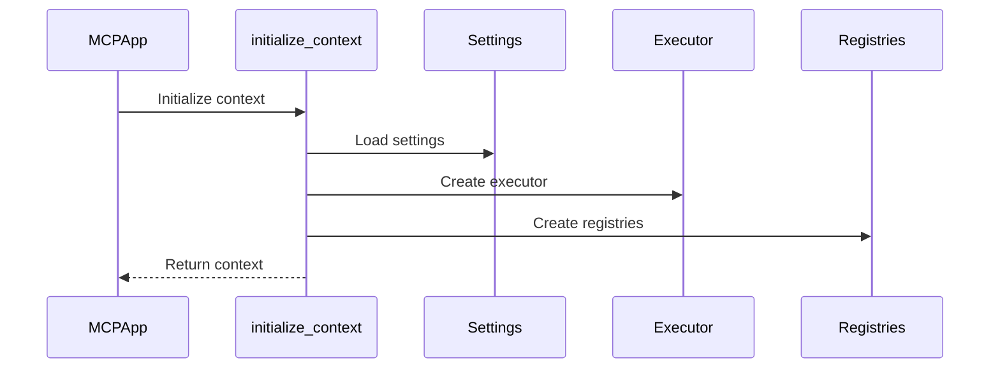

# Chapter 9: Context

In the previous chapter, [Settings](08_settings.md), we learned how to configure our `HMS-MCP` application. Now, let's explore the `Context` object, which acts as a central information hub for your project.

## What problem does the Context solve?

Imagine you're building a project management AI assistant.  This assistant needs access to information like the project's budget, deadlines, and team members' contact information.  Instead of passing this information around to every function and agent individually, you can store it in the `Context` object.  Think of the `Context` as a shared project notebook where everyone can access and update important details.

## Key Concepts

The `Context` object is a container that holds global state and configuration for your application.  It's accessible from anywhere within your application, making it easy to share information between different components.

## Using the Context

You typically interact with the `Context` indirectly through other components like [Agents](02_agent.md) and [AugmentedLLMs](05_augmentedllm.md).  These components automatically receive the `Context` object, allowing them to access the information they need.

For example, an agent might need access to the [ServerRegistry](04_mcp_server.md) to discover available [MCP Servers](04_mcp_server.md).  The agent can access the registry through the `Context` object:

```python
# Inside an agent
server_registry = self.context.server_registry
# ... use the server_registry ...
```

This code retrieves the `server_registry` from the `Context` object. The agent can then use the registry to connect to the necessary servers.

## Internal Implementation

The `Context` object is initialized when you start your [MCPApp](01_mcpapp.md) using `app.run()`.  The `initialize_context` function creates the `Context` object and populates it with various components, including the [Settings](08_settings.md), [Executor](05_augmentedllm.md), and registries.



Here's a simplified look at the `initialize_context` function from `src/mcp_agent/context.py`:

```python
async def initialize_context(config):
    context = Context()
    context.config = config
    context.server_registry = ServerRegistry(config=config)
    # ... initialize other components ...
    return context
```

This code creates a `Context` object, loads the [Settings](08_settings.md), creates the [ServerRegistry](04_mcp_server.md), and initializes other components.

When the `app.run()` context exits, the `cleanup_context` function is called to release resources.

```python
async def cleanup_context():
    # ... cleanup steps ...
```

The `get_current_context` function allows you to access the `Context` object from anywhere in your application.

```python
from mcp_agent.context import get_current_context

context = get_current_context()
# ... use the context ...
```

## Conclusion

The `Context` object provides a central information hub for your `HMS-MCP` application, making it easy to share global state and configuration between different components.  It simplifies the development process by reducing the need to pass information around manually.  Now that we understand the `Context`, let's move on to the next chapter, [Logger](10_logger.md), which explores how to effectively log events and track the progress of your AI application.


---

Generated by [AI Codebase Knowledge Builder](https://github.com/The-Pocket/Tutorial-Codebase-Knowledge)