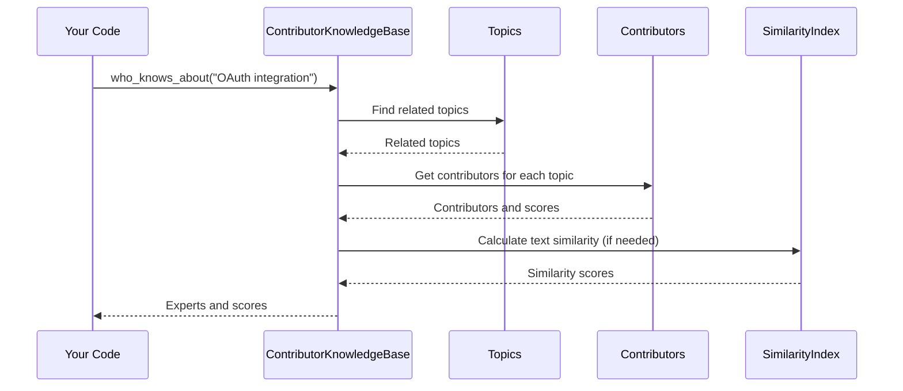

# Chapter 9: ContributorKnowledgeBase (Expertise Tracking)

Coming from our understanding of how the [SidekiqMonitor (Background Job Monitoring)](08_sidekiqmonitor__background_job_monitoring__.md) helps us keep an eye on our background tasks, let's explore how we can easily find the right person to help with a specific problem. Imagine a critical bug related to the "OAuth integration" appears.  Instead of asking around or searching through old emails, wouldn't it be great if you could instantly find out who has the most experience with OAuth?  That's where the `ContributorKnowledgeBase` comes in.

## What is ContributorKnowledgeBase?

The `ContributorKnowledgeBase` is like a company directory, but supercharged. It keeps track of every contributor (think employees, contractors, etc.) and their expertise based on their activity in JIRA.  It analyzes JIRA issues, comments, and assignments to understand who knows about what, allowing you to quickly find the right person for a specific problem or topic.

## Key Concepts

1. **Contributors:** These are the people working on your projects, represented by the [Types::JiraContributor](03_types__data_structures__.md) type.  Each contributor has a profile that includes their name, the issues they've reported, the issues they've been assigned, and the comments they've made.

2. **Topics:** These are keywords or phrases that represent areas of expertise, like "OAuth integration," "database performance," or "frontend development."

3. **Expertise Tracking:** The `ContributorKnowledgeBase` analyzes JIRA data to determine which topics each contributor is knowledgeable about. It assigns expertise scores based on how often a contributor is involved in issues related to a specific topic.

## Use Case: Finding OAuth Experts

Let's see how to use the `ContributorKnowledgeBase` to find experts on "OAuth integration":

```ruby
require_relative 'contributor_knowledge_base'

# Load JIRA data (this is typically done once at startup)
ContributorKnowledgeBase.load_data('jira_export.xml')

# Wait for the data to be loaded
while !ContributorKnowledgeBase.ready?
  sleep 1
end

# Find experts on "OAuth integration"
experts = ContributorKnowledgeBase.who_knows_about("OAuth integration", limit: 3)

experts.each do |contributor, score|
  puts "#{contributor.name} (Expertise Score: #{score})"
end
```

**Explanation:**

1. We load the JIRA data from an XML export file using `load_data`.
2. We wait until the `ContributorKnowledgeBase` is ready.  The parsing happens in the background, so we need to wait for it to finish.
3. We call `who_knows_about` to find experts on "OAuth integration."  We specify a `limit` of 3 to get the top 3 experts.
4. We print the name and expertise score of each expert.

## Internal Implementation

Here's a simplified sequence diagram showing how `who_knows_about` works:



The `ContributorKnowledgeBase` first checks if the query is a known topic. If not, it uses a similarity index to find related topics.  Then, it retrieves the contributors associated with those topics and their expertise scores. It might also calculate text similarity between the query and contributor comments to further refine the results.

## Code Example: `contributor_knowledge_base.rb`

Let's look at a simplified snippet from `contributor_knowledge_base.rb`:

```ruby
# File: contributor_knowledge_base.rb (simplified)
module ContributorKnowledgeBase
  def self.who_knows_about(topic, limit = 5)
    # ... (Preprocess the topic) ...

    # ... (Find similar topics if needed) ...

    # ... (Collect experts and their scores) ...

    # ... (Sort by score and return top results) ...
  end
end
```

The `who_knows_about` method handles the logic of finding experts for a given topic. It preprocesses the topic, finds similar topics if necessary, collects experts and their scores, and returns the top results.

## Conclusion

In this chapter, we learned about the `ContributorKnowledgeBase` and how it helps us find experts on specific topics. We saw how to use `who_knows_about` to find experts and explored its internal implementation. In the next chapter, we'll discuss the [LTI Debug Client (LTI Communication Inspection)](10_lti_debug_client__lti_communication_inspection__.md).


---

Generated by [AI Codebase Knowledge Builder](https://github.com/The-Pocket/Tutorial-Codebase-Knowledge)