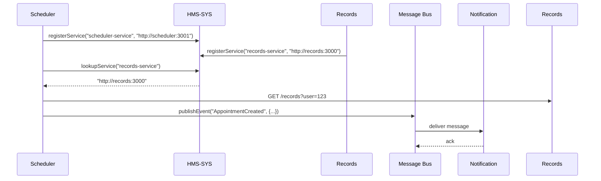

# Chapter 9: Core System Platform (HMS-SYS)

In the last chapter, we saw how frontends talk to microservices via the [Backend API Layer (HMS-API)](08_backend_api_layer__hms_api__.md). Now, let’s dive into the “central nervous system” of HMS-EHR: the **Core System Platform (HMS-SYS)**.

---

## 1. Why a Core System Platform?

Imagine the Department of Veterans Affairs portal needs to:

- **Discover** where the Records Service is running  
- **Route** an “AppointmentCreated” event to both Notification and Audit services  
- **Share** common logging, health checks, and config without rewriting code in every microservice  

Without HMS-SYS, each team must build its own registry, event bus, and infrastructure code. With HMS-SYS, everyone plugs into one power grid:

- **Service Registry** tells you “where is Records?”  
- **Message Router** delivers events like “AppointmentCreated”  
- **Shared Infrastructure** provides logging, health checks, and configuration  

---

## 2. Key Concepts

1. **Service Registry & Discovery**  
   A central directory where each microservice registers its name and URL. Other services ask “Where is X?”

2. **Message Bus (Event Router)**  
   A pub/sub system that routes events (messages) from publishers to subscribers.

3. **Health Checks & Monitoring**  
   HMS-SYS pings each service’s `/health` endpoint and alerts if something fails.

4. **Shared Configuration**  
   Central store for common settings (e.g., database URLs, feature flags).

5. **Infrastructure Utilities**  
   Common libraries for logging, tracing, and metrics—so every service looks and behaves the same way.

---

## 3. Solving the Use Case

### 3.1 Register & Discover Services

When a microservice starts, it tells HMS-SYS “here I am”:

```js
// file: sysClient.js
import { registerService, lookupService } from './hms-sys';

async function start() {
  // Register this service under the name "records-service"
  registerService({
    name: 'records-service',
    url: 'http://records:3000',
    healthCheck: '/health'
  });

  // Later, find another service
  const schedUrl = lookupService('scheduler-service');
  console.log('Scheduler lives at', schedUrl);
}

start();
```

Explanation:
- `registerService()` adds your URL to the central registry.
- `lookupService()` returns the URL of any registered service.

### 3.2 Publish & Subscribe to Events

When an appointment is created, you publish an event. Other services subscribe to it:

```js
// file: sysClient.js
import { publishEvent, subscribeEvent } from './hms-sys';

// In Scheduler Service
publishEvent('AppointmentCreated', {
  userId: 123,
  appointmentId: 456
});

// In Notification Service
subscribeEvent('AppointmentCreated', msg => {
  // send a “Your appointment is confirmed” email
  console.log('Notify user', msg.userId);
});
```

Explanation:
- `publishEvent()` sends the message to the HMS-SYS message bus.
- `subscribeEvent()` registers a callback that HMS-SYS invokes when that event arrives.

---

## 4. What Happens Step-by-Step?



1. Scheduler and Records services register themselves.  
2. Scheduler asks “where is Records?” and calls it.  
3. Scheduler publishes “AppointmentCreated.”  
4. HMS-SYS message bus delivers it to Notification.

---

## 5. Under the Hood

### 5.1 Non-Code Walkthrough

1. **Registry Store**  
   HMS-SYS keeps a map of service names → URLs + health paths.  
2. **Discovery API**  
   A simple HTTP or in-process call to fetch service URLs.  
3. **Event Bus**  
   Maintains subscriptions: event name → list of callbacks (adapters).  
4. **Health Checker**  
   Periodically pings each service’s `/health` and emits alerts.  
5. **Config Store**  
   Exposes a shared key/value or JSON config to any service at startup.

### 5.2 Core Implementation Sketch

```js
// file: hms-sys.js
const registry = {};
const subscribers = {};

// Service Registry
export function registerService({ name, url, healthCheck }) {
  registry[name] = { url, healthCheck };
}
export function lookupService(name) {
  return registry[name]?.url;
}

// Message Bus
export function publishEvent(event, payload) {
  (subscribers[event] || []).forEach(fn => fn(payload));
}
export function subscribeEvent(event, fn) {
  subscribers[event] = subscribers[event] || [];
  subscribers[event].push(fn);
}

// (Health checks and config utils omitted for brevity)
```

Explanation:
- We keep two in-memory objects: `registry` and `subscribers`.  
- Registration and discovery are simple lookups.  
- Publishing an event just loops through callbacks.

---

## 6. Architecture Overview

```mermaid
flowchart LR
  MS1[Scheduler] --> Sys[Core Platform (HMS-SYS)]
  MS2[Records]   --> Sys
  Sys -->|lookup| MS1
  Sys -->|lookup| MS2
  Sys -->|events| Bus[Message Bus]
  Bus --> Notif[Notification Service]
  Bus --> Audit[Audit Service]
  Sys -->|health| Monitor[Health Dashboard]
```

- Every microservice plugs into HMS-SYS for discovery and messaging.  
- HMS-SYS also feeds health and metrics into a central dashboard.

---

## Conclusion

In this chapter you learned how the **Core System Platform (HMS-SYS)**:

- Registers and discovers microservices  
- Routes events via a built-in message bus  
- Provides shared health checks and configuration  

With HMS-SYS in place, teams can focus on their business logic instead of reinventing the wheel.  

Next up, we’ll build the **[Interface Layer](10_interface_layer_.md)** that sits right above HMS-SYS and connects back to our micro-frontends.

---

Generated by [AI Codebase Knowledge Builder](https://github.com/The-Pocket/Tutorial-Codebase-Knowledge)