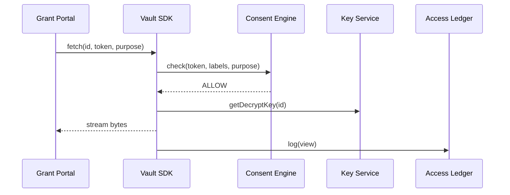

# Chapter 9: Data Governance & Privacy Vault
*(continuing from [Chapter 8: External System Adapters & Sync Layer](08_external_system_adapters___sync_layer_.md))*  

---

## 1. Why Do We Need a “Privacy Vault”?

Imagine the **National Council on Disability (NCD)** collects medical forms from citizens applying for an assistive-technology grant.  
NCD must guarantee:

1. Records are encrypted—​even database admins can’t peek.  
2. Each doctor’s note is shown **only** to reviewers with written consent.  
3. Data is deleted after 7 years—unless a legal hold is active.  
4. Files never leave U.S. soil without special approval.

Fines for a single breach can top \$1 million, so “just another database table” won’t cut it.  
**Data Governance & Privacy Vault** is HMS-EMR’s **secure records room**: encrypted vault + policy brain + tamper-evident log.

---

## 2. Key Concepts—Six Beginner Bricks

| Brick | Analogy | What It Does |
|-------|---------|--------------|
| Encrypted Vault | Bank safe | Stores raw bytes encrypted with per-record keys |
| Consent Policy | Visitor badge rules | Defines *who* may see *what* and *why* |
| Access Ledger | Sign-in book | Immutable log of every open / close attempt |
| Data Classification | Colored folders | Labels (PHI, PII, Public) decide default rules |
| Retention Timer | Paper-shredder schedule | Auto-purges or archives on a fixed date |
| Cross-Border Guard | Customs officer | Blocks reads/writes from banned regions |

Remember these six; everything else is wiring.

---

## 3. A Guided Walk-Through: “Doctor Rose Uploads & Reviewer Ali Reads”

### 3.1 Upload (Doctor Rose)

1. Rose scans a medical form (PDF).  
2. Front-end calls `vault.store()` with Rose’s **Service Token** (from [IAM](06_identity___access_management__iam__.md)).  
3. Vault encrypts the PDF, tags it `PHI`, and writes “doctor upload” to the ledger.

### 3.2 Review (Reviewer Ali)

1. Ali clicks **“View Documents”** in the grant portal.  
2. Portal calls `vault.fetch()` with Ali’s token.  
3. Consent Policy engine checks:  
   • role = “Reviewer”? ✅  
   • patient consent on file? ✅  
   • user location (GPS) in U.S.? ✅  
4. Vault decrypts the PDF and streams it.  
5. Ledger stores “Ali viewed file 2024-06-10 14:02”.

---

## 4. Using the Vault—Tiny Code You Can Copy

### 4.1 Saving a File (Python, 11 lines)

```python
from hms_vault import store

with open("form.pdf", "rb") as f:
    doc_id = store(
        data      = f.read(),
        mime      = "application/pdf",
        labels    = ["PHI"],
        metadata  = {"patientId": "PAT-5542"},
        token     = rose_token               # JWT from IAM
    )
print("Saved as", doc_id)
```

• `store()` returns a random ID; the app never sees encryption keys.  
• Labels (`PHI`) trigger default consent & retention timers.

### 4.2 Retrieving (TypeScript, 15 lines)

```ts
import { fetch } from "hms-vault";

async function view(docId: string, token: string) {
  const file = await fetch({
    id: docId,
    token,                  // Ali’s JWT
    purpose: "grant_review" // checked by policy
  });
  // file.data is ArrayBuffer; render in browser
}
```

If Ali lacks consent, `fetch()` throws `POLICY_DENIED`.

### 4.3 Writing a Consent Rule (YAML, 8 lines)

```yaml
# gov/consent/grant_review.yml
allow:
  roles:  ["Reviewer", "Admin"]
  labels: ["PHI"]
  purpose: "grant_review"
retainYears: 7
crossBorder: "US-only"
```

Save → [Governance Portal](02_governance_portal__hms_gov__.md) publishes → Vault hot-reloads in <60 s.

---

## 5. What Happens Behind the Curtain?



Five actors—easy to keep in your head.

---

## 6. Internal Anatomy (Simplified)

```
vault/
├─ api-gateway/        # gRPC facade
├─ blob-store/         # S3 or MinIO
├─ kms-client/         # per-record KEK/DEK
├─ consent-engine/     # OPA/Rego rules
└─ ledger-writer/      # append-only DB
```

### 6.1 Decrypt Path (Go, 18 lines)

```go
func Fetch(id string, tok JWT, purpose string) ([]byte, error) {
    ok := consent.Allowed(tok, id, purpose)
    if !ok { return nil, ErrDenied }

    meta := db.GetMeta(id)             // labels, keyId
    key  := kms.DecryptKey(meta.KeyId) // per-record DEK
    blob := store.Read(id)

    data := aesgcm.Decrypt(key, blob)  // in-memory only
    ledger.Log(tok.Sub, "view", id)
    return data, nil
}
```

Comments removed for clarity; still < 20 lines.

---

## 7. Handling Retention & Purge

A nightly job runs:

```bash
hms vault sweep --dry-run
```

Output:

```
✓ form PAT-5542.pdf  purge in 30 days
✓ lab PAT-9912.pdf   archived (legal hold)
```

Admins review, then run without `--dry-run` to shred or archive.  
The ledger records who executed the purge.

---

## 8. Cross-Border Guard in Action

If a request comes from an IP located in Canada and the rule is `US-only`, the Consent Engine replies `DENY_REGION`.  
Apps can fall back to “Request Remote Access Exception”, kicking off a workflow in the [Process & Policy Engine](03_process___policy_engine_.md).

---

## 9. Where the Vault Fits with Other HMS Pieces

• **API Gateway** (Chapter 5) — external apps reach Vault only through throttled, audited routes.  
• **IAM** (Chapter 6) — issues the tokens Vault trusts.  
• **Service Mesh** (Chapter 7) — gives mTLS between Vault pods.  
• **Adapters** (Chapter 8) — must pass through Vault when moving PHI to external systems.  
• **Observability Pipeline** (Chapter 14) — scrapes ledger stats for dashboards.

Single source of data truth across all layers.

---

## 10. Frequently Asked Beginner Questions

**Q: Can developers read raw files from blob storage?**  
No. The blobs are encrypted with keys the developer pods can’t access.

**Q: How big can a single file be?**  
Up to 5 GB by default. Vault streams in chunks so memory stays small.

**Q: What if consent rules change?**  
Ledger keeps old views; new fetches obey the updated rule set immediately.

**Q: Is encryption FIPS 140-2 compliant?**  
Yes. Vault uses AES-256-GCM with keys managed by a FIPS-validated HSM.

---

## 11. Summary & What’s Next

You learned:

• The **Privacy Vault** is HMS-EMR’s encrypted safe, governed by consent policies and a tamper-proof ledger.  
• A couple of simple SDK calls (`store`, `fetch`) keep your app compliant without cryptography headaches.  
• Retention timers, cross-border guards, and immutable logs help agencies pass even the toughest audits.

With data now locked down, it’s time to build delightful, reusable user interfaces for citizens and staff.  
Jump to [Chapter 10: Modular Front-End Library (HMS-MFE)](10_modular_front_end_library__hms_mfe__.md) to start crafting screens!

---

Generated by [AI Codebase Knowledge Builder](https://github.com/The-Pocket/Tutorial-Codebase-Knowledge)