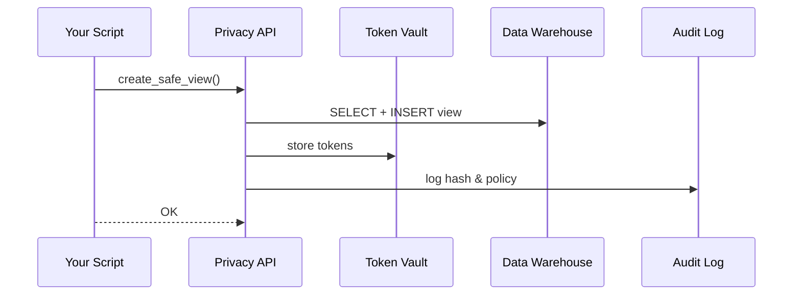

# Chapter 9: Data Privacy & Compliance Layer
*A gentle sequel to* [Role-Based Access Control (RBAC)](08_role_based_access_control__rbac__.md)

---

## 1. Why Do We Need a “Data Safe-Room”?

Imagine the **U.S. Department of Education (ED)** wants to use an AI agent to discover trends in a nationwide dataset of K-12 test scores.  
The files contain:

* Student names & IDs (protected by **FERPA**)  
* Health accommodations (touching **HIPAA**)  
* Birth dates & addresses (covered by the **Privacy Act**)  

If any of that information leaks—even in a single AI prompt—ED faces legal action and loss of public trust.

**The Data Privacy & Compliance Layer (HMS-DPC)** is the platform’s *safe-room*:  
1. It **tokenizes** direct identifiers so the AI never sees real names.  
2. It adds **differential privacy noise** to aggregates so individuals can’t be re-identified.  
3. It auto-generates a **Privacy Impact Assessment (PIA)** every time a new dataset is processed—perfect for FOIA requests or Inspector-General audits.

Think of HMS-DPC as a cross-agency paper-shredder that turns raw documents into harmless confetti before anyone else touches them.

---

## 2. Key Concepts (Plain-English Cheat-Sheet)

| Term | Beginner Explanation |
|------|----------------------|
| **Data Classification** | Label each column: “Highly Sensitive” (student ID) vs “Public” (school district). |
| **Tokenization** | Swap sensitive values with reversible random tokens, e.g. `STU-0001`. |
| **Token Vault** | Encrypted table that maps tokens ↔ real values; only limited roles can open it. |
| **Differential Privacy (DP)** | Adds tiny, random “blur” to numbers so you see trends, not individuals. |
| **Privacy Budget** | A meter that tracks how much DP noise you can “spend” before risking leaks. |
| **PIA Generator** | One command that outputs a filled-in PDF citing FERPA, HIPAA, Privacy Act sections. |

---

## 3. A 6-Minute Walk-Through: Training an AI Safely

We’ll turn a raw **`students_raw`** table into a safe view, train an AI, and produce a PIA.

### 3.1 Classify & Tokenize the Dataset (10 lines)

```python
# file: scripts/protect_students.py
from hms_privacy import guard

guard.create_safe_view(
    source_table='students_raw',
    view_name='students_safe',
    policy='FERPA_HIGH',      # built-in template
    tokenize=['student_id', 'full_name'],
    dp_columns={'score_math': 1.0, 'score_reading': 1.0})  # epsilon=1.0
```

Explanation  
1. `tokenize` columns become random IDs stored in the **Token Vault**.  
2. Numeric scores get DP noise (ε = 1.0).  
3. The new SQL view `students_safe` is what downstream users see.

### 3.2 Let the AI Agent Train Only on the Safe View (12 lines)

```python
# file: ai/train_agent.py
from hms_ai import Agent
from hms_privacy import guard

# Ensure caller holds a token with DATA_SCIENTIST role (RBAC layer)
guard.enforce_access(role='DATA_SCIENTIST', table='students_safe')

agent = Agent(name='ED_Trend_Finder')
agent.train(sql_view='students_safe')   # raw table is off-limits
agent.save('models/ed_trends_v1.pkl')
```

What happens?  
The AI sees `STU-0001`, `STU-0002`, … plus slightly blurred scores—never real names or pinpoint scores.

### 3.3 Auto-Generate a PIA (6 lines)

```bash
hms privacy pia \
  --dataset students_safe \
  --purpose "AI trend analysis for DoE report" \
  --output pia_ed_trends.pdf
```

Output (terminal):

```
✓ PIA completed: pia_ed_trends.pdf (12 pages, FERPA & HIPAA sections auto-filled)
```

Hand this file to your agency Privacy Officer—ready for review.

---

## 4. What Happens Behind the Curtain?



Five actors keep the story simple.

---

## 5. Tiny Peeks at the Implementation

### 5.1 How Tokenization Works (Python, 18 lines)

```python
# file: hms_privacy/tokenizer.py
import secrets, hashlib

def tokenize(column_values):
    tokens = {}
    for val in column_values:
        salt = secrets.token_hex(4)           # random
        token = 'TOK-' + hashlib.sha1((val+salt).encode()).hexdigest()[:8]
        tokens[val] = token
    return tokens
```

Explanation  
* Generates an 8-character token per value.  
* Stores mapping in the **Token Vault** (AES-256 encrypted).  
* Only the `PRIVACY_OFFICER` role can reverse it.

### 5.2 Basic Differential Privacy Adder (Go, 15 lines)

```go
// file: dp/noise.go
func AddNoise(value float64, epsilon float64) float64 {
    noise := rand.ExpFloat64() / epsilon      // Laplace mechanism (simplified)
    if rand.Intn(2) == 0 { noise = -noise }
    return value + noise
}
```

Each call “blurs” the true score just enough to hide an individual while keeping aggregate trends intact.

---

## 6. How HMS-DPC Interacts with Other Layers

| Layer | Cooperation Example |
|-------|---------------------|
| [RBAC](08_role_based_access_control__rbac__.md) | Only `DATA_SCIENTIST` role can access `students_safe`; only `PRIVACY_OFFICER` can open Token Vault. |
| [Governance Layer](03_governance_layer__hms_gov__.md) | Policies define which classification template (`FERPA_HIGH`) a table must follow. |
| [Policy & Process Engine](04_policy___process_engine_.md) | Emits an event if the *privacy budget* for a dataset drops below threshold—triggers escalation. |
| [Observability & Metrics Pipeline](13_observability___metrics_pipeline_.md) | Stores `privacy.budget_remaining` and `tokenization.rate` metrics for dashboards. |
| [AI Representative Agent](12_ai_representative_agent__hms_a2a__.md) | Agent libraries call `guard.enforce_access` before every query. |

---

## 7. Quick-Start Checklist

1. Install SDK: `pip install hms-privacy`  
2. Run `guard.create_safe_view` on your raw table.  
3. Train AI or run analytics against the **safe view only**.  
4. Generate a PIA with `hms privacy pia …`  
5. Monitor privacy budget & token vault access in the Observability dashboard.

---

## 8. Beginner FAQ

**Q: Do I have to understand differential privacy math?**  
No. Pick an ε (privacy strength) from the dropdown; HMS-DPC handles the math and keeps track of the “budget.”

**Q: Can I re-identify a student if I’m an authorized investigator?**  
Yes—users with the `PRIVACY_OFFICER` role can call `guard.detokenize()` on a single record for legitimate purposes. Every use is logged.

**Q: What if my dataset mixes health and education info?**  
Apply multiple policy templates (`FERPA_HIGH` + `HIPAA_MODERATE`). HMS shows a warning if any column is not covered.

**Q: Does tokenization slow queries?**  
Views are materialized and indexed; overhead is usually <5 %. Raw tables stay untouched for lineage.

---

## 9. Summary & What’s Next

In this chapter you:

• Saw how HMS-DPC tokenizes identifiers, adds differential privacy, and produces PIAs—all with a few lines of code.  
• Learned the moving parts: Token Vault, Privacy Budget, PIA Generator.  
• Watched how RBAC, Governance, and Observability layers plug in to keep data safe **and** auditable.

Ready to discover how all these privacy-aware services talk to each other without becoming a tangled web? Jump to [Microservices Mesh (HMS-SYS)](10_microservices_mesh__hms_sys__.md).

---

Generated by [AI Codebase Knowledge Builder](https://github.com/The-Pocket/Tutorial-Codebase-Knowledge)