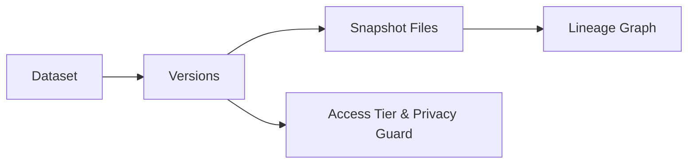
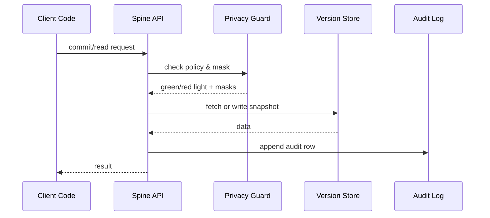

# Chapter 9: Data Spine (HMS-DTA)

*[← Back to Chapter 8: HMS-ACT Workflow Orchestrator](08_hms_act_workflow_orchestrator_.md)*  

---

## 0. Why Do We Need a “Data Spine”? — The Disaster-Relief Numbers Nightmare  

A tornado hits Missouri. Within hours three different agencies need the **same facts**:

| Agency | What they need | Why |
|--------|---------------|-----|
| HUD | Median income per ZIP | To calculate rent vouchers |
| FEMA | Property-damage totals | To release emergency funds |
| IRS  | Last year’s earnings  | To verify fraud claims |

In most states those numbers live in **three unrelated spreadsheets**.  
Different columns, different timestamps, no source notes—auditors cry, AI agents mis-predict, and policy makers guess.

**HMS-DTA** (the *Data Spine*) is the **single, versioned, and fully audited home** for every byte in HMS, from benefit applications to IoT sensor pings.  

Think of it as *“GitHub + Library of Congress + Parental Controls”* for data.

---

## 1. Key Concepts — Learn These Seven Words  

| Term | Everyday Analogy | One-Line Job |
|------|------------------|--------------|
| Dataset | A Google Sheet | Logical bucket of rows/files |
| Version | Git commit | Immutable snapshot (`v1`, `v2`, …) |
| Snapshot | Zip file | Physical blob for one version |
| Lineage Graph | Family tree | Shows “this came from that” |
| Access Tier | Library card type | `public`, `internal`, `restricted` |
| Privacy Guard | Black highlighter | Masks or blocks fields on read |
| Query Ticket | Reading-room slip | Time-boxed permission to query |

Keep “Dataset → Version → Snapshot” on repeat; everything else orbits it.

---

## 2. A 3-Step Mental Model  



1. **Dataset** holds many **Versions**.  
2. Every Version stores its **Snapshot**.  
3. **Lineage** records how a version was made.  
4. **Access Tier / Privacy Guard** police every read.

---

## 3. “Hello Data Spine” — Store & Read in Under 20 Lines  

### 3.1 Publishing Disaster Claims (`publish_claims.py` – 15 lines)

```python
# publish_claims.py
import hms_dta as dta, json, uuid, time

rows = [                     # pretend this came from A2A event
    {"claim_id": "CLM-456", "zip": "64105", "damage_usd": 12000}
]

meta = {
  "source_event": "disaster.claim.created",
  "uploader":  "fema.bot.v2",
  "timestamp": time.time()
}

ds = dta.commit(
        dataset="fema/disaster_claims",
        data=rows,
        metadata=meta,
        access_tier="restricted"
)

print(ds["version"])   # ➜ 'v42'
```

What happened?  
1. `commit` creates **Version v42** under `fema/disaster_claims`.  
2. A **Snapshot** is written to object storage.  
3. A **Lineage edge** notes it came from the `disaster.claim.created` topic.  
4. Privacy tier set to `restricted`—citizens can’t see it.

---

### 3.2 Reading With Automatic Masking (`read_masked.py` – 11 lines)

```python
# read_masked.py
import hms_dta as dta

user = {"id": "hud_analyst_7", "role": "internal"}
rows = dta.read(
        dataset="fema/disaster_claims",
        version="latest",
        user=user
)

print(rows[0])
```

Expected console output:

```
{'claim_id': 'CLM-456', 'zip': '64105', 'damage_usd': 'MASKED'}
```

Why masked?  
`hud_analyst_7` has no right to raw dollar amounts, so **Privacy Guard** automatically replaced `damage_usd` with `'MASKED'`.

---

## 4. Under the Hood – 5 Actors, 6 Steps  



All traffic is an [MCP envelope](02_model_context_protocol__hms_mcp__.md); **Audit Log** can later be queried by [HMS-OPS](11_operational_nerve_center__hms_ops__.md).

---

## 5. Tiny Peek at Core Commit Logic (18 lines)

```python
# hms_dta/core.py  (simplified)
def commit(dataset, data, metadata, access_tier):
    ver = _next_version(dataset)          # e.g. 'v42'
    snap = _write_snapshot(dataset, ver, data)
    _save_catalog({
        "dataset": dataset,
        "version": ver,
        "snapshot": snap,
        "access_tier": access_tier,
        "metadata": metadata,
    })
    _log("commit", dataset, ver)
    return {"dataset": dataset, "version": ver}
```

Beginner notes  
• `_write_snapshot` is just a parquet/JSON dump.  
• `_save_catalog` writes one row in Postgres.  
• Real code also builds the **Lineage Graph**; omitted for brevity.

---

## 6. Exploring Lineage – One Command

```bash
$ hms-dta lineage fema/disaster_claims@v42 --graph
```

Outputs a tiny ASCII chart:

```
v40 ←─ A2A:disaster.claim.created
  │
  ├── transform: dedup.py
  ↓
v42 (current)
```

Auditors can now trace every byte back to its birth event.

---

## 7. Common Pitfalls (and How DTA Fixes Them)

Problem | Old World | With Data Spine
--------|-----------|----------------
“Which file is the truth?” | ₃ copies in email | One canonical **Dataset** |
Silent data edits | Overwrite CSV in place | **Immutable Versions** |
Missing source notes | Tribal memory | **Lineage Graph** auto-built |
Privacy leaks in SQL | Manual redaction | **Privacy Guard** masks by role |

---

## 8. How Other HMS Layers Use the Spine  

Layer | Interaction
------|------------
[HMS-AGT agents](05_hms_agt_core_agent_framework_.md) | Query datasets with role-based masking. |
[HMS-ACT flows](08_hms_act_workflow_orchestrator_.md) | Trigger new versions after each step. |
[HMS-ESQ](04_compliance___legal_reasoning__hms_esq__.md) | Scans metadata for legal conflicts. |
[HMS-A2A bus](07_hms_a2a_inter_agency_messaging_bus_.md) | Emits `dataset.version.created` events for subscribers.|

---

## 9. What You Learned  

• **Datasets, Versions, Snapshots** are the heart of HMS-DTA.  
• Lineage tracking and automatic privacy masking happen transparently.  
• Publishing and reading data is possible in **<20 lines of code**.  
• Every action is logged and auditable, keeping auditors and citizens happy.

Next we’ll learn how backend micro-services and APIs consume this data reliably:  
[Backend Service Mesh (HMS-SVC & HMS-API)](10_backend_service_mesh__hms_svc___hms_api__.md)

---

---

Generated by [AI Codebase Knowledge Builder](https://github.com/The-Pocket/Tutorial-Codebase-Knowledge)