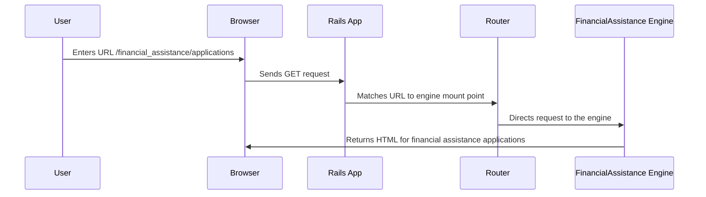

# Chapter 9: Engines

In the previous chapter, [Asynchronous Communication (EventSource, Sidekiq/Resque)](08_asynchronous_communication__eventsource__sidekiq_resque_.md), we learned how to handle long-running tasks in the background. Now, let's imagine our Enroll application is getting very large and complex. We want to organize it into smaller, more manageable pieces.  Our central use case is separating the code related to financial assistance into a self-contained module. This is where Engines come in.

## Engines: Your Application's Building Blocks

Engines are like modular plugins that provide specific functionalities to the Enroll application. Think of them as self-contained units responsible for handling things like benefit sponsors, benefit markets, sponsored benefits, and, our central use case, financial assistance. They encapsulate related logic and resources, making the application more organized and maintainable.  It's like building a house with prefabricated rooms – each room is complete on its own and can be easily added to the house.

## Example: The Financial Assistance Engine

The Financial Assistance Engine handles everything related to financial assistance, including determining eligibility, calculating subsidies, and managing applications. This keeps the code related to financial assistance separate from other parts of the application, like [Routing (routes.rb)](01_routing__routes_rb_.md) or [Models (Mongoid)](06_models__mongoid_.md) for other functionalities.

## Mounting an Engine

Engines are mounted in the `routes.rb` file, similar to how we mount `Sidekiq`:

```ruby
# config/routes.rb
mount FinancialAssistance::Engine,  at: '/financial_assistance'
```

This line mounts the `FinancialAssistance` engine at the `/financial_assistance` path.  This means any requests starting with `/financial_assistance` will be handled by this engine.

## How Engines Work Under the Hood



When a request comes in for `/financial_assistance/applications`, the [Router](01_routing__routes_rb_.md) recognizes the path and directs the request to the `FinancialAssistance` engine. The engine then handles the request internally, just like a separate application.

## Internal Implementation

Engines have their own directories within the application, similar to the main application structure.  For example, the Financial Assistance Engine might have its own controllers, models, and views within the `engines/financial_assistance` directory.  The `engine.rb` file within the engine's directory defines the engine's configuration, such as its name and dependencies.

```ruby
# engines/financial_assistance/lib/financial_assistance/engine.rb (simplified)
module FinancialAssistance
  class Engine < ::Rails::Engine
    isolate_namespace FinancialAssistance
    # ... other configurations ...
  end
end
```

The `isolate_namespace` method ensures that the engine's models, controllers, and other components are namespaced under `FinancialAssistance`, preventing conflicts with other parts of the application.

## Enabling Engines with Feature Toggles

We can use [Feature Toggles (EnrollRegistry)](04_feature_toggles__enrollregistry_.md) to control whether an engine is mounted.  For example:

```ruby
# config/routes.rb
mount Notifier::Engine, at: "/notifier" if EnrollRegistry.feature_enabled?(:notices_tab)
```

This only mounts the `Notifier` engine if the `notices_tab` feature is enabled.  This is configured in the `client_config` directory, for example:

```yaml
# client_config/me/system/config/templates/features/enroll_app/engines.yml
registry:
  - namespace:
      - :enroll_app
    features:
      - key: :financial_assistance
        item: :financial_assistance
        is_enabled: true
```

This snippet enables the `financial_assistance` feature, which in turn can be used to control the mounting of the Financial Assistance Engine.

## Conclusion

In this chapter, we learned how Engines help us organize our application into smaller, reusable components. We saw how to mount an engine in the `routes.rb` file and how it handles requests. We also touched upon the internal structure of engines and how feature toggles can be used to control their availability. This makes our application more maintainable and scalable.

Next, we'll explore how to support multiple languages using [Internationalization (i18n)](10_internationalization__i18n_.md).


---

Generated by [AI Codebase Knowledge Builder](https://github.com/The-Pocket/Tutorial-Codebase-Knowledge)