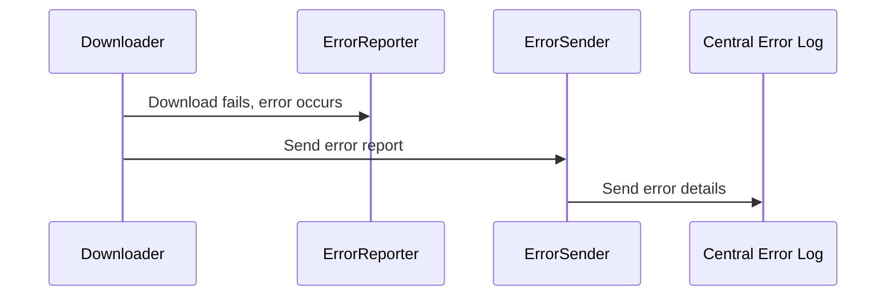

# Chapter 9: Error Reporting (ErrorSender, ErrorReporter)

In the previous chapter, [Chrome Profile and Headless Mode](08_chrome_profile_and_headless_mode.md), we learned how to run our downloader on a server.  But what happens if something goes wrong, like a network error or a video that's no longer available?  That's where the error reporting system, using `ErrorSender` and `ErrorReporter`, comes in.

## What Problem Does Error Reporting Solve?

Imagine you're running `HMS-UTL` on a server, and you're trying to download hundreds of videos.  You don't want to constantly check the server logs to see if any downloads failed.  The error reporting system acts like an automated assistant that notifies you of any problems.

## Key Concepts

1. **`ErrorReporter`:** This is like a watchful guard, always on the lookout for errors.  Whenever a downloader encounters a problem (like a network issue or an invalid URL), the `ErrorReporter` catches the error.

2. **`ErrorSender`:** This is like a messenger that sends the error information to a central location.  Think of it as sending an automated bug report.  This allows you to collect all error information in one place, making it easier to analyze and fix problems.

## Using Error Reporting

You don't directly interact with `ErrorSender` and `ErrorReporter`. They work behind the scenes.  Whenever a download fails, the downloaders automatically use the `ErrorReporter` to catch the error and the `ErrorSender` to send a report.

## Internal Implementation

Here's a simplified sequence diagram showing how error reporting works:



When a download fails in the [Downloader](02_downloader.md), the error is caught by the `ErrorReporter`. The `Downloader` then calls the `ErrorSender` to send the error details to a central error log (like a server or a database).

### Code Example: `downloader.py` (Simplified)

```python
# --- File: media-downloader/downloader.py (Simplified) ---
from lib.error_reporter import ErrorReporter

class Downloader:
    def tiktokDownload(self, url):
        try:
            # ... (download logic)
        except Exception as e:
            ErrorReporter.report(e) # Report the error
            # ... (handle the error, e.g., return an error message)
```

This simplified code snippet shows how the `ErrorReporter` is used.  If an error occurs during the download, the `ErrorReporter.report()` function is called to record the error.

### Code Example: `error_reporter.py` (Simplified)

```python
# --- File: media-downloader/lib/error_reporter.py (Simplified) ---
from lib.error_sender import ErrorSender

class ErrorReporter:
    @staticmethod
    def report(error):
        ErrorSender.send(error) # Send the error report
        # ... (potentially log the error locally as well)
```

This simplified code snippet shows how the `ErrorReporter` uses the `ErrorSender` to send the error report.

### Code Example: `error_sender.py` (Simplified)

```python
# --- File: media-downloader/lib/error_sender.py (Simplified) ---

class ErrorSender:
    @staticmethod
    def send(error):
        # ... (logic to send the error to a central location, e.g., a server)
        print(f"Error sent: {error}") # Simplified: print the error
```

This simplified code snippet represents the `ErrorSender`.  In a real implementation, this would contain the logic to send the error information to a central error logging system.


## Conclusion

In this chapter, we explored the error reporting system, which helps track and manage errors during the download process. We learned about the `ErrorReporter` and `ErrorSender` and how they work together to capture and send error information. This concludes the tutorial for `HMS-UTL`.  You should now have a good understanding of the core components and how they work together to download and manage media from different platforms.


---

Generated by [AI Codebase Knowledge Builder](https://github.com/The-Pocket/Tutorial-Codebase-Knowledge)