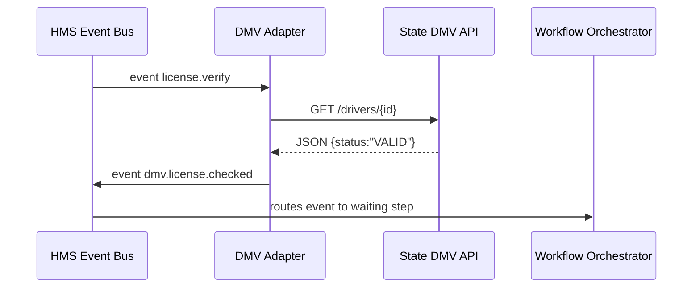

# Chapter 9: External System Adapter  

*(picks up from [Chapter 8: Inter-Agency Communication Bus (HMS-A2A)](08_inter_agency_communication_bus__hms_a2a__.md))*  

---

## 1  Why do we need an “External System Adapter”?

Picture a **City Passport Office** that just modernised its workflow with HMS.  
Everything works—until the very last step: printing.  
All passports must be printed by the **Federal Printing Center (FPC)**, whose legacy SOAP API looks like this:

```
<PrintJob>
  <PhotoBase64>...</PhotoBase64>
  <NameCaps>JOHN DOE</NameCaps>
  <DueDate format="MM-DD-YYYY">05-31-2024</DueDate>
</PrintJob>
```

Meanwhile, inside HMS the same information travels as clean JSON:

```json
{
  "citizen_id": "C-9123",
  "photo_url": "s3://...",
  "name": "John Doe",
  "due_iso": "2024-05-31"
}
```

Without a translator, both sides keep talking past each other and passports never print.

**The External System Adapter (ESA) is that translator.**  
It:

1. Listens for HMS events (JSON).  
2. Transforms them into the “native dialect” of the external system (SOAP, CSV, SQL, etc.).  
3. Sends the request and handles the reply.  
4. Emits a **confirmation event** back to HMS so workflows continue.

In short, **ESA = live court interpreter between HMS and any outside world system**.

---

## 2  Key Concepts (Beginner Friendly)

| Term | Think of it as…            | Why it matters                              |
|------|---------------------------|---------------------------------------------|
| **Adapter** | The interpreter          | Converts message formats both directions.  |
| **Mapping** | A bilingual dictionary   | Exact rule to turn field A → field B.      |
| **Connector** | Phone line             | Low-level channel (HTTP, SOAP, SFTP…).     |
| **Retry & DLQ** | “Please repeat” note | Automatic re-tries; DLQ = Dead-Letter queue for hopeless cases. |
| **Heartbeat** | “Still connected?” ping | Lets HMS-OPS know the adapter is alive.    |

Keep these five words; 90 % of ESA is just making them play nicely.

---

## 3  Quick-Start: Talk to the State DMV

Use case: During a **Vehicle Registration Renewal** workflow, HMS must confirm the citizen’s driver-license status with the *State DMV* REST API.

### 3.1  Declare the mapping (YAML, 18 lines)

Create `mappings/dmv_status.yaml`:

```yaml
id: DMV_LIC_STATUS_V1
request:
  method: GET
  url: "https://api.state-dmv.gov/v1/drivers/{license}"
  headers:
    X-API-Key: "${DMV_KEY}"
response_map:
  valid:   "data.status == 'VALID'"
  expired: "data.status == 'EXPIRED'"
  suspended: "data.status == 'SUSPENDED'"
emit_event:
  type: "dmv.license.checked"
  payload:
    license: "{license}"
    status: "{data.status}"
retry:
  max: 3
  backoff_sec: 10
```

Explanation  
• `${DMV_KEY}` is pulled from a secrets vault.  
• `response_map` tells ESA how to interpret the JSON reply.  
• After success it emits `dmv.license.checked` so [HMS-ACT](07_workflow_orchestrator__hms_act___oms__.md) can move on.

### 3.2  Minimal adapter code (Python, 19 lines)

```python
# file: adapter.py
from hms_esa import Adapter

Adapter(
    mapping_file="mappings/dmv_status.yaml"
).serve_events(
    topic="license.verify"         # events to listen for
)
```

Explanation  
1. `Adapter` loads the YAML mapping.  
2. `serve_events()` listens on the A2A event bus for `license.verify` messages.  
3. For every incoming event, it runs the HTTP call, interprets the reply, and publishes `dmv.license.checked`.

### 3.3  Trigger a test call (5 lines)

```python
from hms_a2a import emit
emit("license.verify", {"license":"D-789-12-3456"})
```

Result (console):

```
▶︎ GET https://api.state-dmv.gov/v1/drivers/D-789-12-3456 … 200
✔ status: VALID → emitted dmv.license.checked
```

That’s it—no custom glue code elsewhere!

---

## 4  What happens behind the curtain?



Step-by-step (plain English)  

1. Workflow emits `license.verify`.  
2. Adapter catches it, builds the HTTP request using the mapping.  
3. Parses the response, maps `status`, and publishes a confirmation event.  
4. Workflow step unblocks and continues.

---

## 5  A tiny peek into the adapter internals

### 5.1  Template renderer (8 lines)

```python
def render(template, ctx):
    for key, val in ctx.items():
        template = template.replace("{" + key + "}", str(val))
    return template
```

Turns `"https://.../{license}"` into the real URL.

### 5.2  Retry with DLQ (12 lines)

```python
def call_with_retry(req, max_retry, backoff):
    for attempt in range(max_retry):
        try:
            return http.request(**req)
        except Exception as e:
            time.sleep(backoff * (attempt + 1))
    dlq.push(req)        # Dead-Letter Queue
```

If all retries fail, the request goes to a Dead-Letter Queue where a human can inspect.

### 5.3  Heartbeat (6 lines)

```python
def heartbeat():
    while True:
        hms_ops.gauge("esa_up", 1)
        time.sleep(30)
```

Reports adapter health to [HMS-OPS](01_operations___monitoring_hub__hms_ops__.md).

---

## 6  Where does the External System Adapter fit?

```
HMS Workflow  ──► Event Bus ──►  External System Adapter ──► 3rd-party API
       ▲                                 │
       │                                 ▼
  (follow-up event)        HMS-OPS monitors health & retries
```

Supporting layers:

* **Governance Layer** checks that the outgoing request obeys policy tags.  
* **Identity, Access & Authorization** (up next!) supplies tokens and rotates secrets.  
* **HMS-A2A** delivers the confirmation event across agencies if needed.

---

## 7  Beginner FAQ

**Q:** Do I have to write Python?  
A: No. Mappings are plain YAML. Ready-made *Adapter Runtimes* exist for Node, Go, and Java—same mapping file.

**Q:** How do I handle XML or SOAP?  
Set `request.format: xml` and provide an `xpath` in `response_map`. The runtime ships with XML helpers.

**Q:** What about stateful syncing (e.g., nightly payroll CSV)?  
Adapters can run on a schedule (`cron: "0 2 * * *"`) instead of listening for events.

**Q:** Can one adapter talk to multiple systems?  
Yes. Put multiple mapping files in the same folder; the runtime auto-registers them.

---

## 8  Recap & What’s Next

In this chapter you:

1. Saw why translating between HMS and legacy/third-party systems is crucial.  
2. Built a 19-line adapter that speaks to a State DMV API.  
3. Learned about mappings, retries, Dead-Letter queues, and health heartbeats.  
4. Glimpsed the internal code that powers template rendering and retries.

Next, we’ll explore how **tokens, roles, and keys** are issued so every request—internal or external—is properly authenticated.

Continue to [Chapter 10: Identity, Access & Authorization](10_identity__access___authorization_.md)  

---

---

Generated by [AI Codebase Knowledge Builder](https://github.com/The-Pocket/Tutorial-Codebase-Knowledge)