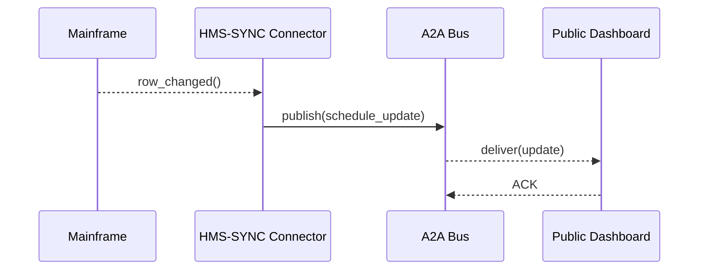

# Chapter 9: External System Synchronization Layer  
*(Jump back to the previous chapter: [Inter-Agency Communication Bus (HMS-A2A)](08_inter_agency_communication_bus__hms_a2a__.md))*  

---

## 1. Why Do We Need a “Sync Layer”?

Imagine the **Federal Highway Administration (FHWA)** maintains bridge-inspection dates in a *40-year-old mainframe*.  
Meanwhile, your shiny HMS platform houses citizen dashboards, AI reminder agents, and compliance checks.

Problem:  
*Bridge inspectors update the legacy calendar at 2 PM.*  
Citizens expect the public dashboard to reflect that change **instantly**, not tomorrow.

Emailing CSVs or nightly ETL jobs won’t cut it.  
Enter the **External System Synchronization Layer (HMS-SYNC)**—think of it as a squad of bilingual clerks stationed in other buildings, phoning headquarters whenever something moves.

```
Mainframe Calendar ──▶ HMS-SYNC ──▶ A2A Bus ──▶ Dashboards, Agents, Alerts
                                      ▲
          ◀───────────────────────────┘
           (also listens for updates going the other way)
```

The goal: keep data **eventually identical** on both sides, without manual work.

---

## 2. Key Concepts (bite-sized)

| Term | Everyday Analogy | Why It Matters |
|------|------------------|----------------|
| Connector | Language interpreter | Talks *SOAP* to the mainframe, *JSON* to HMS. |
| Change Stream | Security camera | Watches for inserts/updates in the legacy DB. |
| Mapping Table | Rosetta Stone | Translates field names & codes. |
| Debounce Window | “Let the paint dry” timer | Batches rapid edits into one event. |
| Reconciliation Job | Nightly headcount | Verifies both sides truly match. |

---

## 3. 5-Minute Tour: Syncing Bridge-Inspection Dates

Below is a **toy script** (18 lines) using an imaginary `hms_sync` SDK.

```python
# File: mainframe_watcher.py
from hms_sync import Connector
from hms_a2a   import Bus         # Chapter 8

bus   = Bus.connect("FHWA")
north = Connector.open(
    name="mainframe_calendar",
    driver="soap",
    url="https://mainframe.fhwa.gov/bridge.wsdl"
)

# 1️⃣  Subscribe to CHANGE STREAM
for change in north.stream(table="INSPECTIONS"):
    # 2️⃣  Translate legacy fields → HMS fields
    event = {
        "bridgeId":   change["BRG_ID"],
        "nextDate":   change["NEXT_INSP_DT"],
        "status":     change["CODE_STS"]
    }
    # 3️⃣  Publish over A2A
    bus.publish(channel="infra.bridge.schedule", payload=event)
```

What will happen?  
1. `Connector.stream()` tails the mainframe table.  
2. Each change is mapped to HMS-style JSON.  
3. The message rides the [A2A Bus](08_inter_agency_communication_bus__hms_a2a__.md); dashboards & agents update in seconds.

---

### Consuming the Update on the HMS side

```python
# File: dashboard_listener.py
from hms_a2a import Bus

def refresh(msg):
    print("🔄  Bridge", msg.payload["bridgeId"], "now scheduled for",
          msg.payload["nextDate"])
    # ...update Postgres or cache...

bus = Bus.connect("DOT_Dashboard")
bus.subscribe("infra.bridge.schedule", refresh)
bus.start()     # blocks forever
```

---

## 4. Under the Hood (Plain-English Walkthrough)

1. The **Connector** sits *inside* the agency’s firewall, speaking native protocol (e.g., SOAP, Oracle, CSV drops).  
2. On any insert/update/delete it emits a normalized **MCP envelope** (see [Model Context Protocol](05_model_context_protocol__hms_mcp__.md)).  
3. HMS-SYNC publishes the envelope to the **A2A Bus**—encrypted, signed, logged.  
4. Subscribers process the event; UI refreshes, agents reschedule tasks, etc.  
5. A nightly **Reconciliation Job** re-queries both systems. If mismatches appear, it queues a “DIFF” report for a human in [HITL Oversight](06_human_in_the_loop__hitl__oversight_.md).

### Mini Sequence Diagram



Only four hops—short, observable, debuggable.

---

## 5. Peek Inside the Codebase

### 5.1  Minimal Connector Class  
*File: `hms_sync/connector.py` (≤18 lines)*

```python
import time, hashlib

class Connector:
    @classmethod
    def open(cls, name, driver, url):
        return cls(name, driver, url)

    def __init__(self, name, driver, url):
        self.name, self.driver, self.url = name, driver, url
        # ...init driver (SOAP, ODBC, etc.)...

    def stream(self, table):
        last_hash = None
        while True:
            row = self._poll(table)        # pretend SOAP call
            h   = hashlib.md5(str(row).encode()).hexdigest()
            if h != last_hash:
                last_hash = h
                yield row                   # <-- emit change
            time.sleep(5)                   # debounce window
```

Key ideas:  
* Poll the legacy table every few seconds.  
* Hash rows to detect changes.  
* Yield only when something is truly new.

### 5.2  Reconciliation Job (nightly)  
*File: `hms_sync/reconcile.py` (≤16 lines)*

```python
def reconcile(connector, shadow_db):
    legacy = connector.fetch_all("INSPECTIONS")
    modern = shadow_db.select("SELECT * FROM bridge_schedule")
    
    diffs = [
        r for r in legacy
        if r["BRG_ID"] not in {m["bridgeId"] for m in modern}
    ]
    if diffs:
        # park for human review
        hitl_id = hitl.checkpoint("SYNC_DIFF", {"rows": diffs})
        print("⚠️  Mismatch found; review draft", hitl_id)
```

Under 15 lines yet demonstrates the safety net.

---

## 6. Frequently Asked Questions

**Q: Is polling the only option?**  
No. Connectors also support database triggers, webhooks, and message queues—pick what the legacy system allows.

**Q: What happens if the mainframe is offline?**  
Connector queues events locally and retries. Once the link returns, HMS-SYNC back-fills the missing updates.

**Q: How do we handle conflicting edits?**  
The first write wins; later conflicting updates trigger a *conflict event* routed to [HMS-ESQ](03_compliance___legal_reasoning__hms_esq__.md) for policy-driven resolution.

---

## 7. Mini Exercise

1. Run `dashboard_listener.py` in one terminal.  
2. Edit `mainframe_watcher.py` to simulate two inspection updates within 3 seconds—notice the **debounce** groups them.  
3. Kill the watcher for a minute, restart, and observe queued events replay.

---

## 8. What You Learned

* HMS-SYNC is the **real-time translator** between legacy/third-party systems and the HMS universe.  
* Connectors watch for changes, map fields, and broadcast over the secure [A2A Bus](08_inter_agency_communication_bus__hms_a2a__.md).  
* Nightly reconciliation + HITL drafts ensure the data *really* matches.  

Next up, see how these synchronized events feed into the nuts-and-bolts services that power the platform:  
[Core Backend Services (HMS-SVC)](10_core_backend_services__hms_svc__.md)

---

Generated by [AI Codebase Knowledge Builder](https://github.com/The-Pocket/Tutorial-Codebase-Knowledge)