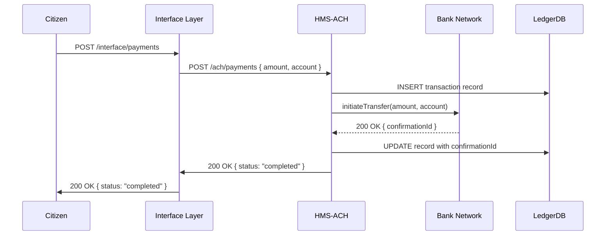

# Chapter 9: Financial Systems (HMS-ACH)

In the last chapter we connected HMS-NFO to external systems for data exchange. Now let’s handle the money side—payments, accounting, and audits—using our **Financial Systems (HMS-ACH)** module.

---

## 1. Why Financial Systems?

Think of HMS-ACH as the government’s **treasury department**:

- It **processes** payments (grants, fees, subsidies).
- It **records** every transaction in ledgers.
- It **audits** activity to meet fiscal rules.
- It produces secure financial records for reporting.

**Use Case**: A small business applies for a COVID relief grant. Once approved, HMS-ACH must send funds to the business bank account, log the disbursement, and let the citizen track the payment status.

---

## 2. Key Concepts

1. **Payment Processing**  
   Initiating and confirming fund transfers with banking networks.

2. **Accounting (Ledger)**  
   Recording each transaction—debits, credits, and balances.

3. **Auditing & Compliance**  
   Keeping immutable logs for review and legal checks.

4. **Reconciliation**  
   Matching records with bank confirmations to catch errors.

5. **Secure Records**  
   Encrypting sensitive data and controlling access.

---

## 3. Grant Disbursement Flow

Here’s a bird’s-eye view of what happens when our citizen requests a grant payout:



---

## 4. Using HMS-ACH in Your Code

### 4.1. Interface Layer Handler

File: `src/interface/handlers/paymentHandler.js`

```js
const apiClient = require('../../backend/apiClient');

async function payGrant(req, res) {
  const { amount, account } = req.body;
  // Forward to HMS-ACH with user token
  const result = await apiClient.post(
    '/ach/payments',
    { amount, account },
    req.user.token
  );
  res.json(result);
}

module.exports = { payGrant };
```

Explanation:  
We take `amount` and `account` from the citizen’s request, call HMS-ACH (`/ach/payments`), then return the ACH response.

### 4.2. HMS-ACH Route Definition

File: `hms-ach/src/routes/payments.js`

```js
const router = require('express').Router();
const { processPayment } = require('../handlers/payments');

router.post('/payments', processPayment);

module.exports = router;
```

Explanation:  
HMS-ACH listens for POSTs at `/payments` and delegates to our handler.

### 4.3. ACH Payment Handler

File: `hms-ach/src/handlers/payments.js`

```js
const achService = require('../services/achService');
const ledgerDB   = require('../lib/ledgerDB');

async function processPayment(req, res) {
  const { amount, account } = req.body;
  // 1. Record initial transaction
  const record = await ledgerDB.insert({ amount, account, status: 'pending' });
  // 2. Call bank network
  const bankResp = await achService.transfer(amount, account);
  // 3. Update ledger with result
  await ledgerDB.update(record.id, { status: bankResp.status, confirmationId: bankResp.id });
  // 4. Return status to caller
  res.json({ status: bankResp.status, confirmationId: bankResp.id });
}

module.exports = { processPayment };
```

Explanation:  
1. We log a **pending** transaction in the ledger.  
2. We call the **bank network** via our service.  
3. We update the ledger with the final status.  
4. We send back a simple JSON response.

### 4.4. ACH Service Mock

File: `hms-ach/src/services/achService.js`

```js
async function transfer(amount, account) {
  // (In real life: call bank’s API, handle keys, errors, retries)
  // Here we simulate a successful transfer
  return { status: 'completed', id: 'BANK12345' };
}

module.exports = { transfer };
```

Explanation:  
This service wraps the actual bank API. For beginners, we mock it to always succeed.

---

## 5. Under the Hood: Step-by-Step

1. **Citizen** submits a payment request via HMS-MFE ([Chapter 2](02_frontend_interface__hms_mfe__.md)).  
2. **Interface Layer** validates and forwards to HMS-ACH.  
3. **HMS-ACH**:
   - Writes a **pending** record to the ledger database.
   - Calls the **bank network** to move funds.
   - Updates the ledger with success/failure and a confirmation ID.
4. HMS-ACH returns a **simple status** to the Interface Layer.  
5. **Citizen** sees “completed” or “failed” on the portal.

---

## 6. What We’ve Learned

- HMS-ACH is like a virtual treasury, handling payments, ledgers, and audits.  
- We saw how to wire up:
  - An Interface Layer handler (`paymentHandler.js`).
  - HMS-ACH routes and handlers (`routes/payments.js`, `handlers/payments.js`).  
  - A mock banking service (`achService.js`).
- We followed a **grant disbursement** from request to final ledger update.

Up next, we’ll explore how all our services fit into a larger, resilient system in [Chapter 10: Microservices Architecture](10_microservices_architecture_.md).

---

Generated by [AI Codebase Knowledge Builder](https://github.com/The-Pocket/Tutorial-Codebase-Knowledge)