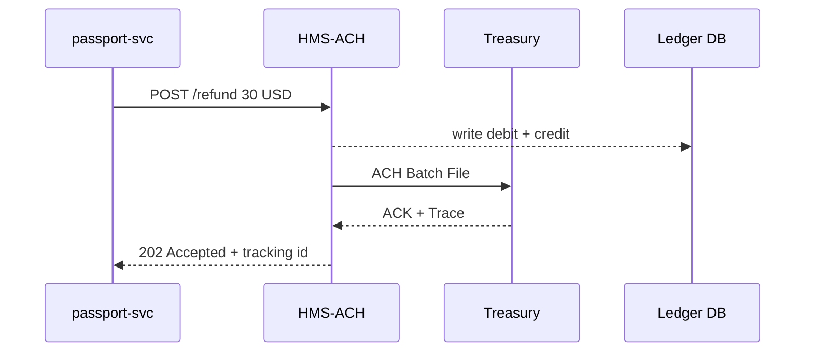

# Chapter 9: Financial Transaction Clearinghouse (HMS-ACH)

*(Follow-up to [Secure Inter-agency Communication Layer (HMS-A2A)](08_secure_inter_agency_communication_layer__hms_a2a__.md))*  

---

## 1  Why Do We Need a “Tiny Federal Reserve” Inside HMS-GOV?

Picture this real-world day in government IT:

1. A citizen named **Alex** over-paid the State Department when she renewed her passport.  
2. The Passport Service must **refund $30** straight back to Alex’s checking account.  
3. The Treasury wants the refund posted through the **Automated Clearing House (ACH)** network, stamped with the same audit rigor they use on multi-million-dollar grants.  
4. Auditors will later ask:  
   *“Show every debit and credit that touched the Treasury fund **76X4540** on 2025-04-15, plus anti-money-laundering flags.”*

Doing this manually would mean SQL scripts, e-mails to the Bureau of the Fiscal Service, and a mountain of spreadsheets.

**HMS-ACH** acts like a **mini Federal Reserve clearinghouse** embedded in our platform:  
• It receives payment or refund requests from any HMS service.  
• Bundles them into **ACH batches**.  
• Talks to Treasury systems over secure channels.  
• Stores an immutable **double-entry ledger** so GAAP and anti-money-laundering (AML) audits are a breeze.

> One API call, and your micro-service suddenly speaks Treasury-grade finance.

---

## 2  Key Concepts (in Plain English)

| Term                     | Friendly Meaning |
|--------------------------|------------------|
| **Transaction**          | A single debit or credit (e.g., “refund $30 to Alex”). |
| **Batch**                | 10–10 000 transactions shipped together; ACH requires batches. |
| **Settlement Window**    | The 4 PM ET “cut-off” when a batch is finalised. |
| **Ledger**               | Database table that records *both* sides of every move (debit + credit). |
| **Reconciliation Report**| CSV snapshot proving our books match Treasury’s books. |

Keep these five words in mind; everything we build below maps to them.

---

## 3  A 3-Minute Walk-Through — Alex’s Refund



Four hops, end-to-end cryptographically logged, no human in the loop.

---

## 4  Using HMS-ACH in Your Service (only 17 lines!)

### 4.1 Call the API

```javascript
// passport-svc/payments.js
import { refund } from 'hms-ach-sdk'

export async function sendRefund(userId, amount) {
  const res = await refund({
    fund:   '76X4540',        // Treasury account code
    toRtn:  '031000503',      // Alex's bank routing number
    toAcct: '123456789',      // Alex's account number
    amount // in cents: 3000
  })
  console.log('Refund tracking id:', res.id)
}
```

Explanation  
1. We import `refund` from the SDK.  
2. Pass fund code + destination bank details + amount.  
3. SDK returns a **tracking id** we can show Alex (“Refund in progress, trace #9821”).

### 4.2 What Do We Get Back?

```json
{
  "id": "REF-20250415-9821",
  "status": "QUEUED",
  "estimated_settlement": "2025-04-15T20:00:00Z"
}
```

No ACH file wrangling, no Excel worksheets—done!

---

## 5  Under the Hood — What Happens Next

1. **Validation** – HMS-ACH checks routing number format, OFAC sanctions list, and balance of the fund.  
2. **Ledger Write** – Two rows inserted:  
   * debit Treasury fund *76X4540*  
   * credit external bank “Alex / 031000503 / 123456789”  
3. **Batch Builder** – Adds the row to today’s “Passport-Refunds_20250415.ach” file.  
4. **Cut-off Robot** – At 4 PM ET, closes the file and pushes it via [HMS-A2A](08_secure_inter_agency_communication_layer__hms_a2a__.md) to Treasury.  
5. **Treasury ACK** – Returns an “ACK + trace number” message. HMS-ACH flips the ledger rows from `PENDING` → `SETTLED`.  
6. **Reconciliation Report** – At midnight, generates `recon_20250415.csv` for auditors.

All of this is automatic; your service already got its `tracking id` minutes ago.

---

## 6  Peeking Inside the Codebase

```
hms-ach/
 ├─ sdk/                 // tiny client used by services
 │   └─ index.js
 ├─ api/                 // Express routes (internal use)
 │   └─ refund.js
 ├─ batcher/             // builds ACH files
 ├─ ledger/              // double-entry helpers
 └─ tasks/settle.js      // 4 PM cron job
```

### 6.1 SDK (sdk/index.js) – 14 lines

```javascript
// hms-ach/sdk/index.js
export async function refund(body) {
  const res = await fetch('/api/ach/refund', {
    method: 'POST',
    headers: {'Content-Type': 'application/json'},
    body: JSON.stringify(body)
  })
  if(!res.ok) throw Error(await res.text())
  return res.json()               // { id, status, estimated_settlement }
}
```

*Beginners only need this file.* It’s a POST wrapper.

### 6.2 API Route (api/refund.js) – 18 lines

```javascript
// hms-ach/api/refund.js
router.post('/refund', async (req, res) => {
  const tx = req.body
  validate(tx)                              // routing #, AML, etc.
  const id = makeId('REF')
  await ledger.writeDoubleEntry(tx, id)     // debit + credit
  batcher.add(tx, id)                       // queue for today’s ACH file
  res.status(202).json({
     id, status:'QUEUED', estimated_settlement: batcher.cutoffTime()
  })
})
```

Highlights  
• **validate** = cheap sync checks (max 5 ms).  
• **ledger.writeDoubleEntry** guarantees debits equal credits → GAAP compliant.  
• **batcher.add** just appends to an in-memory list + DB row.

### 6.3 Batcher Cron (tasks/settle.js) – 12 lines

```javascript
// tasks/settle.js
cron.schedule('0 16 * * 1-5', async () => {  // 4 PM ET weekdays
  const achFile = await batcher.buildFile()  // returns Buffer
  const ack = await sendPouch(
    'https://treasury.gov/ach/inbox', achFile
  )                                          // via HMS-A2A
  ledger.markSettled(ack.traceNumbers)
})
```

One cron, three lines of real work!

---

## 7  Auditing & AML — Built-in Safety Rails

HMS-ACH automatically:

1. Logs **who** requested the transaction (JWT `sub`) and **when**.  
2. Screens each name against the **OFAC** Specially Designated Nationals list.  
3. Refuses transactions that would overdraw the fund.  
4. Emits a daily **GAAP-formatted** trial balance (`debits = credits`).  
5. Exposes a `/reports/aml?date=YYYY-MM-DD` endpoint so auditors pull red-flag summaries.

These rails live in `ledger/` and `screens/aml.js`; beginner services never touch them.

---

## 8  Common Beginner Questions

**Q: Can HMS-ACH handle incoming *payments* (e.g., application fees)?**  
Yes! Use `sdk.charge({ fromRtn, fromAcct, amount })`—same idea but opposite debit/credit.

**Q: What about credit/debit cards?**  
Card rails go through `payment-svc`, which then *settles* the net ACH amount into Treasury via HMS-ACH. One ledger, unified view.

**Q: How do I see status updates?**  
Call `GET /api/ach/tx/REF-20250415-9821` or subscribe to the `ACH.STATUS` event bus topic.

**Q: What if Treasury rejects a batch?**  
The batcher rolls it back (`ledger.markFailed`), and a notification banner appears in the [Policy Management Dashboard](04_policy_management_dashboard_.md). You do nothing until the finance team investigates.

---

## 9  Hands-On Mini Lab (Optional)

```bash
# 1) Run HMS-ACH locally
docker compose up ach-db ach-api

# 2) Trigger a fake refund
curl -X POST http://localhost:4000/api/ach/refund \
  -H "Content-Type: application/json" \
  -d '{"fund":"76X4540","toRtn":"031000503","toAcct":"123456789","amount":3000}'
```

You should see:

```json
{"id":"REF-LOCAL-0001","status":"QUEUED","estimated_settlement":"today 20:00Z"}
```

At **4 PM** your console prints `ACH batch sent, trace #ABC123`.

---

## 10  What You Learned

• HMS-ACH is our **embedded clearinghouse**—ACH files, Treasury rules, and GAAP ledger in one micro-service.  
• Your service calls a tiny SDK (`refund`, `charge`), gets a tracking id, and walks away.  
• Behind the scenes: validate → ledger → batch → A2A → Treasury → reconcile.  
• Audits and AML checks are automatic; you can sleep at night.

➡️ Next we’ll plug into a very different financial world—federal **health-care reimbursements**—inside [Universal Health Care Integration (HMS-UHC)](10_universal_health_care_integration__hms_uhc__.md).

---

Generated by [AI Codebase Knowledge Builder](https://github.com/The-Pocket/Tutorial-Codebase-Knowledge)