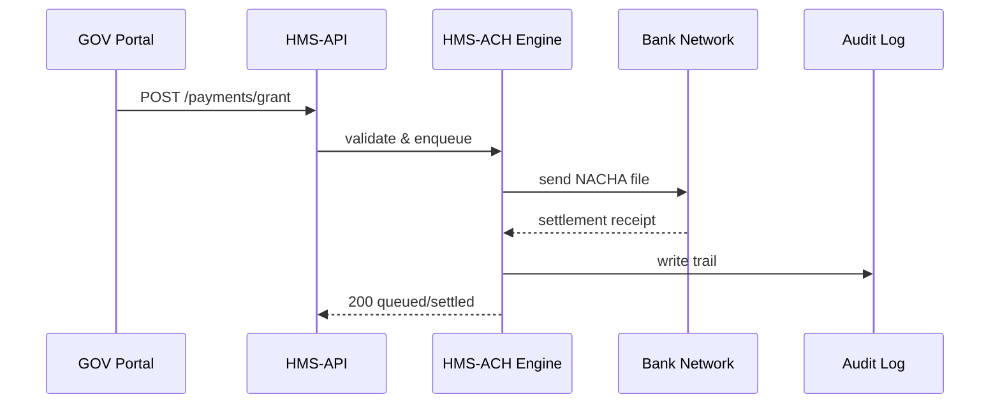

# Chapter 9: Financial Transaction Engine (HMS-ACH)

*(Jumped in from [Data Lake & Schema Registry (HMS-DTA)](08_data_lake___schema_registry__hms_dta__.md))*  

---

## 1 — Why Does HMS Need a “Checkbook in Software”?

Picture the **Institute of Education Sciences (IES)** awarding a $5,000 grant to a doctoral student:

1. The award is approved in the portal.  
2. The student’s bank must see the money tomorrow morning.  
3. Treasury must record the outflow and check for *duplicate* grants.  
4. The Office of the Inspector General (OIG) needs a paper-trail—*who pressed “Send” and when?*

If every agency wrote its **own** payment code there would be:

* Copy-paste security bugs.  
* 50 different audit formats.  
* Sleepless Treasury accountants.

**HMS-ACH** is the **single checkbook** for the entire platform.  
It speaks **ACH**, **Fedwire**, and modern **RTP** rails, while baking in:

* Fraud detection (duplicate or suspicious amounts).  
* Compliance audits (OFAC, NACHA, FIPS 140-2 encryption).  
* Reconciliations against the **Data Lake** for historical reporting.

---

## 2 — Key Ideas in Plain English

| Term                  | Think of it as…                                                    |
|-----------------------|--------------------------------------------------------------------|
| Payment Instruction   | A filled-out Treasury check.                                       |
| Rail                  | Which “road” the money travels on (ACH, Fedwire, RTP).             |
| Batch Window          | The nightly mail truck—e.g., ACH 6 PM ET cutoff.                   |
| Fraud Rule            | A guard dog sniffing each check (“Is the amount weird?”).          |
| Settlement Receipt    | The stamped, returned envelope proving money arrived.              |
| Audit Trail           | A diary entry of *every* button push and network hop.              |

Keep these six words close; the rest of the chapter revolves around them.

---

## 3 — 60-Second Code Tour: “Send a Grant”

Below is **everything** you need to push a $5,000 ACH payment.  

```php
// routes/api_v1.php   (≤ 20 lines)
Route::post('/payments/grant', function () {
    $pi = \App\Services\ACH\PaymentInstruction::make([
        'amount'         => 5000_00,           // cents
        'recipient_name' => 'Dr. Jane Grant',
        'routing_number' => '021000021',
        'account_number' => '987654321',
        'purpose'        => 'Education Grant 2024-05',
        'rail'           => 'ACH',
    ]);

    return \App\Services\ACH\Engine::dispatch($pi);
});
```

What happens?

1. We create a **Payment Instruction** object.  
2. `Engine::dispatch()` validates, queues, and returns JSON:

```json
{
  "instruction_id": "PAY-2024-0515-00042",
  "status": "queued",
  "rail": "ACH",
  "batch_window": "2024-05-15T18:00:00Z"
}
```

---

### 3.1 — Collect a Fee Instead

```php
Route::post('/payments/collect', function () {
    return \App\Services\ACH\Engine::pull([
        'amount'         => 25_00,
        'payer_name'     => 'Acme Corp',
        'routing_number' => '053100300',
        'account_number' => '1122334455',
        'purpose'        => 'Freedom of Info Copy Fee',
        'rail'           => 'RTP',             // instant pull
    ]);
});
```

The engine flips direction (“pull”), creates an **RTP** request, and emails the payer a confirmation link.

---

## 4 — What Happens Under the Hood?



1. **Validation** – format, OFAC, duplicate detection.  
2. **Enqueue** – if before the cutoff time, include in tonight’s batch.  
3. **Network** – exchanging files or RTP messages with the Federal Reserve.  
4. **Audit Log** – every step is appended to an immutable table.

---

## 5 — Peeking Inside the Engine

```
hms-ach/
 ├─ Engine.php                 # main façade
 ├─ Rails/
 │   ├─ AchRail.php
 │   ├─ FedwireRail.php
 │   └─ RtpRail.php
 ├─ Rules/                     # fraud & compliance
 │   └─ DuplicateAmountRule.php
 ├─ Jobs/
 │   ├─ BuildAchFile.php
 │   └─ PollSettlements.php
 └─ Audit/                     # PSR-3 logger to Data Lake
```

### 5.1 — Validation & Fraud (≤ 15 lines)

```php
// Rules/DuplicateAmountRule.php
class DuplicateAmountRule implements FraudRule
{
    public function check(PaymentInstruction $pi): bool
    {
        $dupe = PaymentInstruction::where('amount', $pi->amount)
                ->where('recipient_name', $pi->recipient_name)
                ->whereDate('created_at', today())
                ->exists();

        return ! $dupe;   // pass only if NOT duplicate
    }
}
```

Engine loads every `FraudRule` via reflection; all must pass or the payment is blocked.

### 5.2 — Building a NACHA File (≤ 15 lines)

```php
// Jobs/BuildAchFile.php
foreach (PaymentInstruction::queued('ACH') as $pi) {
    $nacha->addEntry([
        'routing'  => $pi->routing_number,
        'account'  => $pi->account_number,
        'amount'   => $pi->amount,
        'name'     => Str::limit($pi->recipient_name, 22),
        'id'       => $pi->instruction_id,
    ]);
}
Storage::put("ach/{$today}.ach", $nacha->render());
```

At 6 PM a cron job uploads the file to the Fed via SFTP.

---

## 6 — Government Analogy Cheat-Sheet

HMS-ACH Thing       | Real-World Counterpart
--------------------|------------------------
Payment Instruction | Treasury Form 1164 (“Payment Voucher”)
Batch Window        | Locked bag of checks put on the 6 PM mail truck
Fraud Rule          | Treasury agent holding a counterfeit pen
Settlement Receipt  | Bank stamp “Funds Posted”
Audit Trail         | Page in the Daily Treasury Statement

---

## 7 — Common Beginner Pitfalls

1. **Missing “purpose” field**  
   • NACHA rejects files without descriptions.  
2. **Using the wrong rail for urgent payments**  
   • ACH is cheap but *not* instant—use RTP for same-day aid.  
3. **Ignoring duplicate checks**  
   • Always let the **DuplicateAmountRule** run (don’t comment it out in tests).  
4. **Storing account numbers in logs**  
   • Use `$logger->mask()` helper; plaintext PAN/ABA is a FISMA violation.

---

## 8 — Mini-Exercise

1. Create a `sandbox` routing number in `.env`:  
   `SANDBOX_ROUTING=999999999`  
2. Dispatch two identical $100 payments to the same test account.  
3. Observe the second one fails with JSON:  

```json
{ "error": "DuplicateAmountRule failed (same day)" }
```

4. Change the amount to `$101` and watch it queue successfully.  
5. Verify a new row in the `audit_trail` table with `event = "queued"`.

---

## 9 — Recap & What’s Next

In this chapter you learned how **HMS-ACH**:

* Acts as Treasury’s single **checkbook** across ACH, Fedwire, and RTP.  
* Validates each Payment Instruction with **fraud & compliance** rules.  
* Produces **settlement receipts** and immutable **audit trails**.  

Next we’ll see how to **watch** those jobs run in real time—dashes, logs, and alerts—in [Operations & Observability (HMS-OPS)](10_operations___observability__hms_ops__.md).

---

Generated by [AI Codebase Knowledge Builder](https://github.com/The-Pocket/Tutorial-Codebase-Knowledge)