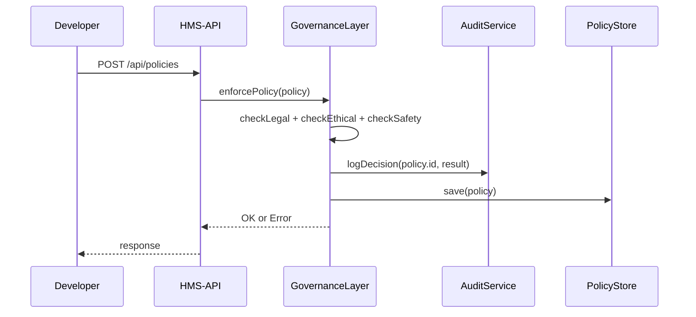

# Chapter 9: Governance Layer

In [Chapter 8: AI Governance Values](08_ai_governance_values_.md) we learned how to bake transparency, safety, ethics, and privacy into every automated decision. Now we’ll build the **Governance Layer**—the “Supreme Court” of our platform. It sets the top-level rules and makes sure every policy or change follows legal and ethical standards. Federal agencies rely on this layer to guarantee regulatory compliance across all services.

---

## 1. Why the Governance Layer?

Imagine the National Highway Traffic Safety Administration (NHTSA) rolls out a new vehicle-recall policy. Engineers push a change that flags older cars for axle inspection. Before that policy goes live:

1. We must verify it doesn’t conflict with existing safety regulations.  
2. We must ensure it respects privacy (no open exposure of VINs).  
3. We must log who approved it and why—for audits.

The **Governance Layer** intercepts every policy update, runs compliance checks, logs decisions, and either approves or rejects the change.

---

## 2. Key Concepts

1. **Policy Definition**  
   A structured object describing a new rule (ID, title, description, rule set).  

2. **Enforcement**  
   Running legal, ethical, and safety checks before applying a policy.  

3. **Audit Trail**  
   Recording every decision (who, what, when) for future review.  

4. **Compliance Checker**  
   A set of functions verifying new policies against laws and standards.  

5. **Supreme Court Analogy**  
   Just like a court reviews legislation, our Governance Layer reviews every policy change.

---

## 3. Using the Governance Layer

### 3.1 Registering or Updating a Policy

In your API, call `governance.enforcePolicy()`. It will:

- Run compliance checks  
- Log the decision  
- Save the policy if it passes  

```js
// src/routes/policyRoutes.js
const express = require('express');
const { enforcePolicy } = require('../services/governanceLayer');
const router = express.Router();

router.post('/policies', async (req, res) => {
  try {
    await enforcePolicy(req.body);      // policy = { id, title, description, rules }
    res.send('Policy approved and stored');
  } catch (err) {
    res.status(400).send(err.message);  // e.g. "Violates safety rules"
  }
});

module.exports = router;
```

Explanation:
- Client POSTs a policy object to `/api/policies`.  
- If checks pass, the policy is saved. Otherwise an error message returns.

### 3.2 Example Input & Output

**Request** POST `/api/policies` with body:
```json
{
  "id": "NHTSA-Recall-001",
  "title": "Axle Inspection for Pre-2010 Cars",
  "description": "All vehicles manufactured before 2010 must undergo axle inspection.",
  "rules": [
    { "type": "age", "operator": "<", "value": 2010 }
  ]
}
```
**Response** (if all checks pass):  
`Policy approved and stored`

If the policy misses a description or fails a rule, you might get:
`400 Bad Request: Violates safety rules`

---

## 4. Under the Hood: Sequence Diagram



1. Developer submits a policy.  
2. The Governance Layer runs checks.  
3. It logs the decision.  
4. If approved, it saves the policy.  
5. API returns success or failure.

---

## 5. Internal Implementation

### 5.1 governanceLayer.js

```js
// src/services/governanceLayer.js
const policyStore = require('./policyStore');
const audit = require('./auditService');
const { checkLegal, checkEthical, checkSafety } =
  require('./complianceChecker');

async function enforcePolicy(policy) {
  if (!checkLegal(policy)) throw new Error('Violates legal standards');
  if (!checkEthical(policy)) throw new Error('Ethical violation detected');
  if (!checkSafety(policy)) throw new Error('Safety rules not met');
  await audit.log('ENFORCE', policy.id);
  await policyStore.save(policy);
}

module.exports = { enforcePolicy };
```
Explanation:
- Three checks guard against illegal, unethical, or unsafe policies.  
- We log every decision (`audit.log`).  
- Finally, we save or update the policy in the store.

### 5.2 complianceChecker.js

```js
// src/services/complianceChecker.js
function checkLegal(policy) {
  return Boolean(policy.id && policy.description && policy.rules.length);
}
function checkEthical(policy) {
  // e.g., no targeting of protected groups
  return !policy.rules.some(r => r.target === 'protectedGroup');
}
function checkSafety(policy) {
  // e.g., ensure mandatory safety thresholds exist
  return policy.rules.every(r => r.type !== 'unsafeOperation');
}
module.exports = { checkLegal, checkEthical, checkSafety };
```
Explanation:
- These are simple stubs—you’d replace them with real checks against statutes or regulations.

### 5.3 auditService.js

```js
// src/services/auditService.js
const db = require('../db');

async function log(action, policyId) {
  await db.query(
    'INSERT INTO audit_log(action, policy_id, timestamp) VALUES($1,$2,NOW())',
    [action, policyId]
  );
}

module.exports = { log };
```
Explanation:
- Records every enforcement attempt in an `audit_log` table for transparency.

### 5.4 policyStore.js

```js
// src/services/policyStore.js
const db = require('../db');

async function save(policy) {
  await db.query(
    `INSERT INTO policies(id,title,description)
     VALUES($1,$2,$3)
     ON CONFLICT(id) DO UPDATE
       SET title=$2, description=$3`,
    [policy.id, policy.title, policy.description]
  );
}

module.exports = { save };
```
Explanation:
- Upserts the policy so updates don’t create duplicates.

---

## Conclusion

In this chapter you learned how the **Governance Layer** acts like a Supreme Court—setting rules, enforcing legal and ethical standards, and logging every decision. You saw how to use `enforcePolicy()` in your API and peeked under the hood at compliance checks and audit logging.

Next up, we’ll build the [Management Layer](10_management_layer_.md), which handles user accounts, roles, and overall system configuration.

---

Generated by [AI Codebase Knowledge Builder](https://github.com/The-Pocket/Tutorial-Codebase-Knowledge)