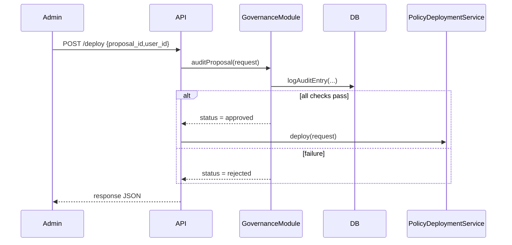

# Chapter 9: Governance Module

In [Chapter 8: Policy Deployment](08_policy_deployment_.md), you saw how approved proposals become live rules. Now we’ll add a safety net: the **Governance Module**. This acts like an ethics office for all AI-driven changes—auditing, logging, and enforcing transparency, safety, ethics, and privacy before anything goes live.

## Why a Governance Module Matters

Central Use Case  
Imagine the Department of Health wants to use AI to speed up eligibility checks for food assistance. Before updating any policy or workflow:

1. The system must **audit** the proposed change.  
2. It must check against data‐privacy laws and ethics rules.  
3. It must **log** who made the change and when.  
4. It must block any update that violates core values.

The **Governance Module** automates those steps, ensuring no change slips through without review and traceability.

## Key Concepts

1. Auditing  
   Every proposal or policy change is reviewed for core values.

2. Logging  
   All decisions (approved, rejected) are stored with timestamps and user IDs.

3. Compliance Checks  
   Automated rules ensure changes follow transparency, safety, ethics, and privacy guidelines.

4. Governance Policies  
   Configurable rules (e.g., “all personal data must be anonymized”) that the module enforces.

## Using the Governance Module

### 1. Register Governance in Code

First, we create and configure our Governance Module:

```php
use App\Managers\GovernanceManager;

$gov = GovernanceManager::init([
  'name'       => 'CoreAI-Governance',
  'policies'   => ['transparency','privacy','safety','ethics']
]);
```
Here we name our module and tell it which policies to enforce.

### 2. Auditing a Proposal

Before deploying a proposal, call the audit step:

```php
$result = $gov->auditProposal([
  'proposal_id' => $proposal->id,
  'actor_id'    => $deployer->user_id,
]);
```

If everything passes, `$result->status` is `"approved"`. Otherwise you get `"rejected"` with an explanation in `$result->issues`.

## What Happens Under the Hood



1. **API** receives a deployment request.  
2. It calls **GovernanceModule** to run compliance checks and log the audit.  
3. If approved, the request moves to deployment; if not, it’s rejected with issues.

## Inside the Implementation

### 1. GovernanceManager

File: `app/Managers/GovernanceManager.php`

```php
<?php
namespace App\Managers;

use App\Models\Governance\AuditRecord;

class GovernanceManager
{
    protected $policies;

    public static function init(array $config)
    {
        $mgr = new self();
        $mgr->policies = $config['policies'];
        return $mgr;
    }

    public function auditProposal(array $req)
    {
        $issues = $this->runChecks($req['proposal_id']);
        // Log every attempt
        AuditRecord::create([
          'proposal_id' => $req['proposal_id'],
          'actor_id'    => $req['actor_id'],
          'issues'      => $issues
        ]);
        return (object)[
          'status' => empty($issues) ? 'approved' : 'rejected',
          'issues' => $issues
        ];
    }

    protected function runChecks(int $proposalId)
    {
        // Pseudo: apply each policy to the proposal details
        // Return an array of issue messages if any
        return [];
    }
}
```

- **`init()`** sets up which policies to enforce.  
- **`auditProposal()`** runs checks, logs the audit, and returns the outcome.

### 2. AuditRecord Model

File: `app/Models/Governance/AuditRecord.php`

```php
<?php
namespace App\Models\Governance;

class AuditRecord
{
    public static function create(array $attrs)
    {
        // Pseudo: INSERT INTO governance_audits ...
    }
}
```

This simple model writes each audit attempt into the database for traceability.

## Real-World Analogy

Think of the **Governance Module** as an ethics committee in a government agency:

- Every new policy draft goes to them first.  
- They check for conflicts of interest, legal compliance, privacy impacts, and safety risks.  
- They record their findings, approve or reject, and only then does the policy move forward.

## Summary

In this chapter you learned how HMS-API’s **Governance Module**:

- Automates auditing of proposals for core values  
- Logs every decision for transparency  
- Enforces configurable compliance checks  
- Integrates seamlessly before deployment

Next up, we’ll see how live changes sync with other systems in [Chapter 10: External System Sync](10_external_system_sync_.md).

---

Generated by [AI Codebase Knowledge Builder](https://github.com/The-Pocket/Tutorial-Codebase-Knowledge)