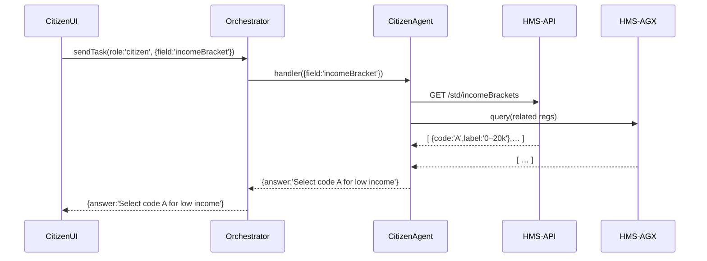

# Chapter 9: HMS-A2A (Agent-to-Agent System)

Welcome back! In [Chapter 8: HMS-NFO (System-Level Info)](08_hms_nfo__system_level_info__.md) we saw how we store regulations and code lists. Now we’ll learn how to coordinate a network of AI agents—our **Agent-to-Agent System**—to help citizens, administrators, and politicians work together seamlessly.

---

## 1. Motivation: Why an Agent-to-Agent System?

Imagine three scenarios:

- A **citizen** wants guided help filling out a benefits application.  
- An **administrator** needs to analyze application progress across regions.  
- A **politician** drafts new legislation and wants quick expert feedback on compliance and stakeholder impact.

Without automation, these tasks require bouncing between forms, dashboards, legal texts, and expert advisors. **HMS-A2A** solves this by spinning up specialized AI agents (“expert advisors”) behind the scenes. Agents talk to each other, fetch data from micro-frontends (HMS-MFE), query the API ([Chapter 6](06_hms_api__backend_api__.md)), or browse the knowledge graph ([Chapter 7](07_hms_agx__knowledge_graph__.md))—all without the user juggling multiple tools.

**Central Use Case:**  
A politician opens a “HITL Agent Card” in **HMS-GOV**. The agent proposes draft language, consults legal clauses in HMS-NFO, checks past bills in HMS-AGX, then refines the draft. Meanwhile, a citizen-facing agent guides a user step-by-step to submit an input form, ensuring every field matches the politician’s intent.

---

## 2. Key Concepts

1. **Agent Registry**  
   A directory of available agents and their roles (citizen-agent, admin-agent, pol-agent).

2. **Orchestrator**  
   The core service that routes tasks to the right agent(s) and handles their responses.

3. **Agent**  
   A small AI or human-in-the-loop module that can:
   - Call micro-frontends (HMS-MFE)  
   - Query HMS-API  
   - Consult the knowledge graph (HMS-AGX)  
   - Load metadata from HMS-NFO

4. **HITL Agent Cards**  
   UI cards in **HMS-GOV** for politicians to interact with their dedicated agent before finalizing legislation.

5. **Task Flow**  
   The lifecycle of a user request:  
   1. **Submit** → 2. **Orchestrate** → 3. **Agent Work** → 4. **Aggregate** → 5. **Respond**

---

## 3. Using HMS-A2A: A Minimal Example

We’ll walk through how to register an agent, send it a task, and receive a response.

### 3.1 Register an Agent

```js
// modules/hms-a2a/registry.js
const agents = [];

function registerAgent({ id, role, handler }) {
  agents.push({ id, role, handler });
}

module.exports = { agents, registerAgent };
```

Registering a “citizen” agent:

```js
const { registerAgent } = require('./registry');
registerAgent({
  id: 'citizen-guide',
  role: 'citizen',
  handler: async task => {
    // e.g. call HMS-API or HMS-AGX internally
    return { answer: `Next, fill ${task.field}` };
  }
});
```

### 3.2 Orchestrate a Task

```js
// modules/hms-a2a/orchestrator.js
const { agents } = require('./registry');

async function sendTask(role, task) {
  // find the first agent matching the role
  const agent = agents.find(a => a.role === role);
  if (!agent) throw Error('No agent for role');
  return await agent.handler(task);
}

module.exports = { sendTask };
```

### 3.3 Invoking from a Service

```js
// services/appService.js
const { sendTask } = require('../modules/hms-a2a/orchestrator');

async function guideCitizen(fieldName) {
  const response = await sendTask('citizen', { field: fieldName });
  console.log(response.answer);
  // Output: "Next, fill applicantIncomeBracket"
}
```

This minimal flow lets your front-end or backend ask the right agent for help.

---

## 4. Under the Hood: Task Sequence

Here’s what happens when a citizen needs help on “income bracket”:



1. **UI** calls the **Orchestrator**.  
2. **Orchestrator** picks the **CitizenAgent**.  
3. Agent fetches details from HMS-API and HMS-AGX.  
4. Agent returns a friendly message to the UI.

---

## 5. Internal Implementation Details

Let’s look at two core files.

### 5.1 Agent Registry

File: `modules/hms-a2a/registry.js`

```js
// Holds all registered agents
const agents = [];

// Adds agent metadata and handler
function registerAgent(agent) {
  agents.push(agent);
}

module.exports = { agents, registerAgent };
```

### 5.2 Orchestrator

File: `modules/hms-a2a/orchestrator.js`

```js
const { agents } = require('./registry');

async function sendTask(role, task) {
  const agent = agents.find(a => a.role === role);
  if (!agent) throw Error(`No agent for role ${role}`);
  return await agent.handler(task);
}

module.exports = { sendTask };
```

- **registerAgent**: let other modules plug in new agent types (e.g. admin, politician).  
- **sendTask**: finds the correct agent and runs its handler, keeping orchestration logic in one place.

---

## 6. Conclusion

You’ve learned how **HMS-A2A** spins up a network of specialized agents—citizen guides, admin analysts, and political advisors—that call micro-frontends, APIs, and knowledge graphs on your behalf. We covered:

- Agent Registry & Orchestrator basics  
- A minimal code example for registering agents and sending tasks  
- A sequence diagram showing how agents fetch data and reply  

Next up, we’ll see how administrators use **HMS-GOV** to manage these agents in [Chapter 10: HMS-GOV (Admin Frontend)](10_hms_gov__admin_frontend__.md).

---

Generated by [AI Codebase Knowledge Builder](https://github.com/The-Pocket/Tutorial-Codebase-Knowledge)