# Chapter 9: HMS-AGT  (Core Agent Framework)

*(Coming from [Activity Orchestration (HMS-ACT & HMS-OMS)](08_activity_orchestration__hms_act___hms_oms__.md))*  

---

## 1. Why Do We Need an “HR Department” for Bots?

Picture the Treasury’s **Payment Reconciliation** office.  
Every night thousands of digital workers must:

1. pull ACH files,  
2. match them to tax receipts,  
3. flag mismatches for human review.

New interns (agents) arrive weekly: one written in Python, another inside a SaaS dashboard, a third produced by a vendor.  
Without oversight you soon have a **Wild West**:

* Which agent is allowed to touch production data?  
* Did last night’s hire read the fraud-detection manual?  
* Who reports if an agent silently crashes at 2 a.m.?

**HMS-AGT** solves this by acting like a **federal HR desk** for AI:

| HR Step | HMS-AGT Feature | Why It Matters |
|---------|-----------------|----------------|
| Hire | Registration & credential issuance | Only vetted agents run in prod |
| Train | Auto-attach policy manual | Governance baked in from day 1 |
| Badge | OAuth/JWT signing | Agents log into services safely |
| Review | Performance & ethics metrics | Detect bias, drift, or failures |
| Retire | Graceful de-registration | Removes secrets + stops new jobs |

---

## 2. Key Concepts (One-By-One)

| Concept | Beginner Analogy | Short Definition |
|---------|------------------|------------------|
| Agent Manifest | Job application | YAML file declaring skills & needs |
| Policy Pack | Employee handbook | List of HMS-CDF rules the agent must follow |
| Badge Token | Staff ID card | Short-lived JWT issued by AGT |
| Performance Hook | KPI spreadsheet | POST endpoint where agent reports work stats |
| Retirement Ticket | Exit form | Removes badge & kills outstanding tasks |

---

## 3. Step-By-Step: Hiring a New Agent

We’ll hire the **Budget Reconciler** bot.

### 3.1 Fill the Job Application (Agent Manifest)

```yaml
# file: reconciler.manifest.yml
id: budget-reconciler
version: 1.0.0
skills: [ "csv-join", "flag-delta" ]
needs:
  - api: /payments/*
  - bucket: s3://treasury-raw/*
policy_pack: ["FISMA-Low", "Anti-Fraud-1"]
performance_hook: "http://agt/report/budget-reconciler"
```

*10 lines → declares what the agent does and which rules apply.*

### 3.2 Submit to HMS-AGT

```bash
hms agt register reconciler.manifest.yml
```

Console:

```
✔ Policies attached (FISMA-Low, Anti-Fraud-1)
✔ Badge issued: JWT exp=60m
✔ Agent ID: AG-431
```

### 3.3 Write the Agent Loop (≤ 18 lines)

```python
# file: reconciler.py
import httpx, os, time, jwt

AGT = os.getenv("AGT_URL","http://agt")
BADGE = jwt.encode({"sub":"AG-431"}, "secret", algorithm="HS256")

while True:
    # ① pull new assignment from OMS
    job = httpx.get("http://oms/pull?lane=budget").json()
    if not job:
        time.sleep(2); continue

    # ② do work (stub)
    matches = sum(1 for _ in job["rows"])     # pretend

    # ③ report back
    httpx.post(f"{AGT}/report/AG-431",
               json={"job":job["id"],"matches":matches},
               headers={"Authorization":f"Bearer {BADGE}"})
```

Explanation:  
① Agent authenticates with its **badge**.  
② Runs its domain skill.  
③ Posts a tiny performance report; AGT stores it for audits.

---

## 4. What Happens Under the Hood?


*Only five actors keep the mental model simple.*

---

## 5. Inside HMS-AGT (Code-Light)

### 5.1 Agent Registry Table (SQLite, 8 lines)

```sql
CREATE TABLE agents (
  id        TEXT PRIMARY KEY,
  manifest  JSON,
  badge_kid TEXT,     -- public-key id
  status    TEXT      -- active / retired
);
```

### 5.2 Badge Issuer (Python, 15 lines)

```python
# file: agt/badge.py
import jwt, datetime, uuid

def issue(agent_id, kid, key):
    claims = {
        "sub": agent_id,
        "iat": datetime.datetime.utcnow(),
        "exp": datetime.datetime.utcnow() + datetime.timedelta(minutes=60),
        "kid": kid
    }
    return jwt.encode(claims, key, algorithm="RS256")
```

*One tiny helper signs every badge.*

### 5.3 Policy Guard (Pseudo, 12 lines)

```python
def can_access(agent_id, resource):
    manifest = registry[agent_id]
    needed = manifest["needs"]
    if resource_matches(resource, needed):
        return cdf.check_policies(manifest["policy_pack"])
    return False
```

Relies on Rule Engine from [HMS-CDF](02_hms_cdf___policy_engine___codified_democracy_foundation__.md).

---

## 6. Monitoring & Retirement

*Performance Dashboard (one-liner CLI)*

```bash
hms agt stats budget-reconciler --last 24h
```

Returns:

```
jobs: 18   avg_duration: 2.3s   errors: 0
```

*Graceful Exit*

```bash
hms agt retire budget-reconciler
```

Effects:

1. Badge revoked.  
2. OMS no longer assigns work.  
3. Status flips to `retired` in registry.

---

## 7. Where HMS-AGT Fits in the Big Picture

```mermaid
graph TD
  AGT["🤖 HMS-AGT"] --> OMS["🛫 HMS-OMS"]
  AGT --> API["🔗 HMS-API"]
  AGT --> ESQ["🛡️ HMS-ESQ"]
  AGT --> OPS["🔭 HMS-OPS"]
```



* Agents receive tasks from **OMS** (Chapter 8).  
* Badges are validated by the API gateway you met in [Chapter 4](04_backend_api_layer__hms_svc___hms_api__.md).  
* Security scans & ethics rules come from **HMS-ESQ**.  
* All metrics go to **HMS-OPS** for dashboards and alerts.

---

## 8. Common Beginner Questions

| Question | Quick Fix |
|----------|-----------|
| “My agent’s requests are **401 Unauthorized**.” | Badge probably expired; re-issue with `hms agt refresh`. |
| “How do I attach a new policy?” | Edit `policy_pack` in the manifest and run `hms agt update …`. |
| “Can human clerks be ‘agents’?” | Yes—set `type: human` in the manifest; AGT will issue login tokens instead of JWTs. |

---

## 9. Summary & Next Steps

In this chapter you learned:

1. HMS-AGT is the **HR desk for AI & human agents**—handling hiring, training, badging, reviews, and retirement.  
2. A full walk-through hired the **Budget Reconciler** bot with a 10-line manifest and an 18-line loop.  
3. Under the hood, AGT keeps a simple registry, signs badges, and enforces policies via HMS-CDF.  
4. AGT plugs into OMS for work assignments, ESQ for security, and OPS for monitoring.

Agents sometimes need extra gear—special data adapters, GPUs, or language packs.  
Those optional add-ons live in the next chapter:  
[HMS-AGX  (Agent Extensions)](10_hms_agx___agent_extensions__.md)

---

---

Generated by [AI Codebase Knowledge Builder](https://github.com/The-Pocket/Tutorial-Codebase-Knowledge)