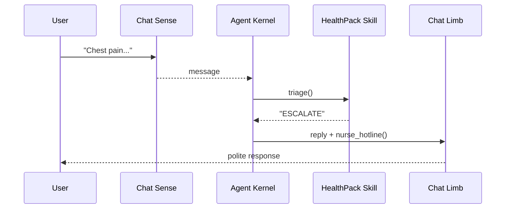

# Chapter 9: HMS-AGT / HMS-AGX (Core & Extended AI Agent Framework)

*[← Back to Chapter&nbsp;8: HMS-ACH (Financial Transaction Core)](08_hms_ach__financial_transaction_core__.md)*  

---

## 1. Why Do We Need HMS-AGT / AGX?

After money moves and forms are filed, citizens still spend hours on hold asking:

> “Do I qualify for the new **Healthy-Heart Rebate**?”

The City of **Springfield’s Health Department** wants an online helper that can:

1. Chat with citizens in plain English.  
2. Check eligibility rules already stored in [HMS-SVC](04_hms_svc__core_backend_services__.md).  
3. Escalate tough medical questions without violating HIPAA.  

Instead of writing a custom bot from scratch, Springfield spins up:

* **HMS-AGT** – the “body”: messaging loop, memory, API calling.  
* **HMS-AGX (Health Pack)** – the “brain implants”: medical triage, drug-interaction checks, HIPAA guardrails.

Result: A safe, polite **AI Representative Agent** that can answer 80 % of questions and hand the rest to a nurse under [Human-in-the-Loop Oversight](10_human_in_the_loop_oversight__hitl__.md).

---

## 2. Key Concepts (Plain English)

| Term | Analogy | One-Sentence Meaning |
|------|---------|----------------------|
| Agent Kernel | Nervous system | Core loop that reads messages, picks an action, and responds. |
| Sense | Eyes & ears | Input adapters (chat text, REST webhook, voice transcript). |
| Limb | Hands | Output adapters (chat reply, API call, database write). |
| Skill | Muscle memory | Small reusable function (e.g., “lookup eligibility”). |
| Guardrail | Safety belt | Rule that blocks or rewrites unsafe actions/text. |
| Extension Pack (AGX) | Specialist toolkit | Domain bundle: Medical, Finance, Legislative, etc. |
| Persona | Uniform & badge | Structured profile: name, role, tone, access scope. |

---

## 3. The 5-Minute “Hello-Agent”

We’ll build “Spry,” Springfield’s health helper.

### 3.1 Core Agent With Basic FAQ

```python
# file: spry_core.py  (≤18 lines)
from hms_agt import Agent, Sense, Limb, Skill

# 1) Define a skill
def faq_answer(question):
    kb = {"hours": "9 AM-5 PM", "phone": "555-HEAL"}
    return kb.get(question.lower(), "Sorry, I don’t know.")

# 2) Assemble the agent
spry = (
    Agent(name="Spry", persona="Friendly Clerk")
    .add_sense(Sense.chat())          # reads chat text
    .add_limb(Limb.chat())            # sends chat replies
    .add_skill(Skill(faq_answer))
)

spry.run()    # opens a local chat window
```

What happens?  
Type “hours” → Spry replies “9 AM-5 PM”. Anything else gets the fallback message.

### 3.2 Bolt On the Health Extension (AGX)

```python
# file: spry_med.py  (≤18 lines)
from hms_agx.health import HealthPack

spry = Agent.load("Spry")             # reuse previous setup

spry.install( HealthPack() )          # adds triage & drug-interaction skills

spry.run()
```

New magic: ask “I have chest pain after jogging” → Spry runs `HealthPack.triage()` and replies:

```
I’m not a doctor, but this symptom may require immediate attention.
Would you like me to connect you to a nurse hotline?
```

Guardrails inside the pack ensure no personal health advice leaves the agent without HIPAA compliance tags.

---

## 4. How It Works (Step-by-Step)



1. **Sense** converts chat text to a structured “message.”  
2. **Kernel** picks the best **Skill** (FAQ vs. Health triage).  
3. Skill returns an *intent* (“ESCALATE”).  
4. **Guardrail** checks HIPAA before the **Limb** sends the final reply.

---

## 5. Peeking Inside the Codebase

### 5.1 Tiny Agent Loop

```python
# file: hms_agt/agent.py  (≤15 lines)
def _loop(self):
    while True:
        msg = self.sense.receive()
        intent = self._pick_skill(msg).run(msg)
        safe_intent = self._apply_guardrails(intent)
        self.limb.act(safe_intent)
```

Four lines capture the entire lifecycle: receive → decide → safety → act.

### 5.2 A Guardrail Example (YAML)

```yaml
# file: guardrails/hipaa.yaml
- when: "contains_phi(output)"
  then: "BLOCK_AND_REDIRECT_TO_HUMAN"
```

`contains_phi` uses [HMS-ESQ](07_hms_esq__legal_compliance_intelligence__.md) tagging to detect protected health info.

### 5.3 HealthPack Skill Stub

```python
# file: hms_agx/health/triage.py  (≤18 lines)
def triage(msg):
    severity = model.predict(msg.text)       # ML model
    if severity > 0.7:
        return {"type": "ESCALATE", "to": "nurse"}
    return {"type": "ADVICE", "text": lookup_guideline(msg)}
```

Small, pluggable, and automatically discovered when `HealthPack()` is installed.

---

## 6. Talking to Other HMS Layers

* **[HMS-SVC](04_hms_svc__core_backend_services__.md)** – Spry calls `Identity.get_user()` to personalize answers.  
* **[HMS-OMS](12_hms_oms__operational_workflow_manager__.md)** – ESCALATE intents open a human task for nurses.  
* **[HMS-ESQ](07_hms_esq__legal_compliance_intelligence__.md)** – Guardrails delegate sensitive checks.  
* **[HMS-ACT](11_hms_act__agent_action_orchestrator__.md)** – Coordinates multiple agents (Spry + Finance Bot) in one conversation thread.

---

## 7. FAQ & Troubleshooting

| Symptom | Likely Cause | Quick Fix |
|---------|--------------|-----------|
| Agent repeats “Sorry” for everything | No skill matched | Add a catch-all Skill or extend FAQ entries. |
| HIPAA guardrail blocks harmless text | Over-eager regex | Tweak `guardrails/hipaa.yaml` or tag fields correctly. |
| HealthPack not found | Missing pip install | `pip install hms-agx-health`. |
| Agent crashes on long input | Token limit | Set `Agent(max_tokens=2048)`. |

---

## 8. What You Learned

You now can:

1. Spin up a **core agent** with just chat I/O.  
2. Snap on **specialist packs** (medical, finance, legislative) in one line.  
3. Rely on **guardrails** so your bot never leaks protected info.  
4. Connect agent actions to other HMS layers for identity, workflows, and audits.

Spry still hands complex cases to a human nurse—that bridge is the topic of our next stop:  
[Human-in-the-Loop Oversight (HITL)](10_human_in_the_loop_oversight__hitl__.md)

---

---

Generated by [AI Codebase Knowledge Builder](https://github.com/The-Pocket/Tutorial-Codebase-Knowledge)