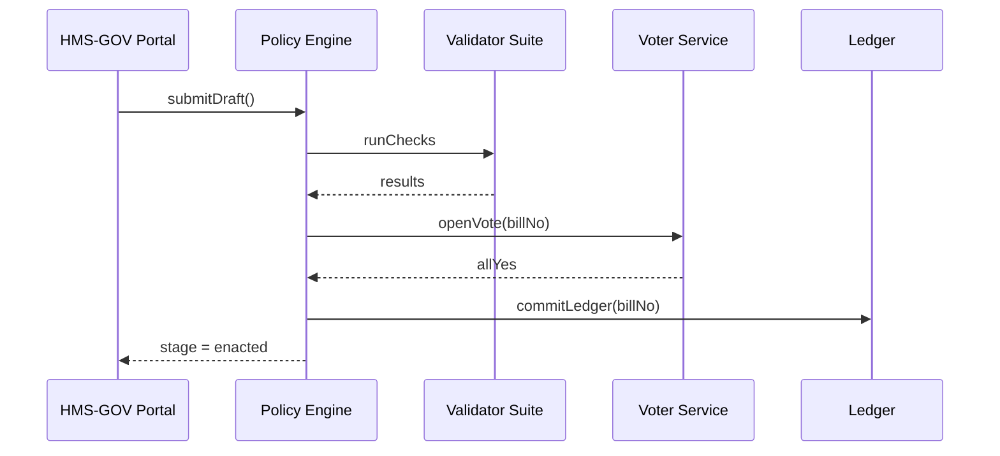

# Chapter 9: HMS-CDF Policy Governance Engine  

[← Back to Chapter 8: HMS-ACT Orchestration & Workflow Engine](08_hms_act_orchestration___workflow_engine_.md)

---

## 1. Why Bother?  
Imagine the **U.S. Mint** wants an AI agent to **cut coin-engraving permit time from 60 days to 30**.  
Great for innovation—but if that new rule bypasses a public-comment window or breaks Treasury authority, the Mint could land in hot water with Congress.

What we need is the software equivalent of **“How a Bill Becomes a Law.”**  
That is exactly what **HMS-CDF** provides: every draft rule—human or AI—must pass **Draft → Committee → Vote → Enact** before it can change real-world behavior.

---

## 2. Key Concepts (Plain-English Cheat-Sheet)

| Word | Think of It As… |
|------|-----------------|
| Draft | First text of a proposed rule (like a bill introduced). |
| Committee Review | Automated & human checks (legal authority, budget, overlap). |
| Vote | Digital thumbs-up/down from required roles (e.g., Treasury Legal, OMB). |
| Enactment | Rule becomes “live”; downstream systems auto-update. |
| Immutable Ledger | Public, read-only log—similar to the Federal Register. |
| Bill No. | Unique ID (`B-2024-0421`) used in dashboards & APIs. |
| Amendment | Change to an enacted rule; goes back to Draft stage. |

Remember these seven words—you now speak 80 % of HMS-CDF!

---

## 3. Hands-On Walk-Through: “Faster Coin Permits”

### 3.1 Write the Draft (fast-permit.yaml – 12 lines)

```yaml
title: "Expedite Coin-Engraving Permits"
proposedBy: usmint-ai-agent
effectiveDate: "2025-01-01"
summary: >
  Reduce statutory review period from 60 to 30 days
  while maintaining public comment of 15 days.
legalCitation: 31 U.S.C. §5112
changes:
  - section: "PermitReviewPeriod"
    oldDays: 60
    newDays: 30
publicCommentDays: 15
```

### 3.2 Submit the Draft (one `curl`)

```bash
curl -X POST https://cdf.hms.gov/drafts \
     -H "Authorization: Bearer mintToken" \
     -d @fast-permit.yaml
```

Response:

```json
{ "billNo": "B-2024-0421", "stage": "committee" }
```

Congratulations—you just filed a “bill”!

### 3.3 Watch Committee Review

```bash
curl https://cdf.hms.gov/bills/B-2024-0421/status
```

Example output:

```jsonc
{
  "billNo": "B-2024-0421",
  "checks": {
    "legalAuthority": "pass",
    "budgetImpact":  "pass",
    "conflictScan":  "warning"   // overlaps with OMB Circular A-11
  },
  "stage": "committee"
}
```

When **all mandatory checks are `pass`** (or warnings resolved) the bill auto-moves to **Vote**.

### 3.4 Cast the Votes (mocked—2 tiny calls)

```bash
# Treasury Legal votes YES
curl -X POST https://cdf.hms.gov/bills/B-2024-0421/vote \
     -d '{ "vote":"yes" }' -H "X-Role: treasury-legal"

# OMB Budget votes YES
curl -X POST https://cdf.hms.gov/bills/B-2024-0421/vote \
     -d '{ "vote":"yes" }' -H "X-Role: omb-budget"
```

Once all required seats vote **yes**, the bill is **Enacted**.

### 3.5 Verify Enactment & Ledger Entry

```bash
curl https://cdf.hms.gov/ledger/latest/B-2024-0421
```

You’ll see a signed JSON blob with a SHA-256 hash—permanent, tamper-proof, world-readable.

Downstream systems (HMS-ACT workflows, marketplace skills, etc.) subscribe to a **`policy.enacted`** event and update automatically.

---

## 4. What Happens Under the Hood? (No Big Code)



Only five actors—easy to keep in your head!

---

## 5. Tiny Peek at the Code (All Under 20 Lines)

### 5.1 Route: Submit Draft  
_File `cdf/src/routes/drafts.ts`_

```ts
router.post('/', async (req, res) => {
  const draft = req.body                      // ← YAML already parsed
  const billNo = idGen()                      // e.g., B-2024-0421
  await db.saveDraft(billNo, draft)

  queue.push('runChecks', { billNo })         // fire-and-forget job
  res.status(201).json({ billNo, stage: 'committee' })
})
```

Explanation  
1. Save draft.  
2. Queue validation job.  
3. Return bill number.

### 5.2 Worker: Run Checks  
_File `cdf/src/workers/runChecks.ts`_

```ts
bus.on('runChecks', async ({ billNo }) => {
  const draft = await db.getDraft(billNo)

  const results = {
    legalAuthority: await checkLaw(draft.legalCitation),
    budgetImpact:  await checkBudget(draft.changes),
    conflictScan:  await scanConflicts(draft.changes)
  }
  await db.saveChecks(billNo, results)

  if (allPass(results)) bus.publish('openVote', { billNo })
})
```

Explanation  
• Each `check*` is a micro-function.  
• If all pass, open the voting stage.

### 5.3 Worker: Commit Ledger  
_File `cdf/src/workers/commitLedger.ts`_

```ts
bus.on('votePassed', async ({ billNo }) => {
  const bill = await db.getBillComplete(billNo)
  const hash = crypto.createHash('sha256').update(JSON.stringify(bill)).digest('hex')

  await ledger.append({ billNo, hash, bill, enactedAt: Date.now() })
  bus.publish('policy.enacted', { billNo })    // notify world
})
```

Explanation  
1. Compute immutable hash.  
2. Append to public ledger.  
3. Emit `policy.enacted` event for other HMS components.

---

## 6. Where HMS-CDF Plugs into the Rest of HMS

Component | Interaction
----------|------------
[HMS-GOV Admin / Policy-Maker Portal](05_hms_gov_admin___policy_maker_portal_.md) | UI for drafting & voting.  
[HMS-ACT Workflow Engine](08_hms_act_orchestration___workflow_engine_.md) | Subscribes to `policy.enacted` events to update running workflows.  
[HMS-MKT Agent & Data Marketplace](03_hms_mkt_agent___data_marketplace_.md) | Publishes enacted rules as datasets others can buy/subscribe to.  
[Human-in-the-Loop Framework](14_human_in_the_loop__hitl__oversight_framework_.md) | Inserts mandatory human checkpoints during Committee Review.  
[Security, Compliance & Legal Reasoning](10_security__compliance___legal_reasoning__hms_esq__hms_sys__.md) | Provides deeper reasoning engines used inside `checkLaw` and `scanConflicts`.

---

## 7. 60-Second Local Playground

```bash
# 1. Run dev stack
npm run dev --workspace=hms-cdf

# 2. Seed the fast-permit draft
curl -X POST localhost:6000/drafts -d @fast-permit.yaml

# 3. Auto-approve checks (demo flag)
curl localhost:6000/bills/B-2024-0421/autoApprove

# 4. Vote YES twice
for role in treasury-legal omb-budget
do curl -X POST localhost:6000/bills/B-2024-0421/vote \
        -d "{\"vote\":\"yes\"}" -H "X-Role: $role"
done

# 5. View ledger
curl localhost:6000/ledger/latest/B-2024-0421
```

You will see the SHA-256 hash and `enactedAt` timestamp.

---

## 8. Recap & What’s Next  
In this chapter you:

• Learned why **policy governance** matters even for AI-generated rules.  
• Filed a draft, watched it clear checks, gathered votes, and land in an immutable ledger.  
• Peeked at the < 20-line code chunks that power each stage.  
• Saw how other HMS layers subscribe to `policy.enacted` events.

Next we’ll zoom in on the **legal-reasoning engines** that perform deep statutory analysis and compliance checks:  
[Next Chapter: Security, Compliance & Legal Reasoning (HMS-ESQ, HMS-SYS)](10_security__compliance___legal_reasoning__hms_esq__hms_sys__.md)

---

Generated by [AI Codebase Knowledge Builder](https://github.com/The-Pocket/Tutorial-Codebase-Knowledge)