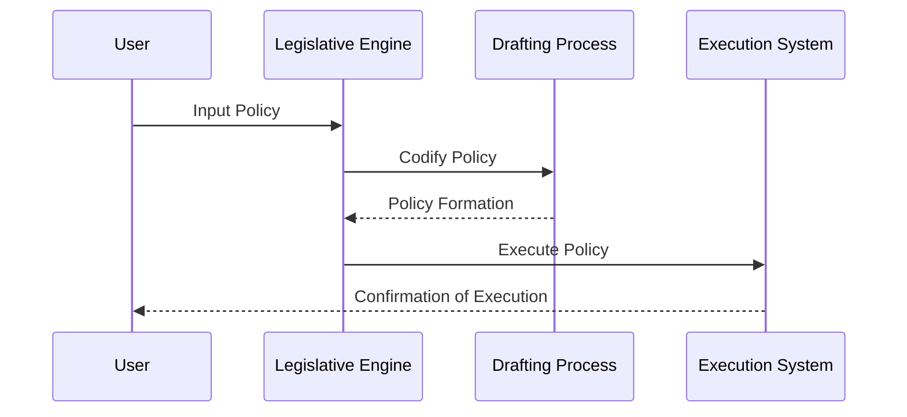

# Chapter 9: HMS-CDF

Welcome to Chapter 9 of our tutorial series! In the previous chapter, we explored the command center of governance with [HMS-GOV](08_hms_gov_.md). Now, let's dive into `HMS-CDF`, the high-performance legislative engine that codifies laws and policies at AI-speed, ensuring they are quickly and effectively executed within the HMS platform.

## Motivation and Use Case

Imagine you are tasked with drafting and passing new legislation in response to an urgent environmental crisis. Traditional legislative processes can be slow and cumbersome, but `HMS-CDF` acts like an efficient legal assembly, rapidly codifying laws with precision and speed using advanced technology.

`HMS-CDF` is perfect for scenarios requiring swift legislative action, ensuring that laws are not only drafted quickly but also implemented efficiently. This system is built in Rust, offering high performance and reliability, which is crucial for managing complex legislative processes seamlessly.

## Understanding Key Concepts

Let's break down `HMS-CDF` into a few essential concepts to simplify the way it operates.

### Key Concept 1: Legislative Engine

Think of `HMS-CDF` as a high-speed train for law-making. It streamlines the entire legislative process, from drafting to execution, ensuring every step is completed efficiently.

### Key Concept 2: Rust-Based Performance

Picture Rust as the powerful engine behind our train, with `HMS-CDF` leveraging its capabilities to ensure reliability and speed. Rust's performance characteristics make it ideal for managing the complex tasks involved in codifying laws.

## How to Use HMS-CDF

Let's walk through a simple example of utilizing `HMS-CDF` to draft and execute a new policy.

```rust
// Example usage of HMS-CDF to draft a policy

fn main() {
    // Initialize the legislative engine
    let legislative_engine = HMS_CDF::new();

    // Define a policy as a simple string for demonstration purposes
    let new_policy = "Implement green energy standards by 2025";

    // Codify the policy
    legislative_engine.codify_policy(new_policy);
}
```

**Explanation:**

- **Initialization**: We create an instance of `HMS_CDF`, representing our legislative engine.
- **Define Policy**: We specify the new policy to be codified, such as setting green energy standards.
- **Codify Policy**: The policy is processed by the engine, turning it into executable law.

## Behind the Scenes

Wondering how `HMS-CDF` processes a policy internally? Let's visualize it with a basic sequence diagram.



**Step-by-Step Breakdown:**

1. **User Input**: You input the policy into the `HMS-CDF`.
2. **Policy Codification**: The engine transforms the policy into a formal structure.
3. **Execution**: The codified policy is executed efficiently.
4. **Confirmation**: You receive confirmation when the policy is enacted.

## Internal Implementation

Here's how `HMS-CDF` might be internally structured in a simplified way:

```rust
// Basic structure of HMS-CDF
struct HMS_CDF;

impl HMS_CDF {
    fn new() -> Self {
        HMS_CDF
    }

    fn codify_policy(&self, policy: &str) {
        // Simplified logic to codify and execute a policy
        println!("Policy '{}' has been codified and executed.", policy);
    }
}
```

**Explanation:**

- **Structure Definition**: `HMS_CDF` is defined as a struct in Rust.
- **Codification Logic**: The `codify_policy` method processes the given policy, with a simplified logic here to focus on the high-level steps.

## Conclusion

In this chapter, you've learned how `HMS-CDF` acts as a rapid legislative engine, using Rust to ensure laws are quickly codified and executed. This powerful tool allows urgent legislative actions to be taken with precision and speed.

Get ready for more learning as we dive into new challenges! Next, we'll explore exciting new concepts. Stay curious and continue your journey with us!

---

Generated by [AI Codebase Knowledge Builder](https://github.com/The-Pocket/Tutorial-Codebase-Knowledge)