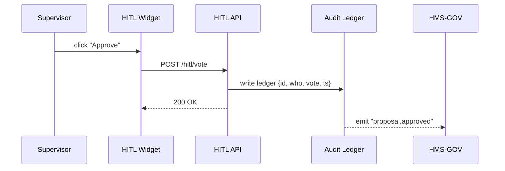

# Chapter 9: Human-in-the-Loop (HITL) Oversight  
*(Filename: 09_human_in_the_loop__hitl__oversight_.md)*  

[← Back to Chapter 8: AI Representative Agent (HMS-A2A)](08_ai_representative_agent__hms_a2a__.md)

---

## 1. Why Do We Need “Humans on the Balcony”?

Picture U.S. Customs & Border Protection (**CBP**) testing a new AI that suggests faster screening questions at airports.  
The agent’s **digital motion** (filed by [HMS-A2A](08_ai_representative_agent__hms_a2a__.md)) claims:

> “Cutting Question #4 will shave 30 sec per traveler and keep security risk unchanged.”  

Before this goes live, a real CBP supervisor must:

1. Compare the **AI proposal** with the current questionnaire.  
2. Inspect the **impact forecast** (wait-time vs. risk metrics).  
3. Check the **legal citations** the AI used.  
4. Approve, tweak, or reject—**every keystroke recorded** for Congress or FOIA.

That final checkpoint is **Human-in-the-Loop (HITL) Oversight**—the digital equivalent of a *roll-call vote*.

---

## 2. Big Ideas (Friendly Glossary)

| Term                     | Beginner Analogy                                         |
|--------------------------|----------------------------------------------------------|
| Review Panel             | Side-by-side “before vs. after” view of a proposal.      |
| Action Buttons           | **Approve ✔️**, **Tweak ✏️**, **Reject ❌**—like voting buttons in Congress. |
| Keystroke Ledger         | Tamper-proof notebook logging every click & note.        |
| Escalation Dashboard     | Sends “stall alerts” to higher-ups if a reviewer drags their feet. |
| Performance Snapshot     | Mini metrics card (“Avg wait-time ↓ 12 %”).              |

---

## 3. The 5-Minute Beginner Walk-Through

Goal: build a **HITL Review Widget** that lets Supervisor Maria approve or reject the AI’s travel-questionnaire change.

### 3.1 Front-End Widget (Vue ≤ 20 lines)

```vue
<!-- File: widgets/HitlReview.vue -->
<template>
  <div class="panel">
    <Diff :old="data.old" :new="data.new" />
    <ImpactChart :forecasts="data.impact" />
    <button @click="vote('APPROVE')">✔️ Approve</button>
    <button @click="vote('REJECT')">❌ Reject</button>
  </div>
</template>

<script setup>
import { logVote } from '@/services/hitlSvc'      // tiny client
const props = defineProps({ data:Object })
function vote(decision){ logVote(decision, props.data.id) }
</script>
```

What happens?  
1. Shows **Diff** (old vs. new questions) and an **ImpactChart**.  
2. On click, calls `logVote()` which writes an un-editable ledger entry.

### 3.2 Ledger API Call (≤ 10 lines)

```js
// File: services/hitlSvc.js
export async function logVote(choice, proposalId){
  await fetch('/api/hitl/vote', {
    method:'POST',
    headers:{'Content-Type':'application/json'},
    body:JSON.stringify({ proposalId, choice })
  })
}
```

Server side, the Management Layer adds a timestamp and the supervisor’s ID, then hashes the record into an **immutable audit log** (see sample later).

---

## 4. What Happens Behind the Curtain? (Step-By-Step)



Plain English:  
1. The **click** goes to the API.  
2. API stores an **indelible ledger line**.  
3. Sends event back to [Governance](06_governance_layer__hms_gov__.md), which unblocks deployment.

---

## 5. Under-the-Hood Code (Tiny, Friendly Stubs)

### 5.1 Express Route + Ledger Write (≤ 20 lines)

```js
// File: api/routes/hitl.js
import { need } from '../middleware/rbacGuard.js'   // Chapter 5
import { appendFileSync } from 'fs'
import crypto from 'crypto'

app.post('/api/hitl/vote', need('proposal.vote'), (req,res)=>{
  const rec = { ...req.body,
                who:req.user.id,
                ts:Date.now() }
  const line = JSON.stringify(rec)+"\n"
  appendFileSync('ledger.log', line)       // ✏️ write once
  // Add hash chain for tamper-proofing
  const hash = crypto.createHash('sha256')
                      .update(line)
                      .digest('hex')
  appendFileSync('ledger.hash', hash+"\n")
  res.sendStatus(200)
})
```

Explanation:  
• `need('proposal.vote')` re-uses the RBAC guard from [Chapter 5](05_authorization___role_based_access_control__rbac__.md).  
• Every line is immediately hashed; later lines include the previous hash to prevent edits (simple blockchain style).

### 5.2 “Stall Alert” Cron (≤ 15 lines)

```js
// File: jobs/stallAlert.js
import { readFileSync } from 'fs'
import bus from '../svc/eventBus.js'       // Chapter 4

export function checkStalls(){
  const recs = readFileSync('ledger.log','utf8').trim().split('\n')
  const last = recs.filter(l=>l.includes('"PENDING"')).pop()
  if(last){
     const age = Date.now() - JSON.parse(last).ts
     if(age > 24*60*60*1000)         // > 24 h
        bus.emit('hitl.stalled', last)
  }
}
setInterval(checkStalls, 3600_000)   // run hourly
```

If Supervisor Maria leaves a proposal in **PENDING** for > 24 h, an event notifies her director via email or Slack.

---

## 6. Plugging the Widget into the Interface Layer

```vue
<!-- File: layouts/AdminDashboard.vue (snippet) -->
<template>
  <HitlReview v-if="pending" :data="pending[0]" />
</template>

<script setup>
import { ref, onMounted } from 'vue'
import HitlReview from '@/widgets/HitlReview.vue'

const pending = ref([])
onMounted(async ()=>{
  const res = await fetch('/api/hitl/pending')
  pending.value = await res.json()
})
</script>
```

Now the supervisor’s dashboard automatically shows the **next** proposal requiring action.

---

## 7. Relationships to Other HMS-MKT Layers

• **AI Representative Agent** proposes; HITL approves.  
• **RBAC** controls *who* may vote (`proposal.vote`).  
• **Governance Layer** listens to `proposal.approved` events and issues or revokes stamps.  
• **Metrics Pipeline** (next chapter) exports ledger data for dashboards—average approval time, rejection rate, etc.

---

## 8. Frequently Asked Questions

**Q: Can multiple reviewers co-sign?**  
A: Yes. Store an array of votes in the ledger. Governance can wait for **quorum ≥ 2** before unblocking deployment.

**Q: What if someone edits the ledger file?**  
A: Every entry’s hash is chained; a single byte change breaks the chain, and the Metrics Pipeline will raise an alert.

**Q: Can reviewers tweak the proposal instead of a binary vote?**  
A: Clicking **✏️ Tweak** opens a mini editor. The modified diff is written as a *new* proposal ID, ensuring the original evidence remains intact.

---

## 9. Recap & What’s Next

You learned how **HITL Oversight**:

• Presents AI proposals, forecasts, and citations **side-by-side**.  
• Lets humans Approve / Tweak / Reject—every action immutably logged.  
• Surfaces “stall alerts” to keep projects moving.  
• Works hand-in-glove with RBAC, Governance, and the upcoming metrics system.

Ready to see **how those logs and hashes become live dashboards and alerts**?  
Jump to [Chapter 10: Metrics & Observability Pipeline](10_metrics___observability_pipeline_.md) →

---

---

Generated by [AI Codebase Knowledge Builder](https://github.com/The-Pocket/Tutorial-Codebase-Knowledge)