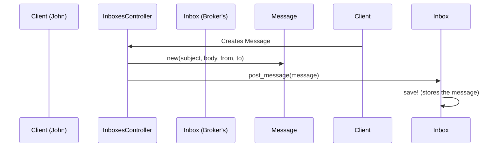

# Chapter 9: Inbox/Message

In the previous chapter, [User/Authentication](08_user_authentication_.md), we learned how users log in to the system.  This chapter introduces the `Inbox` and `Message` models, which provide a way for users to communicate securely within the application.

## Why do we need Inboxes and Messages?

Imagine John Doe wants to ask his insurance broker a question about his plan.  He needs a secure way to send a message within the application.  Or perhaps an administrator needs to send a notification to all employers.  This is where `Inbox` and `Message` come in.

## Key Concepts

* **Inbox:**  Think of an `Inbox` as a user's mailbox. Each [User](08_user_authentication_.md), or entity like an [EmployerProfile](03_employerprofile_benefitsponsorship_benefitapplication_.md) or [BrokerAgencyProfile](05_broker_brokeragency_brokeragencyprofile_.md), can have an `Inbox`.

* **Message:** A `Message` is like an email.  It has a subject, body, sender, and recipient.  Messages are sent and received through Inboxes.

## Solving the Use Case: John Messaging his Broker

1. **Find the Broker's Inbox:** First, we find the `Inbox` belonging to John's [Broker](05_broker_brokeragency_brokeragencyprofile_.md).

2. **Create a Message:**  We create a new `Message` object with John's question.

3. **Send the Message:** We "post" the message to the broker's `Inbox`.

```ruby
# Simplified example (actual implementation is more complex)

broker_inbox = john.family.broker_role.person.inbox # Get the broker's inbox

message = Message.new(
  subject: "Question about my plan",
  body: "What is the deductible for my plan?",
  from: john.user.oim_id, # Sender's ID
  to: john.family.broker_role.person.user.oim_id # Recipient's ID
)

broker_inbox.post_message(message)
broker_inbox.save!
```

This code creates a new message and adds it to the broker's inbox.  A copy is also typically saved to John's sent folder.

## Internal Implementation

When a message is sent, the system stores it in the recipient's inbox.



1. The `inboxes_controller.rb` (or a subclass like `insured/inboxes_controller.rb`) receives the request to send a message.

2. A new `Message` object is created.

3. The `post_message` method adds the message to the `Inbox`.

4. The `save!` method stores the `Inbox` (and its messages) in the database.

The relevant code for sending messages can be found in `inboxes_controller.rb` and its subclasses (e.g., `insured/inboxes_controller.rb`, `employers/inboxes_controller.rb`).  The `Inbox` and `Message` models handle data storage.

```ruby
# inboxes_controller.rb (simplified)
def create
  @new_message = Message.new(...)
  @inbox.post_message(@new_message)
  @inbox.save!
end
```

## Conclusion

This chapter introduced the `Inbox` and `Message` models, explaining how they enable secure communication within the application.  We used the example of John messaging his broker to illustrate how messages are sent. We also looked at the internal implementation to understand how messages are stored.

Next, we'll explore the `EnrollRegistry` with [EnrollRegistry](10_enrollregistry_.md).


---

Generated by [AI Codebase Knowledge Builder](https://github.com/The-Pocket/Tutorial-Codebase-Knowledge)