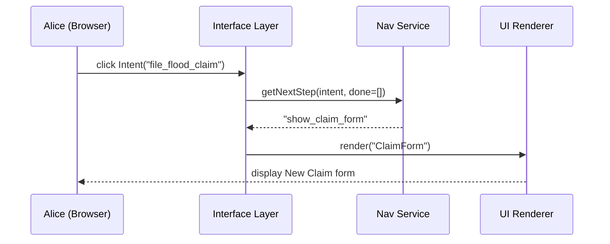

# Chapter 9: Intent-Driven Navigation

Welcome back! In the last chapter we saw how the [Interface Layer](08_interface_layer_.md) delivers forms, dashboards, and chat helpers to citizens and administrators. Now we’ll make those screens smarter: instead of forcing users to click through rigid menus, our **Intent-Driven Navigation** engine will listen to what people want (their _intent_) and guide them to the next best step—like an intelligent concierge.

---

## 9.1 Why Intent-Driven Navigation?

Imagine Alice, a homeowner in a flood-prone area, needs to file an insurance claim after a storm. A traditional menu might look like:

  • Insurance → Flood Insurance → Claims → New Claim → Attach Photos → Submit  

That’s a lot of clicks—and it’s easy to get lost.

With Intent-Driven Navigation:

1. Alice declares her goal: **“File a flood claim.”**  
2. The system immediately shows the New Claim form.  
3. As she finishes each part, it automatically suggests:  
   - “Great—attach photos now.”  
   - “All set—track your claim status next.”  

By focusing on Alice’s intent rather than fixed menus, we reduce confusion and speed her through the process.

---

## 9.2 Key Concepts

1. **Intent**  
   A high-level user goal, e.g., `file_flood_claim` or `request_medical_records`.

2. **Navigation Graph**  
   A simple map of steps for each intent. Think of it as a flowchart under the hood.

3. **Next Best Step**  
   The immediate action the user should take, based on what’s done so far.

4. **Context**  
   What the user has already completed (form fields filled, documents uploaded).

5. **Navigation Engine**  
   The service that reads intent + context and returns the next step.

---

## 9.3 Using Intent-Driven Navigation

### 1. Define Intents in YAML

We set up a file `intents.yaml` that lists each intent and its ordered steps:

```yaml
# intents.yaml
intents:
  file_flood_claim:
    label: "File a Flood Insurance Claim"
    steps:
      - show_claim_form
      - attach_photos
      - review_summary
      - submit_claim
      - track_claim

  request_medical_records:
    label: "Request Medical Records"
    steps:
      - verify_identity
      - show_request_form
      - confirm_submission
      - notify_when_ready
```

_Each intent has a human-friendly `label` and an array of `steps`._

### 2. Call the Navigation Engine

In your UI code, whenever the user picks or completes a step, ask:

```python
# app_navigation.py
from navigation_service import NavigationEngine

nav = NavigationEngine("intents.yaml")

# User says: “I want to file a flood claim”
intent = "file_flood_claim"
done_steps = []                    # nothing done yet

next_step = nav.get_next_step(intent, done_steps)
print(next_step)                   # → "show_claim_form"
```

_Beginner-friendly: we load the YAML, then ask which step comes first._

---

## 9.4 Under the Hood: Sequence Walkthrough

Here’s what happens when Alice clicks “File a Flood Claim”:



1. Alice signals her intent to the **Interface Layer**.  
2. **Nav Service** looks up the first step.  
3. It returns `"show_claim_form"`.  
4. The Interface Layer tells the UI to render the ClaimForm component.  

---

## 9.5 Internal Implementation

Let’s peek at a minimal `NavigationEngine` in Python.

```python
# navigation_service.py
import yaml

class NavigationEngine:
    def __init__(self, config_file):
        data = yaml.safe_load(open(config_file))
        self.intents = data["intents"]

    def get_next_step(self, intent, completed):
        steps = self.intents[intent]["steps"]
        for step in steps:
            if step not in completed:
                return step
        return None              # all done!
```

- We load the `intents.yaml` into `self.intents`.  
- `get_next_step()` finds the first step not yet completed.  
- If the user has finished every step, it returns `None`.

### Marking a Step Complete

When Alice finishes one step, update her context and ask again:

```python
# Continuing in navigation_service.py
    def complete_and_get_next(self, intent, completed, finished_step):
        completed.append(finished_step)
        return self.get_next_step(intent, completed)
```

_Beginner-friendly: call `complete_and_get_next()` with the step the user just did, and you’ll get the following action._

---

## 9.6 Putting It All Together in the UI

A simplified React example in the [Interface Layer](08_interface_layer_.md):

```jsx
import React, { useState } from 'react'
import nav from './navigation_service'   // wraps our Python service via API

function App() {
  const intent = "file_flood_claim"
  const [done, setDone] = useState([])
  const [step, setStep] = useState(null)

  // On mount, fetch the first step
  React.useEffect(() => {
    nav.getNextStep(intent, done).then(setStep)
  }, [])

  // When user finishes a step
  function onStepComplete() {
    nav.completeAndGetNext(intent, done, step)
       .then(next => {
         setDone([...done, step])
         setStep(next)
       })
  }

  return (
    <div>
      <h2>{step}</h2>
      <button onClick={onStepComplete}>I finished this</button>
    </div>
  )
}
```

- We keep track of `done` steps in state.  
- We call our Nav Service for the next action.  
- The UI updates automatically to guide Alice.

---

## 9.7 Conclusion

In this chapter you learned:

- **What** Intent-Driven Navigation is and **why** it helps citizens like Alice breeze through multi-step processes.  
- **Key concepts**: Intents, Navigation Graphs, Next Best Steps, Context, and the Navigation Engine.  
- **How to define** your intents in YAML and call them in code.  
- **What happens under the hood** with a simple `sequenceDiagram`.  
- A peek at the minimal `NavigationEngine` implementation and a React UI example.

Up next: we’ll empower even smarter workflows by introducing [Specialized AI Agents](10_specialized_ai_agents_.md).

---

Generated by [AI Codebase Knowledge Builder](https://github.com/The-Pocket/Tutorial-Codebase-Knowledge)