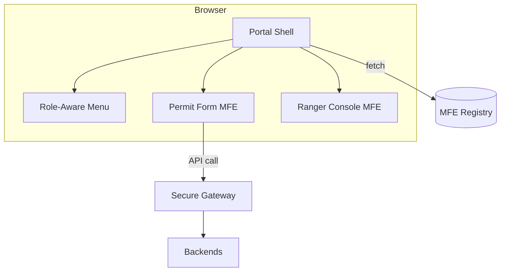
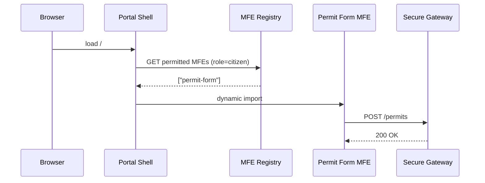

# Chapter 9: Interface Layer (HMS-MFE & Portals)

*[Jump back to Chapter 8: Role & Access Control Matrix](08_role___access_control_matrix_.md)*  

---

## 1. Why Do We Need a Whole Layer for “Screens”?

Picture the **U.S. Department of the Interior (DOI)** releasing a new web portal where:

* **Citizens** request *Back-Country* permits.  
* **Park Rangers** approve or deny those requests.  
* **Supervisors** see dashboards across all parks.

Behind the curtain we already have:

* Rules (Governance, Chapter 1)  
* APIs (Policy & Process Engine, Chapter 2)  
* Budget guards, security, consent, roles…  

…but none of that matters if the **page looks broken**, buttons are hidden for the wrong user, or the mobile view fails in the woods with 1-bar LTE.

The **Interface Layer (HMS-MFE & Portals)** turns scary back-end power into friendly:

* Forms that validate as you type  
* Wizards that guide a rookie through complex rules  
* Dashboards that only show *your* data

Think of it as the **public service desk** in a federal building: marble counter, clear signs, and a helpful clerk saying “next in line, please.”  

---

## 2. Key Concepts at a Glance

| Term | Plain-English Analogy |
|------|----------------------|
| Portal Shell | The lobby of the building |
| Micro-Frontend (MFE) | A self-contained kiosk placed inside the lobby |
| Component Library | A box of identical Lego® bricks painted in the *federal style guide* colors |
| Role-Aware Menu | A revolving door that only spins for authorized badges |
| Remote Module | A kiosk delivered just-in-time from another agency |
| Responsive Layout | Furniture on wheels that rearranges itself for phones, tablets, desktops |

---

## 3. One-Minute Mental Model



1. Browser downloads a **Portal Shell** (single page).  
2. Shell asks the **MFE Registry** which kiosks (MFEs) the current role may load.  
3. Shell mounts those MFEs on demand.  
4. MFEs speak to back-end APIs via the secure gateway, inheriting all earlier layers.

---

## 4. Hands-On Walk-Through: “Request a Back-Country Permit”

We will build **two** tiny MFEs and plug them into the shell.

### 4.1 Scaffold the Portal Shell (Terminal, ≤ 3 min)

```bash
npx hms-mfe init portal-shell
cd portal-shell && npm start          # dev server on http://localhost:3000
```

Console output:

```
✔ Shell created with HMS UI Library
✔ Role-Aware Menu stubbed
```

### 4.2 Build MFE #1 – Citizen Permit Form

```bash
npx hms-mfe init permit-form-mfe
```

`src/App.js` (15 lines)

```jsx
import { Form, TextField, DatePicker } from "@hms/ui";
import { api } from "@hms/sdk";

export default function PermitForm() {
  async function submit(data) {
    await api.post("/permits", data);   // mesh-secured call
    alert("Request submitted!");
  }

  return (
    <Form onSubmit={submit} title="Back-Country Permit">
      <TextField name="park" label="Park Name" required />
      <DatePicker name="start" label="Start Date" required />
      <DatePicker name="end"   label="End Date"   required />
    </Form>
  );
}
```

What happened?  
* We used **federal-style** UI pieces (`TextField`, `DatePicker`).  
* One line, `api.post`, talks to the back-end through secure gateway—no hard-coded URL.

### 4.3 Build MFE #2 – Ranger Approval Console

`src/App.js` (18 lines)

```jsx
import { Table, Button } from "@hms/ui";
import { api, access } from "@hms/sdk";

export default function RangerConsole() {
  const [rows, setRows] = React.useState([]);

  React.useEffect(() => api.get("/permits?status=PENDING").then(setRows), []);

  async function approve(id) {
    if (!(await access.allowed("ranger", "UPDATE_PERMIT_STATUS"))) return;
    await api.post(`/permits/${id}/approve`);
    setRows(rows.filter(r => r.id !== id));
  }

  return (
    <Table data={rows} title="Pending Permits">
      {(row) => <Button onClick={() => approve(row.id)}>Approve</Button>}
    </Table>
  );
}
```

Notice:  
* We quickly ask [Role & Access Control Matrix](08_role___access_control_matrix_.md) before acting.  
* The same UI library keeps look-and-feel consistent.

### 4.4 Register MFEs so the Shell Can Find Them

Create `mfe-manifest.json` inside each project:

```json
{
  "name": "permit-form",
  "version": "1.0.0",
  "entry": "https://cdn.agency.gov/permit-form/remoteEntry.js",
  "roles": ["citizen"]
}
```

```json
{
  "name": "ranger-console",
  "version": "1.0.0",
  "entry": "https://cdn.agency.gov/ranger-console/remoteEntry.js",
  "roles": ["ranger", "supervisor"]
}
```

Publish:

```bash
hms-mfe publish mfe-manifest.json
```

### 4.5 Wire Up the Shell

`portal-shell/src/routes.js` (12 lines)

```js
import { useMfe } from "@hms/mfe";

export const routes = [
  {
    path: "/apply",
    component: useMfe("permit-form")     // citizen kiosk
  },
  {
    path: "/ranger",
    component: useMfe("ranger-console")  // ranger kiosk
  }
];
```

At runtime the hook:

1. Checks user role.  
2. Loads the remote script.  
3. Renders it inside the shell.

Done! One shell, infinite kiosks.

---

## 5. What Happens Behind the Curtain?

### 5.1 Request Flow (5 participants)



### 5.2 Tiny Peek: Dynamic Loader (8 lines)

```js
export async function useMfe(name) {
  const { entry } = await fetchRegistry(name);
  await import(/* @vite-ignore */ entry);   // loads remote script
  return window[name].App;                  // each MFE exposes `App`
}
```

Simple: pull the manifest, import the script, grab the component.

---

## 6. Common Pitfalls & Simple Fixes

| Symptom | Cause | Quick Fix |
|---------|-------|-----------|
| Blank page after login | Role not mapped in manifest | Add role to `roles` array and republish |
| “Cross-origin blocked” error | CDN missing CORS headers | Enable `Access-Control-Allow-Origin: *` |
| UI colors inconsistent | MFE didn’t import component library | `npm i @hms/ui && use its components` |

---

## 7. FAQ Corner

**Q: Can two MFEs be written in different frameworks (React & Svelte)?**  
Yes—each kiosk is a separate bundle. The shell only needs the exposed `App` element.

**Q: How large should an MFE be?**  
Aim for a *single mission* (“fill permit”, “approve permit”). If the bundle > 200 KB, consider splitting.

**Q: Is server-side rendering supported?**  
The shell can pre-render critical MFEs; remote ones hydrate on the client.

---

## 8. What You Learned

• The **Portal Shell** is a lightweight lobby that loads **Micro-Frontends** on demand.  
• The shared **Component Library** guarantees a consistent federal look.  
• Role information from the [Role & Access Control Matrix](08_role___access_control_matrix_.md) decides which kiosks appear.  
• MFEs talk to back-ends through the secure gateway—no messy URLs or auth code.

In the next chapter we’ll make the portal **guide** citizens step-by-step—like a helpful clerk who predicts why you came.  

*[Continue to Chapter 10: Intent-Driven Navigation & Guided Journeys](10_intent_driven_navigation___guided_journeys_.md)*

---

Generated by [AI Codebase Knowledge Builder](https://github.com/The-Pocket/Tutorial-Codebase-Knowledge)