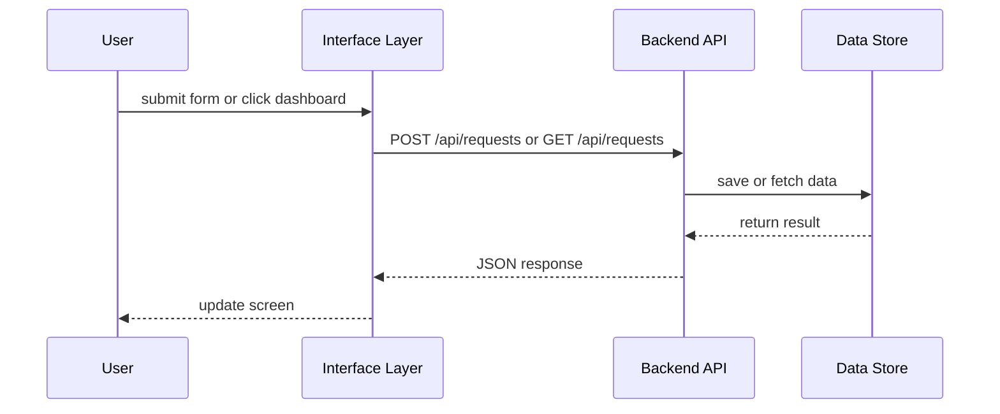

# Chapter 9: Interface Layer

In the previous chapter [Chapter 8: External System Synchronization](08_external_system_synchronization_.md) we saw how HMS-SME pushes updates out to third-party tools. Now it’s time to welcome our users to the “public service counter” of the platform: the **Interface Layer**. This layer provides dashboards, forms, and guided journeys so citizens and administrators can interact with HMS-SME in a clear, consistent way.

---

## 1. Why We Need an Interface Layer

Imagine a federal citizen service center in Washington, D.C. A person walks up, fills out a complaint form, and checks back later to see the status. Behind the scenes, clerks review documents and update records. We need an equivalent **web-based counter**:

- Through **HMS-MFE**, citizens submit requests or complaints.  
- Through **HMS-GOV**, administrators review proposals or process updates.  
- Regardless of user type, the Interface Layer ensures everyone sees a familiar, accessible front end.

Without it, each department would build its own UI—leading to confusion, duplicated work, and inconsistent user experiences.

---

## 2. Key Concepts

1. **Dashboard**  
   An overview page where users see the status of their requests, metrics, or pending tasks.

2. **Form**  
   A simple input component where citizens or staff submit data (requests, complaints, approvals).

3. **Guided Journey**  
   A multi-step wizard for complex processes (e.g., an application that spans several pages).

---

## 3. Solving Our Use Case

We’ll build three minimal React components to illustrate how the Interface Layer works:

1. A **request form** for citizens.  
2. A **dashboard** showing submitted requests.  
3. A **guided journey** wizard for multi-step processes.

### 3.1 Request Form Component

```js
// src/components/RequestForm.js
import React, { useState } from 'react';

function RequestForm({ onSubmit }) {
  const [text, setText] = useState('');
  function handleSubmit(e) {
    e.preventDefault();
    onSubmit({ complaint: text });
    setText('');
  }
  return (
    <form onSubmit={handleSubmit}>
      <label>Your Request:</label>
      <textarea
        value={text}
        onChange={e => setText(e.target.value)}
        placeholder="Describe your issue"
      />
      <button type="submit">Submit</button>
    </form>
  );
}

export default RequestForm;
```

Explanation:  
This component keeps track of user input, and when the form is submitted it calls `onSubmit` with the complaint text. In a real app, `onSubmit` would call the **Backend API** to save the request.

### 3.2 Dashboard Component

```js
// src/components/Dashboard.js
import React, { useEffect, useState } from 'react';

function Dashboard() {
  const [requests, setRequests] = useState([]);
  useEffect(() => {
    fetch('/api/requests')
      .then(r => r.json())
      .then(data => setRequests(data));
  }, []);
  return (
    <div>
      <h2>My Requests</h2>
      <ul>
        {requests.map(r => (
          <li key={r.id}>
            {r.status}: {r.title}
          </li>
        ))}
      </ul>
    </div>
  );
}

export default Dashboard;
```

Explanation:  
On mount, this dashboard fetches a list of requests from the `/api/requests` endpoint and displays each item in a simple list.

### 3.3 Guided Journey (Wizard)

```js
// src/components/Wizard.js
import React, { useState } from 'react';

function Wizard() {
  const steps = ['Enter Info', 'Review', 'Confirm'];
  const [step, setStep] = useState(0);

  return (
    <div>
      <h3>{steps[step]}</h3>
      {/* Here you’d render form fields for each step */}
      <button onClick={() => setStep(s => Math.max(s - 1, 0))}>
        Back
      </button>
      <button onClick={() => setStep(s => Math.min(s + 1, steps.length - 1))}>
        {step === steps.length - 1 ? 'Finish' : 'Next'}
      </button>
    </div>
  );
}

export default Wizard;
```

Explanation:  
A very basic wizard that moves through three steps. In a real interface you’d show different inputs on each step and collect all data at the end.

---

## 4. What Happens Under the Hood?



1. **User** fills a form or views a dashboard.  
2. The **Interface Layer** calls the **Backend API**.  
3. The **API** interacts with the **Data Store**.  
4. The **Interface Layer** receives JSON and re-renders the UI.

---

## 5. Internal Implementation

Non-code walkthrough:

1. **Component Mounts**: React loads a component like `Dashboard`.  
2. **API Call**: `fetch()` sends an HTTP request.  
3. **State Update**: Received data is stored in React state.  
4. **Render**: The UI updates automatically.  
5. **User Actions**: Form submissions trigger another API call.

File structure example:

```
src/
  components/
    Dashboard.js
    RequestForm.js
    Wizard.js
  App.js           ← sets up routes to each page
```

```js
// src/App.js
import { BrowserRouter, Route, Switch } from 'react-router-dom';
import Dashboard from './components/Dashboard';
import RequestForm from './components/RequestForm';
import Wizard from './components/Wizard';

function App() {
  return (
    <BrowserRouter>
      <Switch>
        <Route path="/dashboard" component={Dashboard}/>
        <Route path="/submit" component={RequestForm}/>
        <Route path="/wizard" component={Wizard}/>
      </Switch>
    </BrowserRouter>
  );
}

export default App;
```

Explanation:  
`App.js` wires up three routes, so users can visit `/submit`, `/dashboard`, or `/wizard` in their browser.

---

## 6. Summary & Next Steps

You’ve learned how the **Interface Layer**:

- Provides friendly, accessible **forms** for data entry  
- Builds **dashboards** so users track their requests or tasks  
- Guides users through complex steps with **wizards/guided journeys**  

Next up, we’ll see how to break these components into independently deployable pieces in the [Frontend Micro‐Frontend (MFE)](10_frontend_micro_frontend__mfe__.md).

---

Generated by [AI Codebase Knowledge Builder](https://github.com/The-Pocket/Tutorial-Codebase-Knowledge)