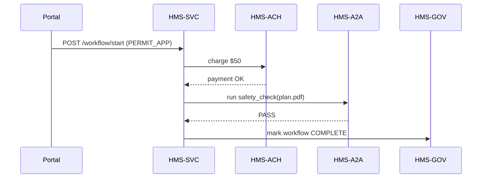

# Chapter 9: Management Layer (HMS-SVC, HMS-ACH, HMS-A2A)

[← Back to Chapter 8: Policy / Process Module](08_policy___process_module_.md)

---

## 1. Why Do We Need a “Management Layer”?

Picture **Jonas**, a coffee-shop owner in Oregon.  
He uses the portal to:

1. **Apply for a sidewalk-seating permit** (City requirement).  
2. **Pay a \$50 fee** online.  
3. Receive an **AI check** that his uploaded seating plan meets safety spacing.

If each step talked directly to every back-end system, we would have a tangle of point-to-point calls.  
The **Management Layer** steps in as a *federal program office in software form*:

* HMS-SVC breaks Jonas’s *intent* into executable service calls.  
* HMS-ACH handles the debit in a legally auditable way.  
* HMS-A2A runs the AI safety check and returns a pass/fail.  

One API request in, many coordinated actions out—no spaghetti.

---

## 2. Meet the Three Mini-Offices

| Service | Plain-English job | Analogy |
|---------|------------------|---------|
| **HMS-SVC** | Orchestrates workflows and schedules jobs. | Project manager |
| **HMS-ACH** | Securely bills, refunds, and reports money flows. | Treasury clerk |
| **HMS-A2A** | Runs specialized AI/ML tasks on demand. | In-house data scientist |

Keep these in mind; we’ll call on each of them in Jonas’s journey.

---

## 3. Jonas’s Permit in Four API Calls



One endpoint from the portal triggers everything else.

---

## 4. Key Concepts One-by-One

1. **Workflow Definition** – JSON recipe stored in the [Policy / Process Module](08_policy___process_module_.md).  
2. **Job Queue** – Internal table where HMS-SVC parks tasks (`PAY_FEE`, `AI_CHECK`).  
3. **Idempotent Calls** – Every step can be replayed safely if something crashes.  
4. **Outcome Report** – Compact status blob (`PENDING`, `FAILED`, `DONE`) returned to the portal.

---

## 5. Starting a Workflow (Front-End)

```js
// /widgets/sidewalk-permit/request.js   (14 lines)
export async function requestPermit(payload){
  const res = await fetch("/api/workflow/start",{
    method:"POST",
    body: JSON.stringify({
      workflow:"PERMIT_APP",
      input:   payload        // {planUrl, businessId, ...}
    })
  });
  return res.json();          // {ticketId:"WF-9812"}
}
```

Explanation  
• Sends the **workflow key** and user data.  
• Receives a `ticketId` to poll later.

---

## 6. Polling Status (Front-End)

```js
// /widgets/sidewalk-permit/status.js   (12 lines)
export async function getStatus(ticketId){
  const res = await fetch(`/api/workflow/${ticketId}`);
  const data = await res.json();         // {progress:0-100, stage:"AI_CHECK"}
  return data;
}
```

Simple and REST-like—no message-bus knowledge needed on the UI.

---

## 7. What Happens Inside HMS-SVC?

### 7.1 10-Line Router

```js
// services/hms-svc/router.js
app.post("/workflow/start", async (req,res)=>{
  const {workflow,input} = req.body;
  const def = await ppm.load(workflow);        // step list from PPM
  const ticket = await db.tickets.insert({
    def, stage:0, input, status:"PENDING"
  });
  queue.add({ticketId: ticket._id});           // enqueue first job
  res.json({ticketId: ticket._id});
});
```

1. Pulls the **recipe** from the Policy / Process Module.  
2. Stores a ticket.  
3. Pushes a first job to the queue.

### 7.2 Worker Loop (excerpt, 18 lines)

```js
// services/hms-svc/worker.js
queue.process(async job=>{
  const t = await db.tickets.find(job.ticketId);
  const step = t.def.procedure[t.stage];

  if (step.id==="PAY_FEE") {
    await chargeFee(t);        // calls HMS-ACH
  } else if (step.id==="AI_CHECK") {
    await runAICheck(t);       // calls HMS-A2A
  }

  await db.tickets.update(t._id, {stage: t.stage+1});
  if (t.stage+1 === t.def.procedure.length)
      await db.tickets.update(t._id,{status:"DONE"});
});
```

• Reads the **next step**, delegates to the right micro-service, advances the cursor.

---

## 8. Delegating to HMS-ACH (Payment)

```js
// services/hms-svc/chargeFee.js  (12 lines)
export async function chargeFee(ticket){
  await fetch("http://hms-ach/pay",{
    method:"POST",
    body: JSON.stringify({
      amount:50,
      ref:`${ticket._id}-sidewalk`
    })
  });
}
```

HMS-ACH replies `200` only after the transaction is logged & reversible.

---

## 9. Delegating to HMS-A2A (AI Check)

```js
// services/hms-svc/runAICheck.js  (14 lines)
export async function runAICheck(ticket){
  const {planUrl} = ticket.input;
  const res = await fetch("http://hms-a2a/safety_check",{
    method:"POST",
    body: JSON.stringify({file:planUrl})
  });
  const {result} = await res.json();     // PASS / FAIL
  if (result!=="PASS") throw new Error("AI check failed");
}
```

Any thrown error sets the ticket status to `FAILED`, visible in the portal.

---

## 10. Security & Observability Shortcuts

* **Auth** – All internal calls carry a JWT issued by the [Access & Authorization Framework](11_access___authorization_framework_.md).  
* **Tracing** – Each ticket ID doubles as a distributed-trace ID, surfaced in the [Metrics & Monitoring Dashboard](14_metrics___monitoring_dashboard_.md).  
* **Retries** – Workers auto-retry transient errors up to 3 times before marking `FAILED`.

---

## 11. How the Pieces Connect to Earlier Chapters

• Workflows come from the **Policy / Process Module** you met in [Chapter 8](08_policy___process_module_.md).  
• Design & legal rules for each step are enforced by the **Governance Layer** in [Chapter 4](04_governance_layer__hms_gov__.md).  
• Payment events feed the **Compliance & Audit Trail** of [Chapter 15](15_compliance___audit_trail_.md).  
• Real-time progress dots appear in the citizen UI powered by the **Interface Layer** ([Chapter 1](01_interface_layer__hms_mfe__sector_portals__.md)).

---

## 12. Try the Whole Flow Locally

```bash
# 1. start all three mini-services
npm run svc:dev   # HMS-SVC
npm run ach:dev   # HMS-ACH (mock)
npm run a2a:dev   # HMS-A2A (mock)

# 2. trigger workflow
curl -X POST localhost:7000/workflow/start \
     -d '{"workflow":"PERMIT_APP","input":{"planUrl":"plan.pdf"}}'

# 3. poll until status is DONE
curl localhost:7000/workflow/WF-9812
```

In the mock, payment clears instantly and the AI check always returns `PASS`, so you should see `status:"DONE"` within seconds.

---

## 13. What You Learned

✔️ The **Management Layer** orchestrates multi-step work so front-ends stay simple.  
✔️ HMS-SVC handles sequencing, HMS-ACH handles money, HMS-A2A handles AI tasks.  
✔️ Workflows are data-driven, pulling definitions from the Policy / Process Module.  
✔️ Only ~30 lines of glue code were enough to power Jonas’s entire permit flow.

Ready to connect federal databases and state systems to these workflows? Jump to [Chapter 10: External System Sync Connector](10_external_system_sync_connector_.md) where we plug into the outside world.

---

Generated by [AI Codebase Knowledge Builder](https://github.com/The-Pocket/Tutorial-Codebase-Knowledge)