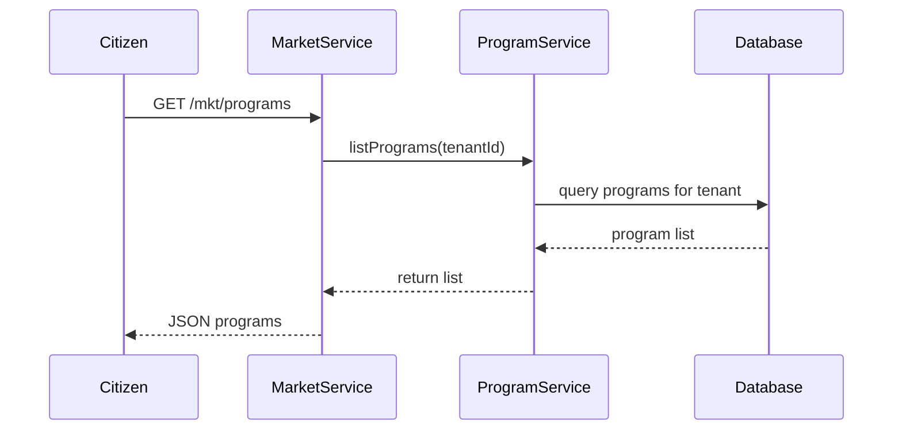

# Chapter 9: Market Portal (HMS-MKT)

Welcome back! In [Chapter 8: Admin Portal (HMS-GOV)](08_admin_portal__hms_gov__.md) you learned how administrators manage programs and publish updates. Now let’s build the **Market Portal**, the citizen-facing storefront where people browse services, enroll in programs, and track their progress—think of it as your town hall, online.

---

## 9.1 Motivation & Central Use Case

Imagine Alice, a homeowner, wants to apply for the **Green Energy Subsidy** your state offers. She needs:

1. A list of available programs (e.g., energy, healthcare, housing).  
2. A simple “Apply Now” button that pops up the right form.  
3. A dashboard to see if her application is under review, approved, or needs more info.

The **Market Portal** (HMS-MKT) solves exactly this: a unified, easy-to-use interface for citizens to discover and interact with government services.

---

## 9.2 Key Concepts

1. Storefront (Browse)  
   - Lists programs with filters (category, eligibility).  
2. Enrollment Flow  
   - Launches the correct [Protocol](02_protocol__core_protocol__.md) to collect data.  
3. Progress Tracker  
   - Shows application status and next steps.  
4. Shared Marketplace  
   - A library of community-built program templates.  
5. Embedded Agent Helpers  
   - Chatbots or wizards that guide users through forms.

---

## 9.3 Getting Started: Initialize the Market Portal

First, register the portal in your API server:

```js
// File: market/bootstrap.js
import { MarketPortal } from 'hms-cdf/market/portal'

const citizenPortal = new MarketPortal({
  tenantId: 'state-no-poverty',
  mountPath: '/mkt'
})

citizenPortal.initialize()
// → Creates routes under /mkt for programs, enroll, and status
```

Explanation:  
- We pass `tenantId` so the portal shows only that agency’s programs.  
- `mountPath` (`/mkt`) prefixes all citizen routes.

---

## 9.4 Browsing and Enrolling in a Program

### 1. List Programs

```js
const programs = await fetch('/mkt/programs')
  .then(r => r.json())

// Example response:
[
  {
    id: 'subsidy-green-energy',
    title: 'Green Energy Subsidy',
    description: 'Up to $5,000 for solar panels'
  }
]
```

Explanation:  
- GET `/mkt/programs` returns a JSON list of programs you can display in a card grid.

### 2. Enroll in a Program

```js
const result = await fetch(
  '/mkt/programs/subsidy-green-energy/enroll',
  {
    method: 'POST',
    headers: { 'Content-Type': 'application/json' },
    body: JSON.stringify({
      name: 'Alice',
      income: 40000,
      address: '123 Main St'
    })
  }
).then(r => r.json())

// Example result:
{ applicationId: 'app123', status: 'Applied' }
```

Explanation:  
- POST to `/enroll` launches the program’s application protocol.  
- You get back an `applicationId` and initial status.

---

## 9.5 Tracking Application Progress

```js
const status = await fetch('/mkt/applications/app123/status')
  .then(r => r.json())

// Example status:
{
  status: 'Review',
  nextStep: 'Upload Documents'
}
```

Explanation:  
- Citizens poll `/status` to see if they need to upload more info or await final approval.

---

## 9.6 Under the Hood

### 9.6.1 Runtime Walkthrough



1. The citizen’s browser requests `/mkt/programs`.  
2. **MarketService** calls **ProgramService** to fetch blueprints.  
3. Data is returned and rendered in the UI.

### 9.6.2 Core Code Example

```ts
// File: hms-cdf/market/portal.ts
export class MarketPortal {
  constructor(private cfg) {}

  initialize() {
    // 1) Persist portal config
    Database.save('marketConfig', this.cfg)
    // 2) Mount storefront routes
    ApiRouter.get(
      `${this.cfg.mountPath}/programs`,
      (req, res) => this.listPrograms(req, res)
    )
    ApiRouter.post(
      `${this.cfg.mountPath}/programs/:id/enroll`,
      (req, res) => this.enroll(req, res)
    )
    ApiRouter.get(
      `${this.cfg.mountPath}/applications/:id/status`,
      (req, res) => this.status(req, res)
    )
  }

  async listPrograms(req, res) {
    const progs = await ProgramService.list({
      tenantId: req.tenant.id
    })
    res.send(progs)
  }

  async enroll(req, res) {
    const result = await ProgramService.submitApplication(
      req.params.id,
      req.body
    )
    res.send(result)
  }

  async status(req, res) {
    const stat = await ProgramService.getStatus(
      req.params.id
    )
    res.send(stat)
  }
}
```

Explanation:  
- We register three handlers: `listPrograms`, `enroll`, and `status`.  
- Each calls into **ProgramService** (from [Chapter 1: Program](01_program__core_program__.md)) to do the real work.

---

## 9.7 Embedding Agent Helpers (Optional)

You can add a chatbot to guide users:

```js
// After portal.initialize()
citizenPortal.addAgentHelper('faq-bot', {
  trigger: '/mkt/help',
  description: 'Ask me about programs or eligibility'
})
```

This mounts a simple agent at `/mkt/help` to answer FAQs or walk through forms.

---

## 9.8 Recap and Next Steps

In this chapter you learned how to:

- Set up the **Market Portal** for citizens.  
- Browse programs, enroll, and track progress with minimal code.  
- See both the user-facing flow and the internal implementation.  
- Optionally embed an agent helper for live guidance.

Up next, we’ll dive into building reusable UI pieces in the citizen portal with [Micro-Frontend Components (HMS-MFE)](10_micro_frontend_components__hms_mfe__.md). Happy coding!

---

Generated by [AI Codebase Knowledge Builder](https://github.com/The-Pocket/Tutorial-Codebase-Knowledge)