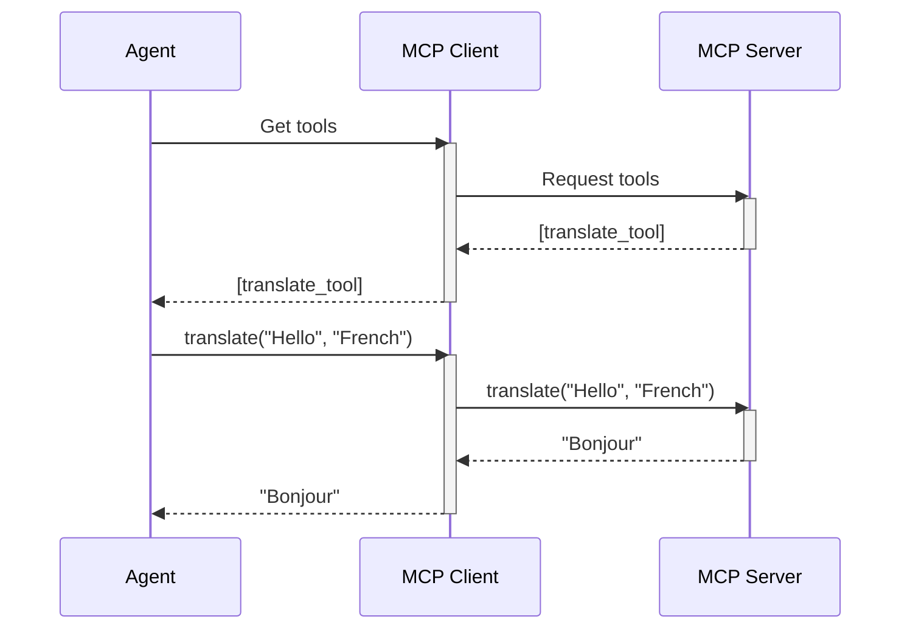

# Chapter 9: MCP Client

In the previous chapter, [Remote Executors](08_remote_executors.md), we learned how to execute code in isolated environments. Now, let's explore how to connect our agent to a network of helpful tools provided by an external server. This is where the **MCP Client** comes in.

Imagine our chef agent wants to access a specialized spice blender owned by another chef. They could ask the other chef to blend the spices for them. Similarly, the MCP Client allows our agent to connect to an MCP server, which can provide access to additional tools and resources, expanding the agent's capabilities.

## What is an MCP Client?

The MCP client is like a network of chefs collaborating. It allows the agent to connect to an MCP server, which can provide access to additional tools and resources, expanding the agent's capabilities.  The MCP server acts like a central hub offering specialized tools that agents can use.

## Using the MCP Client

Let's imagine an MCP server that offers a tool for translating text.  Here's how our agent can use the MCP Client to access this translation tool:

```python
from smolagents import MCPClient
from mcp import StdioServerParameters

# Imagine this script is running on the MCP server
echo_server_script = """
from mcp.server.fastmcp import FastMCP

mcp = FastMCP("Translation Server")

@mcp.tool()
def translate(text: str, target_language: str) -> str:
    \"\"\"Translate text to the target language\"\"\"
    # ... (Implementation for translation, simplified for this example)
    return f"Translated: {text} to {target_language}"

mcp.run()
"""

server_parameters = StdioServerParameters(command="python", args=["-c", echo_server_script])

with MCPClient(server_parameters) as tools:
    translate_tool = tools[0]
    translated_text = translate_tool(text="Hello, world!", target_language="French")
    print(translated_text) # Output: Translated: Hello, world! to French
```

This code first defines a simple MCP server script that offers a `translate` tool.  Then, it creates an `MCPClient` and connects to the server.  Inside the `with` block, the agent can access the tools provided by the server.  In this case, it calls the `translate` tool and prints the result.

## Inside the MCP Client

Here's a simplified sequence diagram showing how the MCP Client interacts with the server:



1. The [Agent](01_agent.md) requests tools from the `MCPClient`.
2. The `MCPClient` requests tools from the `MCPServer`.
3. The `MCPServer` returns a list of available tools.
4. The `MCPClient` provides these tools to the agent.
5. The agent calls a tool through the `MCPClient`.
6. The `MCPClient` forwards the call to the `MCPServer`.
7. The `MCPServer` executes the tool and returns the result.
8. The `MCPClient` returns the result to the agent.

The `MCPClient` class in the `mcp_client.py` file handles the connection to the MCP server.

```python
# Simplified code from mcp_client.py
class MCPClient:
    def __init__(self, server_parameters):
        # ... (Initialize the connection to the MCP server)

    def get_tools(self):
        # ... (Request and return the available tools from the server)

    def __enter__(self):
        # ... (Connect to the server)
        return self.get_tools()

    def __exit__(self, exc_type, exc_value, exc_traceback):
        # ... (Disconnect from the server)
```

The `get_tools` method retrieves the available tools from the server. The `__enter__` and `__exit__` methods manage the connection lifecycle, allowing the client to be used with the `with` statement.

## Conclusion

In this chapter, we learned about the `MCP Client` and how it allows agents to connect to an MCP server to access additional tools and resources. We saw an example of using the client to access a translation tool and explored its internal implementation. Next, we'll learn about [Monitoring](10_monitoring.md) and how to track the agent's performance.


---

Generated by [AI Codebase Knowledge Builder](https://github.com/The-Pocket/Tutorial-Codebase-Knowledge)