# Chapter 9: Model Context Protocol (HMS-MCP)


[↠Back to Chapter 8: Process Optimization Workflow](08_process_optimization_workflow_.md)

---

## 1. Why do we need a “flight plan” for AI agents?

Imagine a **Treasury Department** chatbot that helps citizens request a tax-refund status update.  
Before the bot can answer, it must:

1. Query the IRS API (needs an API key).  
2. Read the user’s last three filings (needs data scope).  
3. Decide whether to show a “possible audit” warning (needs a legal disclaimer).  

If every agent describes those needs differently, chaos ensues—much like airplanes taking off without a common flight plan format.

**Model Context Protocol (MCP)** is that shared format.  
It is a **tiny JSON bundle** every HMS-AGX agent files **before acting** so that other services (security, HITL reviewers, logging, etc.) know:

* Which tools it will touch  
* What data it will look at  
* How it promises to behave

Think of MCP as the agent’s *pre-takeoff checklist*.

---

## 2. The MCP “boarding pass” at a glance

| MCP Section | Plain-English meaning | Analogy |
|-------------|----------------------|---------|
| `header`    | Who I am, why I’m here | Pilot ID & flight route |
| `tool_manifest` | APIs or files I intend to use | The plane’s equipment list |
| `data_request`  | The exact records I need | Cargo manifest |
| `action_plan`   | Steps I will perform | Flight path |
| `safety`        | Confidence + risk flags | Weather & fuel checks |

If any service along the way dislikes what it sees, it can **deny takeoff** or route to [HITL Oversight](04_human_in_the_loop__hitl__oversight_.md).

---

## 3. Quick start – create & submit an MCP in 10 lines

```python
from hms_agx.mcp import MCP, submit_mcp

mcp = MCP(
    header         = {"agent": "TaxStatusBot", "purpose": "refund_lookup"},
    tool_manifest  = ["irs.refund_api@v2"],
    data_request   = {"filings": 3},
    action_plan    = ["call_refund_api", "format_response"],
    confidence     = 0.88
)

ticket = submit_mcp(mcp)
print(ticket.status)   # "approved" or "pending_review"
```

Explanation:  
1. Build an `MCP` object with five small dictionaries/lists.  
2. `submit_mcp()` sends it to the **MCP Gateway**.  
3. The gateway checks policies (budget, privacy, ESQ rules).  
4. Returns a **ticket** telling the agent if it can proceed.

---

## 4. How the MCP Gateway works (no code yet)

```mermaid
sequenceDiagram
    participant AG as AI Agent
    participant MCP as MCP Gateway
    participant ESQ as Compliance (ESQ)
    participant HITL as Reviewer
    participant ACT as Orchestrator

    AG->>MCP: MCP JSON
    MCP->>ESQ: legal & policy check
    ESQ-->>MCP: ✅ / ❌
    MCP-->>HITL: 🔔 if risk>0.2
    MCP-->>AG: ticket
    AG->>ACT: (only if ticket approved) start actions
```



Only **five** actors—easy to keep in your head.

---

## 5. Peek under the hood – the tiniest possible MCP classes

### 5.1 The data class (≤ 15 lines)

```python
# file: hms_agx/mcp/model.py
from dataclasses import dataclass
@dataclass
class MCP:
    header: dict
    tool_manifest: list[str]
    data_request: dict
    action_plan: list[str]
    confidence: float
```

Each attribute is intentionally **plain**—you can build the object from Python, JavaScript, or even cURL.

### 5.2 The Gateway (≤ 18 lines)

```python
# file: hms_agx/mcp/gateway.py
from hms_agx.esq import Counsel           # Chapter 7
from hms_agx.hitl import HitlGateway      # Chapter 4
counsel = Counsel()
hitl    = HitlGateway(reviewer="ai@treasury.gov")

def submit_mcp(mcp):
    risk = counsel.quick_risk(mcp)        # returns 0–1
    if risk > 0.2:
        return hitl.review({"mcp": mcp})
    return Ticket("approved")
class Ticket:
    def __init__(s,status): s.status=status
```

Explanation:

• `quick_risk()` is a lightweight ESQ call that inspects `tool_manifest` and `data_request`.  
• Risk > 0.2 sends the MCP to a human reviewer.  
• Otherwise a one-word “approved” ticket comes back.

Real HMS-AGX adds signatures, timestamps, and storage in the [Data & Metrics Observatory](16_data___metrics_observatory__hms_dta___ops__.md).

---

## 6. Field-by-field cheat sheet

```jsonc
{
  "header": {
    "agent": "TaxStatusBot",
    "version": "1.4.0",
    "purpose": "refund_lookup",
    "user_id": "USR-987"
  },
  "tool_manifest": [
    "irs.refund_api@v2",
    "gov.notify_email@1.1"
  ],
  "data_request": {
    "filings": 3,
    "return_status": true
  },
  "action_plan": [
    "call irs.refund_api -> parse json",
    "send confirmation email"
  ],
  "safety": {
    "confidence": 0.88,
    "budget": "$0.05",        // email fee
    "escalate_if": "audit_flag==true"
  }
}
```

A beginner can skim this and instantly know:

* Which IRS API is used  
* How many filings will be read  
* That an email will be sent, costing five cents  
* When to escalate

---

## 7. Using MCP inside other chapters

• **[Intent-Driven Navigation](01_intent_driven_navigation_.md):** Every step the Navigator generates is wrapped in an MCP so tools & data stay scoped.  
• **[Process Optimization Workflow](08_process_optimization_workflow_.md):** The Optimizer Bot files an MCP before touching live production databases.  
• **[Agent Action Orchestrator](10_agent_action_orchestrator__hms_act__.md):** Reads the approved MCP ticket to know which APIs to invoke—nothing more, nothing less.  
• **[Secure Inter-Agency Exchange](13_secure_inter_agency_exchange__hms_a2a__.md):** Signs the MCP for cross-agency calls.

---

## 8. Common mistakes & how MCP prevents them

| Without MCP | With MCP |
|-------------|----------|
| Agent silently grabs **all** tax records. | Gateway rejects: `data_request` too broad. |
| Agent emails citizen without privacy disclaimer. | ESQ risk > 0.2 → HITL reviewer inserts disclaimer. |
| Agent exceeds budget calling premium API. | `budget` field triggers cost guardrail. |

---

## 9. FAQ

**Q: Is MCP only for LLM-based agents?**  
No. Any script, micro-service, or batch job can (and should) file an MCP.

**Q: How big is an average MCP JSON?**  
Usually < 2 KB—small enough for logging & auditing.

**Q: Do humans ever see raw MCP files?**  
Only when flagged. Reviewers get a friendly dashboard brick that visualizes the sections.

**Q: Can I add custom fields?**  
Yes, but names must be snake_case and unknown fields are ignored by the Gateway (they pass through for downstream tools).

---

## 10. What you learned

• MCP is the **universal flight plan** every HMS-AGX agent must file.  
• Five simple sections describe tools, data, actions, and safety.  
• A 10-line code snippet showed how to create & submit an MCP.  
• The Gateway checks compliance via ESQ and may route to HITL.  
• MCP glues together earlier chapters and powers the next one.

Ready to see **how approved MCPs become real-world actions**?  
Continue to [Chapter&nbsp;10: Agent Action Orchestrator (HMS-ACT)](10_agent_action_orchestrator__hms_act__.md) →

---

Generated by [AI Codebase Knowledge Builder](https://github.com/The-Pocket/Tutorial-Codebase-Knowledge)