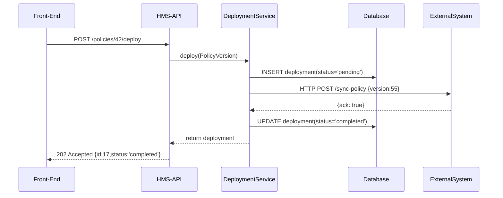

# Chapter 9: Policy Deployment Mechanism

In [Chapter 8: CodifySubprojects](08_codifysubprojects_.md), you learned how to break a big program into focused Subprojects. Once your new policy or rule set is ready in a Subproject, you need to **deploy** it so it goes live—and make sure all external systems (schedulers, data tools) pick up the change. That’s exactly what our **Policy Deployment Mechanism** does. It’s like officially publishing a new regulation and sending an announcement to every relevant agency.

---

## 1. Motivation: Publishing a New Regulation

Imagine the City Planning department finalizes a revised **Building Safety Code** in a Subproject. Now they must:
- Push the new code live via HMS-API  
- Record who deployed it and when  
- Notify external tools (inspection schedulers, document repositories)  

Without a deployment mechanism, each team would invent its own process—leading to missed updates and inconsistent schedules.

---

## 2. Key Concepts

1. **PolicyVersion**  
   A saved draft of your rules. You might have multiple versions (v1, v2, v3) as you refine.

2. **Deployment Record**  
   Tracks each go-live event: which version, who deployed, timestamp, and current status (`pending`, `completed`, `failed`).

3. **Deploy Endpoint**  
   A dedicated API endpoint (`POST /policies/{id}/deploy`) to trigger the deployment.

4. **Post-Deployment Hooks**  
   Events or background jobs that run after deploying, sending notifications or HTTP callbacks to external systems.

5. **Status Tracking**  
   Clients can query `GET /deployments/{deployment_id}` to see if sync is still in progress or finished.

---

## 3. Using the Deployment Mechanism

### 3.1 Triggering a Deployment

Here’s how a controller calls the deploy endpoint:

```php
// app/Http/Controllers/PolicyController.php
public function deploy($policyId)
{
  // 1. Find the latest version
  $version = PolicyVersion::where('policy_id',$policyId)
                          ->latest('created_at')
                          ->firstOrFail();

  // 2. Deploy it
  $deployment = app('policy.deploy')->deploy($version);

  // 3. Return deployment info
  return response()->json($deployment, 202);
}
```
- We fetch the most recent draft (`PolicyVersion`).  
- We call `policy.deploy` (a service we register).  
- We return HTTP 202 Accepted with the new deployment record.

### 3.2 Example Request & Response

Request:
```
POST /api/policies/42/deploy
Authorization: Bearer …
```

Response (202 Accepted):
```json
{
  "id": 17,
  "version_id": 55,
  "status": "pending",
  "deployed_at": "2024-07-10T09:15:00Z"
}
```
Clients can then poll:
```
GET /api/deployments/17
```
to see when `status` turns to `completed` or `failed`.

---

## 4. High-Level Flow

Here’s what happens when you hit **POST /policies/{id}/deploy**:



1. **API** calls the **DeploymentService**.  
2. Service creates a pending deployment record.  
3. It sends the new version to the external system.  
4. On success, it marks the record `completed`.  
5. Response goes back to the front-end.

---

## 5. Under the Hood: Core Implementation

### 5.1 Service Provider Registration

In your `AppServiceProvider` or a custom module provider:

```php
public function register()
{
  $this->app->singleton('policy.deploy', function($app) {
    return new \App\Services\PolicyDeploymentService();
  });
}
```

This binds `policy.deploy` so you can `app('policy.deploy')` anywhere.

### 5.2 Deployment Service

File: `app/Services/PolicyDeploymentService.php`

```php
namespace App\Services;

use App\Models\Core\Policy\PolicyVersion;

class PolicyDeploymentService
{
  public function deploy(PolicyVersion $version)
  {
    // 1. Create a deployment record
    $deployment = $version->deployments()->create([
      'status'     => 'pending',
      'deployed_at'=> now()
    ]);

    // 2. Notify external systems (sync hook)
    event(new \App\Events\PolicyDeployed($deployment));

    return $deployment;
  }
}
```

- We save a new `Deployment` tied to the version.  
- We fire a `PolicyDeployed` event to run hooks.

### 5.3 Event Listener: Notify External Systems

File: `app/Listeners/NotifyExternalSystems.php`

```php
namespace App\Listeners;

use App\Events\PolicyDeployed;
use GuzzleHttp\Client;

class NotifyExternalSystems
{
  public function handle(PolicyDeployed $e)
  {
    $http = new Client(['timeout'=>5]);
    // Call the external sync endpoint
    $http->post(config('services.scheduler.url').'/sync-policy', [
      'json'=> ['version_id'=>$e->deployment->version_id]
    ]);
    // Mark deployment completed
    $e->deployment->update(['status'=>'completed']);
  }
}
```

Register in `EventServiceProvider.php`:
```php
protected $listen = [
  \App\Events\PolicyDeployed::class
    => [\App\Listeners\NotifyExternalSystems::class],
];
```

---

## Conclusion

In this chapter, you learned how HMS-API’s **Policy Deployment Mechanism** lets you:
- Push a revised policy version live via a single API call  
- Track each deployment with a record (`pending` → `completed`)  
- Notify external systems automatically via events and HTTP hooks  

With this in place, your Subprojects’ final rules flow seamlessly into production and all connected tools stay in sync. Next up: deep-dive into more complex data exchange in [External System Sync](10_external_system_sync_.md).

---

Generated by [AI Codebase Knowledge Builder](https://github.com/The-Pocket/Tutorial-Codebase-Knowledge)