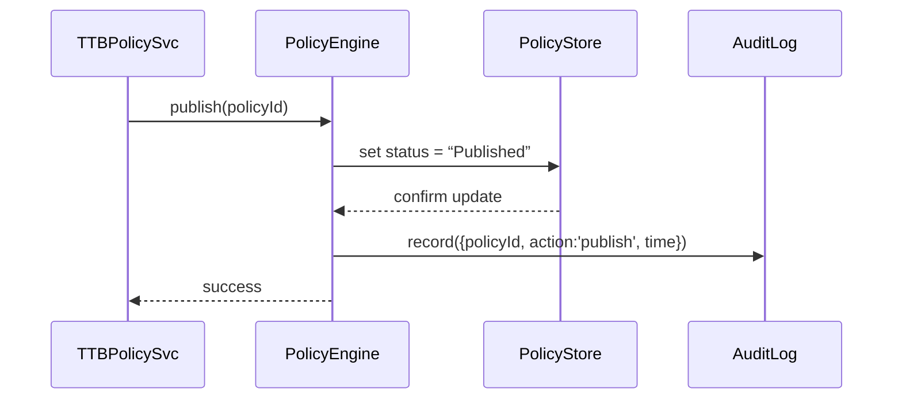

# Chapter 9: Policy Management Module

Welcome back! In [Chapter 8: Governance Layer](08_governance_layer_.md) we saw how to enforce rules at runtime. Now we move “upstream” to the **Policy Management Module**—our “legislative drafting office” where bills (business rules and process definitions) are written, debated, versioned, and finally enacted into policy.

---

## 1. Why Policy Management Matters

Imagine the Alcohol and Tobacco Tax and Trade Bureau (TTB) needs a new labeling requirement on spirits:

1. A policy draft is created—“Require health warnings on all labels.”  
2. Experts and stakeholders debate and suggest amendments.  
3. Multiple versions are tracked as the draft evolves.  
4. A vote is held (human or AI agents).  
5. Once approved, the policy is published and instantly enforced by the system.

The **Policy Management Module** gives you this workflow for any domain‐specific business rule or process, with version control, peer review, voting, and publication.

---

## 2. Key Concepts

1. **Policy (Bill)**  
   A set of rules or a process definition, like a draft regulation.  
2. **Versioning**  
   Every change produces a new version so you can compare or revert.  
3. **Review & Voting**  
   Assigned reviewers (people or AI agents) can comment, propose edits, and vote.  
4. **Workflow States**  
   - _Draft_: still editable  
   - _Under Review_: locked for edits, open to comments  
   - _Approved_: passed voting, ready to publish  
   - _Published_: active in the system  
5. **Publishing**  
   Activates the policy so that enforcement modules (e.g., [Governance Layer](08_governance_layer_.md)) can apply it.

---

## 3. Using the Policy Management Module

Below is a simple example of creating, reviewing, and publishing a policy.

### 3.1 Initialize the Module

```javascript
// file: ttb-policy-service/index.js
const pm = require('hms-policy').init({
  moduleName: 'TTBRegulations'
})
```
This wires in storage, review workflows, and audit logging.

### 3.2 Create a New Policy (Draft)

```javascript
async function draftLabelWarning() {
  const policy = await pm.createPolicy({
    name: 'LabelWarning',
    description: 'Require health warnings on all alcohol labels',
    rules: [
      { condition: { productType: 'spirits' },
        action: { addLabel: 'Health Warning' } }
    ]
  })
  console.log('Draft created, ID:', policy.id)
}
```
After this, the policy is in **Draft** state and editable.

### 3.3 Propose a New Version

```javascript
await pm.versionPolicy(policy.id, {
  description: 'Add font size requirement',
  rules: [
    /* previous rules… */,
    { condition: {}, action: { minFontSize: '12pt' } }
  ]
})
console.log('New version created')
```
Each call to `versionPolicy` stores a snapshot with its own version number.

### 3.4 Submit for Review and Vote

```javascript
await pm.submitForReview(policy.id, ['RegBoard', 'HealthDept'])
// Reviewers receive notification…

await pm.vote(policy.id, 'RegBoard', 'approve')
await pm.vote(policy.id, 'HealthDept', 'approve')
console.log('Votes recorded')
```
When all required votes are in (approve or reject), the module moves the policy to **Approved** or **Rejected**.

### 3.5 Publish the Policy

```javascript
await pm.publish(policy.id)
console.log('Policy is now Published and enforced!')
```
Once published, downstream systems (like the Governance Layer) can fetch and enforce the active rules.

---

## 4. What Happens Under the Hood?

Here’s a simplified sequence when you call `pm.publish(policyId)`:



1. The **PolicyEngine** updates the policy status in the **PolicyStore**.  
2. An **AuditLog** entry ensures an immutable record.  
3. Downstream modules can now retrieve this policy for enforcement.

---

## 5. Inside the Policy Engine: Core Snippet

Below is a tiny peek at how part of the core might look.

```javascript
// file: hms-policy/core.js
const db = require('./storage')
const audit = require('./audit')

exports.init = ({ moduleName }) => ({
  createPolicy: async (data) => {
    const id = await db.insert({ ...data, status:'Draft', moduleName })
    await audit.log({ id, action:'create', time:Date.now() })
    return { id, ...data }
  },
  publish: async (id) => {
    await db.update(id, { status:'Published' })
    await audit.log({ id, action:'publish', time:Date.now() })
  },
  // versionPolicy, submitForReview, vote… omitted
})
```

- `db.insert` and `db.update` talk to your database.  
- `audit.log` writes a permanent record of every action.

---

## 6. Summary

You’ve learned how to:

- Create and version business rules as “policies” (bills)  
- Manage a review and voting workflow with human or AI agents  
- Publish approved policies so they’re enforced by other modules  
- Peek under the hood at the core engine’s implementation  

Up next, we’ll build a user‐friendly interface for administrators to draft, review, and track policies in the [Government Admin Portal (HMS-GOV)](10_government_admin_portal__hms_gov__.md).

---

Generated by [AI Codebase Knowledge Builder](https://github.com/The-Pocket/Tutorial-Codebase-Knowledge)