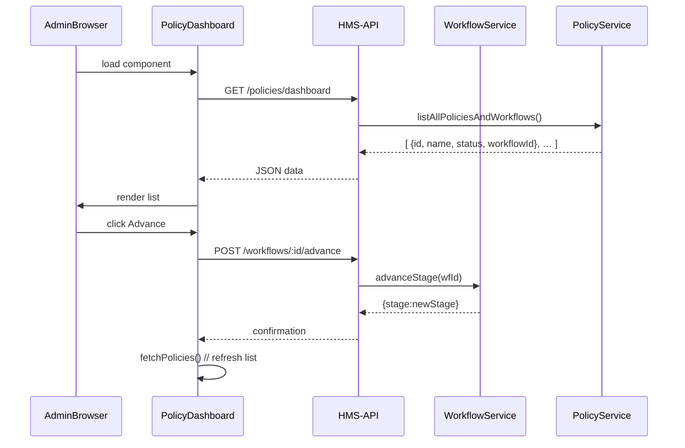

# Chapter 9: PolicyDashboard Component

In [Chapter 8: Admin/Gov Portal (HMS-GOV)](08_admin_gov_portal__hms_gov__.md), we built the overall back-office UI for policy-makers. Now let’s zoom into the **PolicyDashboard** component—the “control tower” view where you get an instant snapshot of every policy, proposal, and its status.

---

## 9.1 Why a PolicyDashboard?

Imagine you’re the Director of Fisheries and your desk has a big screen showing all incoming and outgoing flights at an airport—except here each “flight” is a policy change or proposal. You need to:

- See how many policies are **Active**, **Draft**, or **Under Review**  
- Spot proposals waiting for your OK  
- Jump straight into the details or advance workflows

Without this dashboard, you’d click into dozens of pages just to find what needs attention. The PolicyDashboard brings it all into one glance.

---

## 9.2 Central Use Case

1. You open the Admin Portal and click **Policy Dashboard**.  
2. The dashboard fetches:
   - All **policies** (ID, name, status)  
   - Pending **proposals** count  
   - Latest workflow stage for each policy  
3. You filter to “Draft” and see three new fishing rules.  
4. You click “View” to inspect one, or “Advance” to move it to Committee Review.

---

## 9.3 Key Concepts

1. **Data Fetching**  
   The component calls HMS-API to retrieve a combined list of policies and proposals.

2. **Filtering & Sorting**  
   Drop-down menus let you filter by status (Draft, Active, Retired) and sort by date.

3. **Actions**  
   Buttons like **View**, **Advance**, or **Edit** invoke API routes under the hood.

4. **Real-Time Refresh** (optional)  
   A timer or WebSocket can update counts without reloading the page.

---

## 9.4 Using PolicyDashboard

### 9.4.1 Component Skeleton

```vue
<template>
  <div>
    <h1>Policy Management Dashboard</h1>
    <select v-model="filterStatus">
      <option>All</option>
      <option>Draft</option>
      <option>Active</option>
    </select>
    <button @click="fetchPolicies">Refresh</button>
    <ul>
      <li v-for="p in filteredPolicies" :key="p.id">
        {{ p.name }} — {{ p.status }}
        <button @click="advance(p.workflowId)">Advance</button>
      </li>
    </ul>
  </div>
</template>
<script>
export default {
  name: 'PolicyDashboard',
  data() { return { policies: [], filterStatus: 'All' } },
  computed: {
    filteredPolicies() {
      return this.policies.filter(p =>
        this.filterStatus === 'All' || p.status === this.filterStatus)
    }
  },
  methods: {
    async fetchPolicies() {
      this.policies = await this.$api.get('/policies/dashboard')
    },
    async advance(wfId) {
      await this.$api.post(`/workflows/${wfId}/advance`)
      this.fetchPolicies()
    }
  },
  mounted() { this.fetchPolicies() }
}
</script>
```

Explanation:

1. We declare a **filter** and a **list** of policies.  
2. On mount, `fetchPolicies()` calls the dashboard API.  
3. `filteredPolicies` updates automatically when you pick a status.  
4. Clicking **Advance** posts to `/workflows/:id/advance` and refreshes the view.

---

## 9.5 What Happens Under the Hood



1. **Dashboard** asks HMS-API for a combined list.  
2. **PolicyService** and **WorkflowService** pull policy metadata and current stage.  
3. When you **Advance**, Dashboard calls back to HMS-API → WorkflowService, then reloads.

---

## 9.6 Inside the Dashboard API

On the server side, we expose a special endpoint to feed the dashboard:

File: `hms-api/routes/dashboard.js`
```javascript
import express from 'express'
import fetch from 'node-fetch'
const router = express.Router()

router.get('/policies/dashboard', async (req, res) => {
  // 1. Get all policies
  const policies = await fetch('http://hms-svc/policies').then(r=>r.json())
  // 2. For each policy, get workflow info
  const enriched = await Promise.all(policies.map(async p => {
    const wf = await fetch(`http://hms-api/workflows/${p.id}`).then(r=>r.json())
    return { ...p, workflowId: wf.id, status: wf.stage }
  }))
  res.json(enriched)
})

export default router
```
Explanation:

1. We fetch policies from the **PolicyService**.  
2. We look up each workflow’s current stage.  
3. We merge them into one JSON array for the dashboard.

---

## 9.7 Next Steps

Now you have a bird’s-eye view of every policy and proposal in HMS-GOV. In the next chapter we’ll build the detailed **PolicyEditor** component to create and modify individual policies.

[Chapter 10: PolicyEditor Component](10_policyeditor_component_.md)

---

Congratulations! You now understand how the **PolicyDashboard** works:
- Fetching and displaying combined policy + workflow data  
- Filtering by status  
- Performing quick actions like advancing a workflow  

Just like an airport control tower, you can now see every policy movement at a glance!

---

Generated by [AI Codebase Knowledge Builder](https://github.com/The-Pocket/Tutorial-Codebase-Knowledge)