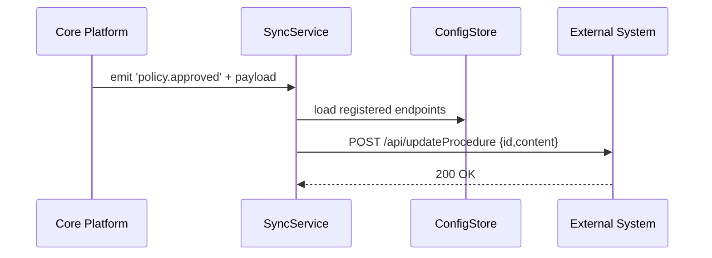

# Chapter 9: Real-Time External Sync

Welcome back! In [Chapter 8: Human-in-the-Loop Override](08_human_in_the_loop_override_.md), we saw how humans review AI-draft proposals. Once a policy or process is approved, we need to make sure **external systems**—like scheduling tools or data stores—see the update **immediately**. That’s where **Real-Time External Sync** comes in.

## Why Real-Time External Sync Matters

Imagine a city’s 911 dispatch platform rolls out a new emergency response procedure. Police cars, EMS routing software, even hospital intake systems all need that update **right away**—no waiting, no stale data.  
Without a live sync, first responders might use outdated instructions, slowing rescue efforts. Real-time sync makes our HMS-MFE platform act like a live broadcast: once the “new script” is approved, every connected system hears it at once.

## Key Concepts

1. **Event Bus**  
   A channel inside our app where things “happen” (events). Example: `policy.approved` or `schedule.updated`.

2. **Connector**  
   A little piece of code that “listens” for events and sends data to an outside system’s API.

3. **External Endpoint**  
   The URL, credentials, and format details of the system you sync with (e.g., `https://ems.city.gov/api/updateProcedure`).

4. **Retry Logic**  
   If the external system is down, the connector will retry until it succeeds—so no updates get lost.

## How to Use Real-Time External Sync

Let’s wire up a simple example: when a new triage policy is approved, we push it to an EMS scheduler.

1. **Register** the external endpoint.  
2. **Emit** an event when the policy is approved.

```ts
// src/sync/setup.ts
import { syncService } from './syncService'

// 1. Tell our syncService where to send updates
syncService.registerEndpoint('EMS-Scheduler', {
  url: 'https://ems.city.gov/api/updateProcedure',
  authToken: 'Bearer abc123'
})
```
*Explanation*: We name our connector `EMS-Scheduler` and give it the URL and token it needs.

```ts
// src/policy/approval.ts
import { syncService } from '../sync/syncService'

// 2. After human approval (see [Chapter 8](08_human_in_the_loop_override_.md))
function onPolicyApproved(policy) {
  // Send the approved policy data to all registered endpoints
  syncService.emit('policy.approved', { id: policy.id, content: policy.content })
}
```
*Explanation*: As soon as the policy lands in “approved” status, we fire a `policy.approved` event with the policy details.

## What Happens Behind the Scenes



1. **Core Platform** emits an event.  
2. **SyncService** checks which endpoints to notify.  
3. It **POSTs** the payload to each **External System**.  
4. On success, the update is live everywhere.

## Under the Hood: Code Walkthrough

### 1. The SyncService

File: `src/sync/syncService.ts`

```ts
import { EventEmitter } from 'events'
import fetch from 'node-fetch'

export class SyncService extends EventEmitter {
  private endpoints = new Map<string, any>()

  // Save endpoint details in memory
  registerEndpoint(name: string, config: {url: string, authToken: string}) {
    this.endpoints.set(name, config)
  }

  // Override EventEmitter.emit to trigger HTTP calls
  emit(eventName: string, data: any) {
    super.emit(eventName, data)
    this.handleEvent(eventName, data)
    return true
  }

  // Send data to every registered endpoint
  private async handleEvent(eventName: string, payload: any) {
    for (const cfg of this.endpoints.values()) {
      await this.callExternal(cfg, eventName, payload)
    }
  }

  private async callExternal(cfg: any, eventName: string, data: any) {
    // Simple retry logic
    for (let i = 0; i < 3; i++) {
      try {
        await fetch(cfg.url, {
          method: 'POST',
          headers: {
            'Content-Type': 'application/json',
            'Authorization': cfg.authToken
          },
          body: JSON.stringify({ event: eventName, data })
        })
        return
      } catch {
        // wait and retry…
        await new Promise(r => setTimeout(r, 1000))
      }
    }
    console.error(`Failed to sync event ${eventName}`)
  }
}

export const syncService = new SyncService()
```

*Explanation*:  
- We extend Node’s `EventEmitter` so any `emit(...)` also calls `handleEvent`.  
- `registerEndpoint` stores where to send updates.  
- `handleEvent` loops through all endpoints and calls them with retry logic.

### 2. Using the EventEmitter

File: `src/index.ts`

```ts
import './sync/setup'           // registers endpoints
import { onPolicyApproved }    // your approval flow

// Example: wire up your approval handler
policyService.on('approved', onPolicyApproved)
```
*Explanation*:  
- We import our sync setup so endpoints are ready.  
- When the policyService marks something approved, it calls `onPolicyApproved`, which triggers the sync.

## Conclusion

You’ve learned how **Real-Time External Sync** lets our platform broadcast approved changes to outside systems instantly and reliably—just like a live feed keeps 911, police, and EMS on the same page.  

Next up, we’ll see how these synced policies are formally rolled out in a controlled process. Check out [Chapter 10: Policy Deployment Workflow](10_policy_deployment_workflow_.md)!

---

Generated by [AI Codebase Knowledge Builder](https://github.com/The-Pocket/Tutorial-Codebase-Knowledge)